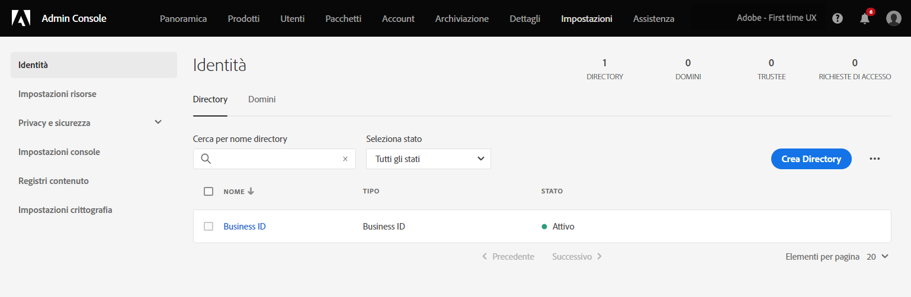
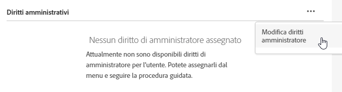
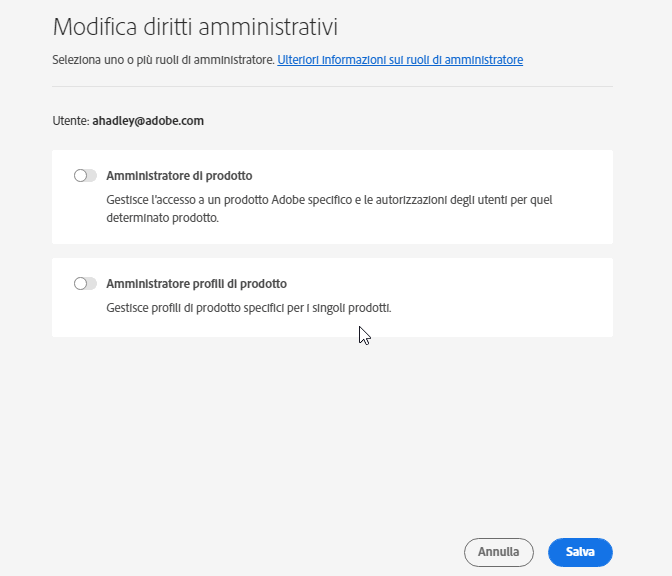

# Gestione di utenti e prodotti Experience Cloud

Scopri come accedere all’Admin Console, gestire le autorizzazioni utente e i profili di prodotto di Experience Cloud e il supporto del browser.

>[!IMPORTANT]
>
>Le seguenti informazioni sono specifiche per le applicazioni di Experience Cloud. Questa guida integra le informazioni contenute nella [Guida utente per l’amministrazione di Enterprise](https://helpx.adobe.com/it/enterprise/admin-guide.html) per tutti i prodotti cloud di Adobe.

Puoi visualizzare un elenco ordinabile e filtrabile di tutti gli utenti Experience Cloud e dei relativi dettagli in Admin Tool. Consulta [Visualizzare gli utenti Experience Cloud in Admin Tool](admin-tool-experience-cloud.md).

## Experience Cloud di autenticazione utente (migrazione pianificata){#migration}

A partire da febbraio 2022, Adobe sta aggiornando il proprio sistema di gestione dei profili per consentire alle organizzazioni di gestire meglio le adesioni aziendali ai singoli profili. Di conseguenza, tutti gli utenti con un profilo personale, che corrisponde a un singolo Adobe ID (Tipo1), verranno migrati a un nuovo profilo commerciale. Questo profilo corrisponde a un _ID business_ (Type2e).

Vedi [Tipi di identità in Adobe Admin Console](https://helpx.adobe.com/it/enterprise/using/identity.html) per informazioni sui tipi di identità.

### Processo di migrazione

Quando è il momento della migrazione, gli amministratori dell’organizzazione ricevono un’e-mail di notifica 30 giorni prima della migrazione.

* La migrazione sarà programmata tra le ore 10 - 6.00 in base al fuso orario principale dell’organizzazione o al fine settimana.
* Durante la migrazione, l’applicazione di Experience Cloud può essere inaccessibile per circa 15 minuti e l’Admin Console può essere inaccessibile fino a 30 minuti. In caso contrario, la migrazione sarà senza soluzione di continuità.

### Modifiche dopo la migrazione

Admin Console

* Gli amministratori con più account possono visualizzare un selettore di profilo al momento dell’accesso [!UICONTROL Admin Console].
* I singoli utenti Adobe ID verranno aggiornati a Business ID.
* La directory Business ID verrà aggiunta in **[!UICONTROL Impostazioni]** > **[!UICONTROL Identità]** > **[!UICONTROL Directory]**.

   

### Accesso dopo la migrazione

L’esperienza di accesso non viene modificata con questo aggiornamento:

1. Accesso a `experience.adobe.com` utilizzando le stesse credenziali.

1. Viene creato un nuovo profilo associato all&#39;ID aziendale. Viene richiesto di **[!UICONTROL Iscriviti subito]** o **[!UICONTROL Salta]**.

1. Una delle opzioni consente di creare un’esperienza di pagina di destinazione esistente.

1. Un profilo di Adobe è associato a ciascun piano aziendale e consente di organizzare le risorse create da ulteriori offerte di Adobe Cloud (Creative Cloud e Document Cloud).

Per ulteriori informazioni, consulta [Introduzione ai profili di Adobe](https://helpx.adobe.com/enterprise/kb/introducing-adobe-profiles.html).

## Cos’è un profilo di prodotto? {#section_AB50558124D541CF80A0D3D76D35A4BF}

I _[!UICONTROL Profili di prodotto]_ sono gruppi di prodotti e servizi che puoi assegnare agli utenti. In Experience Cloud, le autorizzazioni si basano sul profilo di un prodotto, non sull’utente. (Tuttavia, puoi delegare i diritti amministrativi a utenti specifici.)

In Analytics, ad esempio, puoi configurare una raccolta di strumenti di reporting, quali Analysis Workspace e Report Builder, insieme a suite di rapporti, metriche e dimensioni. Puoi concedere l’autorizzazione a un profilo di prodotto aggiungendo utenti al profilo.

* Vedi [Assegnare le autorizzazioni di accesso Analytics a un profilo di prodotto](admin-getting-started.md#task_040673FE3E3E429B9531FBCB8B6A4391) in questa pagina.
* Consulta la pagina [Delegare i ruoli di amministratore agli utenti](#delegate-rights).

## Gestire i profili di prodotto di Experience Cloud {#task_16335111C52D40E9BAC73D0699584DBF}

Puoi creare un profilo di prodotto e assegnarlo a un gruppo di autorizzazioni.

Quando inviti un utente in un&#39;organizzazione, puoi concedergli l&#39;accesso a prodotti e profili di prodotto. Puoi anche delegare autorizzazioni amministrative limitate a un utente. Allo stesso modo, puoi creare gruppi di utenti, quindi aggiungere il gruppo a un profilo di prodotto per abilitare l’accesso.

1. In [Admin Console](https://adminconsole.adobe.com/enterprise/), seleziona **[!UICONTROL Prodotti]**.
1. Fai clic sul nome della tua organizzazione.
1. Seleziona **[!UICONTROL Nuovo profilo]**.
1. Configura i dettagli del profilo, quindi seleziona **[!UICONTROL Salva]**.

Per ulteriori informazioni (e per assistenza sulla gestione dei prodotti Creative Cloud e Document Cloud), consulta [Identità](https://helpx.adobe.com/it/enterprise/admin-guide.html/it/enterprise/using/identity.ug.html) nella [Guida utente per l’amministrazione](https://helpx.adobe.com/it/enterprise/admin-guide.html/it/enterprise/using/users.ug.html).

**Argomenti correlati**

* [Gestire prodotti e profili](https://helpx.adobe.com/it/enterprise/admin-guide.html/it/enterprise/using/manage-products.ug.html) nella Guida utente per l’amministrazione.
* [Autorizzazioni di utenti Enterprise](https://experienceleague.adobe.com/docs/target/using/administer/manage-users/enterprise/property-channel.html?lang=it) nella guida di Adobe Target per maggiori informazioni
* Video: [Come configurare le aree di lavoro di Adobe Target in Adobe Admin Console](https://helpx.adobe.com/it/target/kb/how-to-configure-target-workspaces-in-adobe-admin-console0.html)

## Delega di ruoli amministrativi a utenti {#delegate-rights}

In Admin Console, puoi delegare diritti amministrativi limitati ad altre persone nell&#39;organizzazione. I ruoli delegati consentono agli utenti di fornire l&#39;accesso software agli utenti finali, fornire le funzionalità di distribuzione dell&#39;accesso e fungere da delegati di supporto.

Sarà possibile, ad esempio:

* Consentire al tuo direttore creativo di concedere l&#39;accesso a Creative Cloud.
* Consentire al tuo direttore marketing di concedere l&#39;accesso a Experience Cloud.
* Mantenere questi due ruoli separati in modo che non possano sovrapporsi.

Utilizzando questi ruoli, puoi delegare simultaneamente la gestione ad altri senza fornire più funzionalità di quelle necessarie.

1. In Admin Console, seleziona **[!UICONTROL Utenti]**, quindi fai clic sul nome dell’utente.

   

1. Seleziona **[!UICONTROL Modifica diritti amministratore]**.

   

1. Specifica i diritti di amministrazione dell’utente.
1. Seleziona **[!UICONTROL Salva]**.

## Gestire utenti e prodotti in Analytics {#section_97DE101F92CD494AB073893680992F1A}

Puoi assegnare le autorizzazioni di accesso ai rapporti di Analytics (suite di rapporti, metriche, dimensioni e così via) a un profilo di prodotto.

Ad esempio, puoi creare un profilo di prodotto contenente più strumenti di Analytics ([!UICONTROL Analysis Workspace], [!UICONTROL Reports &amp; Analytics]e [!UICONTROL Report Builder]). Questi profili contengono l’autorizzazione per metriche e dimensioni specifiche (comprese le eVar) e funzionalità come segmenti o creazione di metriche calcolate.

1. Accedi ad [Admin Console](https://adminconsole.adobe.com/enterprise), quindi seleziona **[!UICONTROL Prodotti]**.
1. Nella pagina [!UICONTROL Prodotti], seleziona il prodotto, quindi **[!UICONTROL Autorizzazioni]** (disponibile solo per gli amministratori).
1. Configura le autorizzazioni del profilo:

| Elemento | Descrizione |
|--- |--- |
| Suite di rapporti | Attiva le autorizzazioni per suite di rapporti specifiche. |
| Metriche | Attiva le autorizzazioni per traffico, conversione, eventi personalizzati, eventi delle applicazioni, in base al contenuto e così via. |
| Dimensioni | Personalizza l’accesso degli utenti a un livello granulare, inclusi eVar e rapporti sul traffico, sulle applicazioni e sui percorsi. |
| Strumenti delle suite di rapporti | Attiva le autorizzazioni degli utenti per servizi web, gestione delle suite di rapporti, strumenti, rapporti ed elementi del dashboard. |
| Strumenti di Analytics | Attiva le autorizzazioni degli utenti per elementi generali (fatturazione, registri e così via), gestione società, strumenti, accesso ai servizi web, Report Builder e integrazione con Data Connectors. Le impostazioni aziendali della categoria Personalizza di Admin Console sono state trasferite negli strumenti di Analytics. |

**Migrazione degli account utente**

È disponibile uno strumento di migrazione degli ID utente di Analytics che permette agli amministratori di trasferire gli account utente da Gestione utenti di Analytics ad [Adobe Admin Console](https://adminconsole.adobe.com/enterprise/).

La migrazione diventerà disponibile per i clienti in più fasi. Adobe ti invierà una notifica e ti fornirà assistenza quando arriverà il tuo momento di trasferire gli account utente esistenti da **[!UICONTROL Strumenti di amministrazione]** > **[!UICONTROL Gestione utenti]** all&#39;Admin Console.

Dopo la migrazione, gli utenti potranno accedere con il proprio Adobe ID (o Enterprise ID) e autenticarsi nelle applicazioni e nei servizi Experience Cloud nella pagina [experience.adobe.com](https://experience.adobe.com). Gli utenti che tenteranno di accedere con i metodi precedenti ([!DNL my.omniture.com], [!DNL sc.omniture.com] e [!DNL experiencecloud.adobe.com]) verranno reindirizzati a [!DNL experience.adobe.com].

**Argomenti correlati**

* [Analytics in Admin Console](https://experienceleague.adobe.com/docs/analytics/admin/admin-console/home.html?lang=en)
* [Migrazione degli ID utente di Analytics](https://experienceleague.adobe.com/docs/analytics/admin/user-product-management/migrate-users/c-migration-tool.html?lang=it)

## Gestione di Adobe Target - Profili di prodotto e aree di lavoro {#section_3860AF177C9E4C7E9C390D36A414F353}

In Adobe Target, un’area di lavoro è un profilo di prodotto. Consente a un&#39;organizzazione di assegnare una serie di utenti specifica a una serie di proprietà specifica. In vari modi, un&#39;area di lavoro è simile a una suite di rapporti in Adobe Analytics.

Vedi:

* [Autorizzazioni per gli utenti Enterprise](https://experienceleague.adobe.com/docs/target/using/administer/manage-users/enterprise/property-channel.html?lang=en)
* [Gestire prodotti e profili](https://helpx.adobe.com/enterprise/admin-guide.html/enterprise/using/manage-products.ug.html)
* Video: [Come configurare le aree di lavoro di Adobe Target in Adobe Admin Console](https://helpx.adobe.com/target/kb/how-to-configure-target-workspaces-in-adobe-admin-console0.html)

## Gestire profili di prodotto, tenant e gruppi di sicurezza di Campaign {#section_09CDF75366444CF5810CF321B7C712F3}

Un *tenant* in Campaign viene visualizzato come *prodotto* nella pagina Prodotti di Admin Console.

*Gruppo di sicurezza* viene visualizzato come profilo di prodotto.

Consulta [Gestione di gruppi e utenti](https://experienceleague.adobe.com/docs/campaign-standard/using/administrating/users-and-security/managing-groups-and-users.html?lang=it) per informazioni sui gruppi di sicurezza e sull&#39;assegnazione di utenti ai gruppi di sicurezza.

## Gestire la raccolta dati di Experience Platform (Launch) {#section_F2DA6778DD2D48AA8F794041971EE6B1}

La [!UICONTROL Raccolta dati] di Experience Platform ([!UICONTROL Launch]) viene visualizzata sulla pagina [!UICONTROL Prodotti] in [!UICONTROL Admin Console]. Puoi includere altre applicazioni e altri servizi in un profilo di prodotto Launch.

Invita gli utenti in [!UICONTROL Platform Launch] e assegna ruoli utente e autorizzazioni.

Per informazioni sulle autorizzazioni degli utenti in Admin Console e sulla configurazione di opzioni specifiche per Launch, tra cui l’assegnazione di diritti ai profili, consulta [Autorizzazioni utente](https://experienceleague.adobe.com/docs/experience-platform/tags/admin/user-permissions.html?lang=it).

## Experience Manager as a Cloud Service

In Adobe [!UICONTROL Admin Console] i clienti Adobe Enterprise sono rappresentati come “organizzazioni”. I clienti Experience Manager possono utilizzare Adobe [!UICONTROL Admin Console] per gestire le adesioni ai prodotti e l’autenticazione IMS per Experience Manager as a [!UICONTROL Cloud Service].

Consulta [Supporto IMS per Experience Manager as a Cloud Service](https://experienceleague.adobe.com/docs/experience-manager-cloud-service/security/ims-support.html?lang=it).

## Audience Manager {#section_C31E3FA8A1E14463B1B3E07235F1983C}

Crea utenti Audience Manager e assegnali a gruppi. Puoi anche visualizzare i limiti (caratteristiche, segmenti, destinazioni e [!DNL AlgoModel]).

Consulta [Amministrazione](https://experienceleague.adobe.com/docs/audience-manager/user-guide/features/administration/administration-overview.html?lang=it) nella guida di Audience Manager.

## Browser supportati in Experience Cloud

* [!DNL Microsoft® Edge] (Microsoft® ha [terminato il supporto](https://www.microsoft.com/it-it/WindowsForBusiness/End-of-IE-support) per Internet Explorer 8, 9 e 10. Di conseguenza, Adobe non corregge i problemi segnalati riguardanti queste versioni specifiche di Internet Explorer.)
* [!DNL Google Chrome]
* [!DNL Firefox]
* [!DNL Safari]
* [!DNL Opera]

**Nota:** sebbene l’interfaccia di Experience Cloud supporti questi browser, le singole applicazioni non supportano tutti i browser. (per esempio, [Analytics](https://experienceleague.adobe.com/docs/analytics/admin/sys-reqs.html?lang=en) non supporta [!DNL Opera] e [Adobe Target](https://experienceleague.adobe.com/docs/target/using/implement-target/before-implement/supported-browsers.html?lang=it) non supporta [!DNL Safari]).

### Requisiti di soluzioni e prodotti

* [Analytics](https://experienceleague.adobe.com/docs/analytics/admin/sys-reqs.html?lang=en)
* [Report Builder](https://experienceleague.adobe.com/docs/analytics/analyze/report-builder/report-builder-setup/system-requirements.html?lang=it)
* [Adobe Target](https://experienceleague.adobe.com/docs/target/using/implement-target/before-implement/supported-browsers.html?lang=en)
