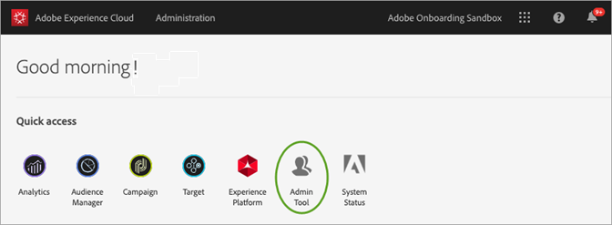

# Strumento Amministrazione Experience Cloud

Experience Cloud Admin Tool consente agli amministratori di visualizzare un elenco ordinabile e filtrabile di tutti gli utenti Experience Cloud. Ogni pagina con i dettagli utente contiene informazioni importanti sull’accesso al prodotto, sui ruoli e sulle ultime informazioni a cui l’utente ha accesso.  

1. Log in to `https://experience.adobe.com/.`

   

1. Dalla home page di Experience Cloud, fai clic su **[!UICONTROL Admin Tool.]**

    (In alternativa, nell’URL della pagina principale potete sostituire la _home_ con _admin._)

   Viene visualizzata la pagina [!UICONTROL Utenti] .

## Pagina Utenti

In questa pagina viene visualizzato l’elenco completo degli utenti con accesso a Experience Cloud nella tua organizzazione. Fornisce informazioni sull&#39;adesione alla soluzione e sull&#39;ultimo accesso. Potete cercare, ordinare e filtrare le viste personalizzate dell’elenco di utenti.

| Elemento | Descrizione |
|---|---|
| [!UICONTROL Nome] | Nome e cognome dell’utente. Puoi ordinare questa colonna da A a Z e da Z a A.  Fate clic sul nome di un utente per visualizzare ulteriori dettagli sull’utente. |
| [!UICONTROL E-mail] | L’indirizzo e-mail associato all’utente. La colonna può essere ordinata A->Z, Z->A. |
| [!UICONTROL Tipo di ID] | Il tipo di identità per l&#39;account dell&#39;utente. È possibile applicare un filtro per visualizzare tipi di ID specifici. Per ulteriori informazioni, consulta [Gestione dei tipi](https://helpx.adobe.com/enterprise/using/identity.html) di identità. |
| [!UICONTROL Soluzioni] | Riepilogo delle soluzioni Experience Cloud a cui l&#39;utente può accedere. Potete applicare i filtri per limitare l&#39;elenco di utenti con accesso specifico alla soluzione. |
| [!UICONTROL Ultimo login] | Ora e data dell’accesso utente più recente a Experience Cloud. Questa colonna può essere ordinata in base a date ascendenti o discendenti.   **** Importante: A partire dal 13 gennaio 2020, gli ultimi dati di accesso di un utente saranno conservati per 365 giorni. Queste informazioni sono volte a mostrare l’attività di accesso corrente in Experience Cloud e non a consigliare di intervenire sugli account inattivi prima del 13 gennaio 2020. |

## Personalizzare la visualizzazione elenco utenti

Potete cercare, ordinare o filtrare le colonne per personalizzare l’elenco degli utenti.

* Cercare gli utenti per Nome o E-mail. Le ricerche corrispondono alla stringa di testo digitata.
* Ordinare le colonne in base ai valori crescente o decrescente. Questo vale per le colonne [!UICONTROL Nome,] [!UICONTROL E-mail,] [!UICONTROL Ultimo login] .
* Fate clic sull&#39;icona **[!UICONTROL Filtra per]** per applicare più filtri all&#39;elenco degli utenti con criteri specifici. Quando vengono applicate più categorie di filtri, le ricerche contengono la soluzione tipo `AND` ID dominio e-mail `AND` .

| Elemento | Descrizione |
|---------|----------|
| [!UICONTROL Filtro Dominio] e-mail | Cerca le stringhe di caratteri nella colonna E-mail per limitare i risultati a uno o più domini. Aggiungere più filtri premendo Invio dopo ogni termine di ricerca |
| [!UICONTROL Tipo] ID, filtro | Scegli tra i tipi di ID disponibili. Più tipi di ID possono essere utilizzati come filtro. |
| [!UICONTROL Filtro soluzione] | Scegliete tra le soluzioni disponibili. Filtri per più soluzioni cercano risultati contenenti la soluzione 1 `OR` Soluzione 2. |

## Visualizza dettagli utente

Nella pagina [!UICONTROL Utenti] , per visualizzare i dettagli di un utente, fate clic sull’e-mail dell’utente.

Una visualizzazione dettagliata di ciascun utente mostra dettagli importanti sull&#39;accesso alla soluzione dell&#39;utente, i ruoli di amministratore e di prodotto e le informazioni sull&#39;ultimo accesso.

## Sezione

In questa sezione viene visualizzato un riepilogo dell’account utente che include:

* Avatar utente e Badge amministratore di sistema (se applicabile)
* Nome
* E-mail
* Nome utente (gli account ID federati possono avere nomi utente diversi dall’indirizzo e-mail)
* [Tipo di ID](https://helpx.adobe.com/enterprise/using/identity.html)
* Paese
* Ultimo login

## Riepilogo delle soluzioni

In questa sezione viene visualizzato un riepilogo delle soluzioni Experience Cloud a cui l&#39;utente può accedere. Include, se applicabile, il ruolo di amministrazione del prodotto

## Elenco dettagliato di accesso al prodotto

In questa sezione viene visualizzato un elenco completo di tutti i profili di prodotto per l&#39;utente.

| Elemento | Descrizione |
|---------|----------|
| [!UICONTROL Prodotto] | Nome del prodotto associato al profilo di prodotto. |
| [!UICONTROL Instance] | Nome dell&#39;istanza (ad esempio società di accesso o tenant) associata al prodotto e al profilo di prodotto. |
| [!UICONTROL Profilo prodotto] | Nome univoco del profilo di prodotto. |
| [!UICONTROL Assegnato dal gruppo] | Nome del gruppo di utenti che associa l’utente a un profilo di prodotto. I risultati vuoti indicano che l&#39;utente è stato assegnato direttamente al profilo di prodotto, non tramite un gruppo. |
| [!UICONTROL Ruoli prodotto] | Assegnazione del ruolo dell&#39;utente nel profilo di prodotto. Attualmente, queste informazioni sono valide solo per i profili di prodotto Target. |
