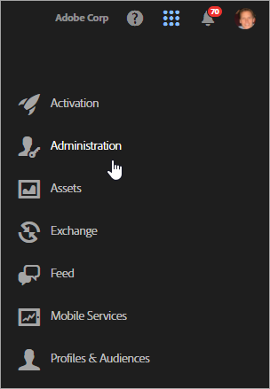
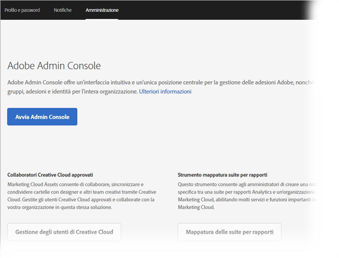

# Accesso e gestione delle impostazioni del profilo

L’accesso a Experience Cloud (anziché a una singola soluzione) consente di accedere in modalità single sign-on a tutte le soluzioni e i servizi di base che hai acquistato. Scopri come accedere a Experience Cloud, gestire le password e le notifiche e specificare una pagina di destinazione predefinita.

<!-- t_sign_in.xml -->

<!-- notifications.xml -->

<!-- t_get_access.xml -->

>[!IMPORTANT]
>
>Per informazioni sugli aggiornamenti di gestione utenti e prodotti, gli amministratori devono consultare [Amministrazione](../admin-getting-started/admin-getting-started.md#topic_3FCB4099640647E3B2411ADBFCE81909).

## Accesso a Experience Cloud (amministratori) {#task_034FC955031347F3B02B686A09801A08}

Accedi e verifica di essere nell’[organizzazione](../admin-getting-started/organizations.md#topic_C31CB834F109465A82ED57FF0563B3F1) corretta.

1. Fai clic sul menu a discesa Experience Cloud ( ), quindi fai clic su **[!UICONTROL Amministrazione]**.

   

   Se non viene visualizzato il collegamento **[!UICONTROL Amministrazione]**, non sei un amministratore di Experience Cloud per l'[organizzazione](../admin-getting-started/organizations.md#topic_C31CB834F109465A82ED57FF0563B3F1) visualizzata (Adobe Corp, in questo esempio). Per assistenza su come diventare amministratore, contatta l’Assistenza clienti o un amministratore Experience Cloud esistente nella tua azienda.
1. Fai clic su **[!UICONTROL Amministrazione]**.

   
1. Procedi facendo clic su uno dei collegamenti seguenti:

| Elemento | Descrizione |
|--- |--- |
| [Admin Console Basics (Informazioni di base su Admin Console)](https://helpx.adobe.com/marketing-cloud/how-to/first-time-setup.html) | Informazioni sui passaggi iniziali necessari per iniziare a usare le soluzioni Experience Cloud. |
| [Set up Identity (Configurazione dell’identità)](https://helpx.adobe.com/enterprise/using/set-up-identity.html) | Definisci e configura un sistema di identità nel quale gli utenti finali effettueranno l'autenticazione. |
| [Gestione utenti](https://helpx.adobe.com/enterprise/using/users.html) | Scopri come accedere ad Admin Console e gestire le autorizzazioni utente e i profili prodotto di Experience Cloud. |
| [Avvia Admin Console](../admin-getting-started/admin-getting-started.md) | Admin Console è la posizione centrale per la gestione di utenti Adobe e adesioni di prodotti in tutta l’organizzazione. Puoi accedere ad Admin Console anche mediante un [collegamento diretto](https://adminconsole.adobe.com). |
| [Gestione degli utenti di Creative Cloud](../experience-cloud-assets/t-admin-add-cc-user.md) | Experience Cloud Assets consente di collaborare, sincronizzare e condividere cartelle con designer e altri team creativi tramite Creative Cloud. Puoi gestire gli utenti Creative Cloud approvati e collaborare con la tua organizzazione in questa stessa soluzione. |
| [Mappa le suite di rapporti](../core-services/core-services.md) | (Solo Analytics): i servizi di base di Experience Cloud sono associati a un'organizzazione invece che a una singola suite di rapporti. Per garantire il funzionamento corretto di questi servizi, ogni suite di rapporti di Analytics deve essere mappata su un'organizzazione. (questa attività fa parte di un flusso di lavoro più ampio correlato alla sezione [abilitare Analytics per i servizi di base](../core-services/core-services.md#concept_07ED1D5C64234E77976E6D572E78FB9C)). |
| [ID organizzazione](../admin-getting-started/organizations.md) | L'*ID organizzazione* si trova al fondo della pagina Amministrazione. Questo ID è l'ID associato all'azienda Experience Cloud in provisioning. Questo ID è una stringa alfanumerica composta da 24 caratteri, seguita da (deve includere) @AdobeOrg. |

## Accesso a Experience Cloud (utenti) {#task_1BFE87E20DCB44078CAC82F3CD44B985}

Aiuto per utenti non amministrativi che accedono a Experience Cloud.

1. Verifica con il tuo amministratore che l'[organizzazione](../admin-getting-started/getting-started-experience-cloud.md#concept_384D169B0B724B799D573B8ECB5C39BF) disponga del provisioning in Experience Cloud.

1. Passa a [Adobe Experience Cloud](https://marketing.adobe.com) ( [!DNL marketing.adobe.com]).
1. Fai clic su **[!UICONTROL Accedi con Adobe ID]**.

   Il tuo amministratore Experience Cloud può aiutarti a determinare il tipo di account (Adobe ID o Enterprise ID).

1. Nella pagina Feed (o nella pagina di destinazione predefinita) fai clic sull’icona del selettore  per accedere al menu a discesa.

   

   Le soluzioni e i servizi visualizzati in questo menu dipendono dai privilegi dell’applicazione definiti dall’[amministratore](../admin-getting-started/admin-getting-started.md#topic_3FCB4099640647E3B2411ADBFCE81909).

## Configurare le impostazioni account personali predefinite {#task_73CBCAE6C91749D19C95421E5AC311BA}

Puoi modificare i dati personali e specificare un’[organizzazione](../admin-getting-started/admin-getting-started.md#concept_705C626560A54CA2A4215F1C870C42B2) e una pagina di destinazione predefinite dopo l’accesso a Experience Cloud.

1. Accedi a Experience Cloud e fai clic sull'icona del profilo.

   
1. Fai clic su **[!UICONTROL Modifica profilo]**.

   
1. Continua a configurare e modificare le informazioni personali, quindi fai clic su **[!UICONTROL Salva modifiche]**.

## Abilitare notifiche {#concept_0105453AD71847B8BFCAF4A40915F157}

Ricevi notifiche (tramite e-mail o nel prodotto) su aggiornamenti di sistema, avvisi di manutenzione, post, menzioni e risorse condivise. Puoi anche specificare i prodotti e le soluzioni per cui ricevere le notifiche, incluso lo stato di caricamento per gli attributi cliente.

Per passare a Notifiche, fai clic sull’icona **[!UICONTROL Notifiche]** , quindi sull’icona **[!UICONTROL Impostazioni]** .

Puoi ordinare la visualizzazione delle notifiche in base ai tipi di messaggio che ti interessano e cercare le notifiche. Puoi anche:

* ordinare per tipo di messaggio che ritieni importante;
* cercare notifiche.

**Per abilitare le notifiche**

<!-- 
 <b>Analytics</b> 
 
<ul id="ul_91BF597858124FA5BF338C36F6C5533F"> 
 <li id="li_FAD3E93CDE6242F58F14D55C8A6E23D7">Contribution analysis completed </li> 
 <li id="li_03D33D3228884CECA371B58656B2F3E7">Guided analysis shared </li> 
 <li id="li_DCF710F89317487B8DAA86CC05C694CA">Scheduled report failure </li> 
</ul> 

 <b>Target</b> 
 

Test started or stopped 
 

 <b>Media Optimizer</b> 
 

Performance alerts 
 

 <b>Dynamic Tag Manager</b> 
 
<ul id="ul_9ACDA418933E40918744D9C32A57DD4B"> 
 <li id="li_4DD0FFD3D9F84A428703611EF767D4D0">New web property created </li> 
 <li id="li_C6B923012E9D40BA91F4CBF7D2D72986">New user added </li> 
 <li id="li_EB0B9D1CFDE24E6987935CCCBFC7892A">Approvals - publishing and approval status for new rules, data elements, and tools </li> 
 <li id="li_17B0B176FF85435FB7EDD4317BC18201">Property has been published </li> 
</ul> -->

## Gestire profili e password {#task_7B89F4F38E5A4C4EB0FF842953856382}

Puoi modificare il tuo profilo Experience Cloud, specificare un’organizzazione e una pagina di destinazione predefinite e molto altro.

1. [Accesso a Experience Cloud](../admin-getting-started/getting-started-experience-cloud.md#task_1BFE87E20DCB44078CAC82F3CD44B985).

1. Dal menu Experience Cloud, fai clic sulla tua immagine del profilo.

   
1. Fai clic su **[!UICONTROL Modifica profilo]**.

   Nella pagina Profilo e password, completa i campi e le opzioni in Dati personali.

## Recupero della password {#task_46541A2806164CB1A4AE8239604E4EB1}

1. Accedi alla pagina di accesso alla soluzione.
1. Fai clic su **[!UICONTROL Password dimenticata]**.

   Reimpostando la password dovresti risolvere il problema del collegamento della password per Experience Cloud.

   Per gli utenti di Adobe Analytics, passa a [https://sc2.omniture.com/password_recovery.html](https://sc2.omniture.com/password_recovery.html).

## Configurare l’accesso alle soluzioni mediante un collegamento diretto {#concept_8BE493A08786469B88B210E13F78FF2F}

Facoltativamente è possibile accedere a una pagina specifica in una soluzione, utilizzando l’autenticazione fornita dall’interfaccia di Experience Cloud.

<!-- mac-deep-linking.xml -->
**Modello URL**

[!DNL https://<tenantId>.marketing.adobe.com/<solutionname>?destURL=<fullURL>]

URL di esempio:

[!DNL https://aem62tenant.marketing.adobe.com/analytics?destURL=https%3A%2F%2Fsc.omniture.com%2Freports%2F11562.html]

>[!NOTE]
>
>Devi codificare qualsiasi URL prima di trasmetterlo al parametro `destURL`. (sono disponibili siti di codifica come [URL Decoder / Encoder](https://meyerweb.com/eric/tools/dencoder/)).

| Parametro | Descrizione | Esempio | Obbligatorio / Facoltativo |
|--- |--- |--- |--- |
| tenantId | Nome del tenant a cui deve accedere l'utente. | aem62tenant | Facoltativo |
| destURL | URL completo alla posizione di destinazione dell'utente. | https://sc.omniture.com/x/1_7xxzf | Facoltativo |
| solutionname | Nome della soluzione MAC proprietaria del parametro destURL. Viene utilizzato per verificare che l'utente abbia accesso alla soluzione proprietaria dell'URL.  È responsabilità delle soluzioni verificare che solutionname sia sincronizzato con il parametro destURL.  Ad esempio: se l'URL contiene solutionname come social e il destURL fornito è un URL di Analytics, l'utente deve essere reindirizzato all'URL anche se non ha accesso ad Analytics. MAC NON verifica se il proprietario di destURL è sincronizzato con il nome della soluzione. | analytics | Obbligatorio se si utilizza il parametro destURL. |
