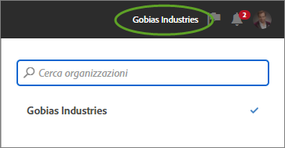
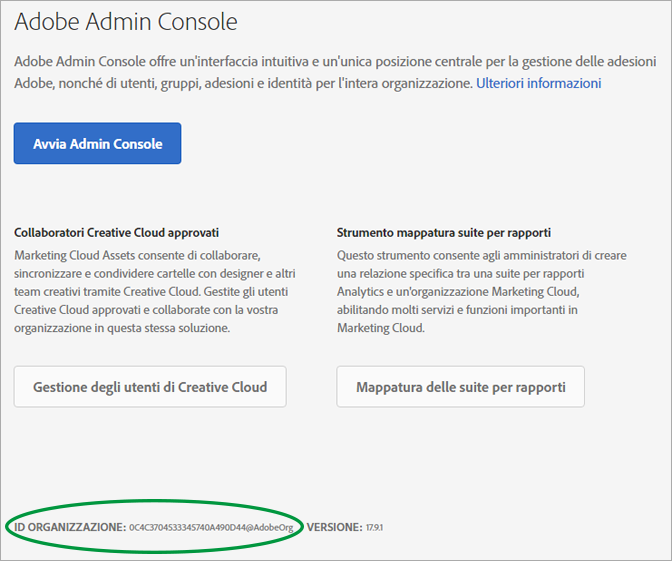

# Organizzazioni e collegamento di account

Informazioni sulla gestione delle organizzazioni e sul collegamento di account delle soluzioni a Experience Cloud.

<!-- accounts-experience-cloud.xml -->

## Identificazione della tua organizzazione {#concept_384D169B0B724B799D573B8ECB5C39BF}

Un'*organizzazione* è l'entità che consente all'amministratore di configurare gruppi e utenti e di controllare il single sign-on in Experience Cloud. L'organizzazione funziona come un'azienda che abbraccia tutti i prodotti e le soluzioni Experience Cloud. Nella maggior parte dei casi, un'organizzazione è il nome dell'azienda. Tuttavia, un'azienda può avere molte organizzazioni.

Inoltre, potresti dover individuare il tuo ID organizzazione a scopi di assistenza. Puoi verificare si essere nell'organizzazione corretta o cambiare organizzazione utilizzando il menu **[!UICONTROL Organizzazione]**.

## Ricerca dell'ID organizzazione {#concept_EA8AEE5B02CF46ACBDAD6A8508646255}

L’**ID organizzazione** è l’ID associato all’azienda con provisioning di Experience Cloud. Questo ID è una stringa alfanumerica composta da 24 caratteri, seguita da (deve includere) @AdobeOrg.

Per visualizzare l’ID organizzazione, passa alla pagina di destinazione di Experience Cloud oppure fai clic su ( ), quindi su **[!UICONTROL Amministrazione]**. Puoi trovare l’ID organizzazione nella parte inferiore della [!UICONTROL Guida introduttiva di Experience Cloud] o della pagina [!UICONTROL Amministrazione].

## Collegamento di un account soluzione a un Adobe ID {#task_FD389E78640848919E247AC5E95B8369}

In genere, gli amministratori di Experience Cloud concedono l'accesso a soluzioni e servizi. In rare circostanze, potresti aver bisogno di collegare le credenziali della soluzione a un Adobe ID.

1. Segui i passaggi contenuti nell'e-mail di invito a Experience Cloud.
1. Accedi utilizzando il tuo Adobe ID o Enterprise ID.
1. Fai clic sul selettore della soluzione. ( ).

   

   Le soluzioni a cui hai accesso sono colorate.
1. Fai clic sulla soluzione desiderata.

   

   Questo tipo di messaggio visualizza se fai parte del gruppo appropriato (e disponi dell'autorizzazione per la soluzione) ma non hai ancora collegato le credenziali del tuo account al tuo Adobe ID.
1. Fai clic su **[!UICONTROL Collega account]**, quindi immetti le tue credenziali.

## Specificare una organizzazione e una pagina di destinazione predefinite {#concept_6A191B42A9874A9780882903BA18F071}

Puoi specificare un'organizzazione predefinita e una pagina di destinazione da usare al momento dell'accesso.

Nel tuo profilo, fai clic su **[!UICONTROL Modifica profilo]**.

In Organizzazione e pagina di destinazione predefinite puoi personalizzare la tua esperienza di accesso.

## Risoluzione dei problemi di collegamento dell'account {#concept_DFCB29A3B4834FC59AA29E0BBA301584}

Aiuto per problemi derivanti dal collegamento dell'account.

Solitamente, se un collegamento dell'account non viene completato correttamente, significa che l'Adobe ID è collegato a un utente precedente. Quando il collegamento dell'account non dà esito positivo, puoi:

* [contattare l'Assistenza Adobe](https://helpx.adobe.com/marketing-cloud/contact-support.html);
* accedere alla soluzione mediante l'accesso standard durante la risoluzione del problema.
