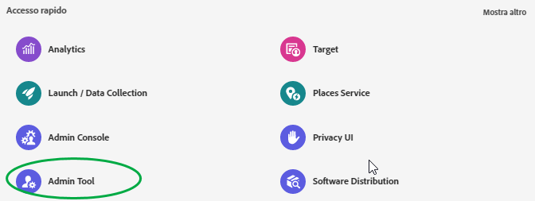
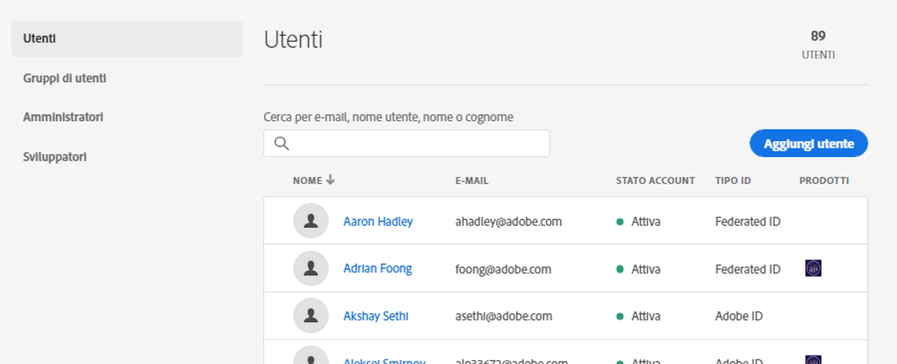
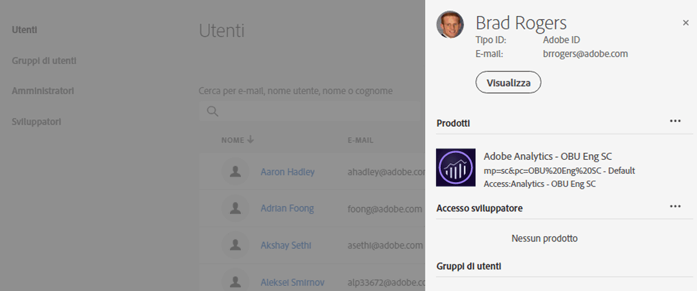
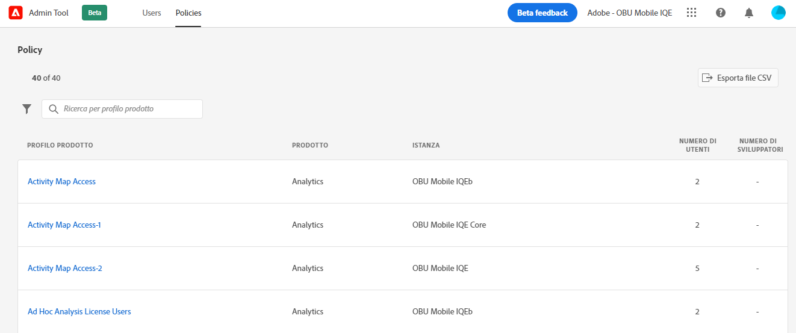
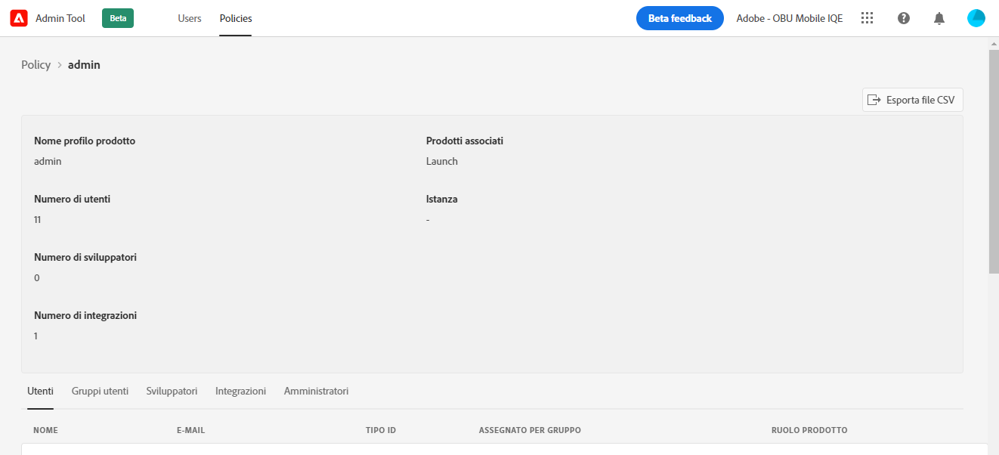

# CX Enterprise [!UICONTROL Admin Tool]

Gli amministratori possono visualizzare un elenco ordinabile e filtrabile di tutti gli utenti e i criteri di CX Enterprise con dettagli in [!UICONTROL Admin Tool]. I dettagli utente includono l’accesso ai prodotti, i ruoli e le informazioni sull’ultimo accesso. I dettagli dei criteri includono l’elenco di utenti, gruppi, sviluppatori, integrazioni e amministratori di un criterio (profilo di prodotto), nonché informazioni dettagliate sulle autorizzazioni e sulle risorse per il criterio.

1. Accedere a `https://experience.adobe.com/.`

   

1. In [!UICONTROL Quick Access], fare clic su **[!UICONTROL Admin Tool]**.

   In alternativa, nell’URL della pagina principale puoi sostituire _home_ con _admin_.

   Viene visualizzata la pagina [!UICONTROL Users].

## Pagina Users (Utenti)

In questa pagina viene visualizzato l&#39;elenco completo degli utenti con accesso a CX Enterprise dell&#39;organizzazione. Fornisce informazioni sulla licenza dell’applicazione e sull’ultimo accesso. Puoi inoltre eseguire ricerche, oltre a ordinare e filtrare le viste personalizzate dell’elenco di utenti.

| Elemento | Descrizione |
| --- | ---|
| [!UICONTROL Name] | Il nome e il cognome dell’utente. Puoi ordinare questa colonna da A a Z e da Z ad A. Fai clic sul nome di un utente per visualizzare ulteriori dettagli sull’utente. |
| [!UICONTROL Email] | L’indirizzo e-mail associato all’utente. Puoi ordinare questa colonna da A a Z e da Z ad A. |
| [!UICONTROL ID Type] | Il tipo di identità per l’account dell’utente. È possibile applicare un filtro per visualizzare tipi di ID specifici. Per ulteriori informazioni, consulta [Manage identity types (Gestisci tipi di identità)](https://helpx.adobe.com/it/enterprise/using/identity.html). |
| [!UICONTROL Solutions] | Riepilogo delle applicazioni aziendali CX a cui l&#39;utente può accedere. Per limitare l’elenco di utenti con accesso specifico all’applicazione puoi applicare i filtri. |
| [!UICONTROL Last Login] | Ora e data dell&#39;ultimo accesso utente a CX Enterprise. Questa colonna può essere ordinata in base a date ascendenti o discendenti.   **Importante:** a partire dal 13 gennaio 2020, gli ultimi dati di accesso dell&#39;utente verranno conservati per 365 giorni. Queste informazioni hanno lo scopo di mostrare l’attuale attività di accesso in CX Enterprise e non costituiscono un consiglio a intervenire sugli account inattivi prima del 13 gennaio 2020. |

## Personalizzare la vista elenco degli utenti

Puoi eseguire ricerche, oltre a ordinare o filtrare le viste personalizzate dell’elenco di utenti.

* Puoi cercare gli utenti per nome o e-mail. Le ricerche corrispondono alla stringa di testo digitata.
* Ordina le colonne in base ai valori crescenti o decrescenti. Questo ordinamento si applica a [!UICONTROL Name,] [!UICONTROL Email,] e [!UICONTROL Last Login] colonne.
* Per applicare più filtri agli utenti dell&#39;elenco con criteri specifici, fare clic su **[!UICONTROL Filter By]**. Quando vengono applicate più categorie di filtro, le ricerche contengono la soluzione `AND` ID TYPE `AND` del dominio e-mail.

| Elemento | Descrizione |
| ---------| ----------|
| Filtro [!UICONTROL Email Domain] | Per limitare i risultati a uno o più domini, cerca le stringhe di caratteri nella colonna E-mail. Per aggiungere più filtri, premi Invio dopo ciascun termine di ricerca. |
| Filtro [!UICONTROL ID Type] | Scegli tra i tipi di ID disponibili. È possibile utilizzare più tipi di ID come filtro. |
| Filtro [!UICONTROL Solution] | Scegli tra le applicazioni disponibili. I filtri per più applicazioni cercano i risultati contenenti Soluzione 1 `OR` Soluzione 2. |

## Visualizzare i dettagli degli utenti

Nella pagina [!UICONTROL Users], per visualizzare i dettagli di un utente, fare clic sull&#39;indirizzo e-mail dell&#39;utente.

La visualizzazione dettagliata di ciascun utente mostra dettagli importanti sull’accesso all’applicazione da parte dell’utente, sui ruoli di amministratore e di prodotto, oltre alle informazioni sull’ultimo accesso.

## Sezione Informazioni

In questa sezione viene visualizzato un riepilogo dell’account utente, il quale include:

* Avatar dell’utente e badge dell’amministratore di sistema (laddove applicabile)
* Nome
* E-mail
* Nome utente (gli account Federated ID possono presentare nomi utente diversi dall’indirizzo e-mail)
* [Tipo ID](https://helpx.adobe.com/it/enterprise/using/identity.html)
* Paese
* Ultimo accesso

## Riepilogo delle soluzioni

In questa sezione viene visualizzato un riepilogo delle applicazioni CX Enterprise a cui l&#39;utente può accedere. comprensivo eventalmente del ruolo di amministrazione del prodotto.

## Elenco dettagliato di accesso al prodotto

In questa sezione viene visualizzato un elenco completo di tutti i profili di prodotto in cui è incluso l’utente in questione.

| Elemento | Descrizione |
| ---------| ----------|
| [!UICONTROL Product] | Il nome associato al profilo di prodotto. |
| [!UICONTROL Instance] | Il nome dell’istanza (ad esempio società di accesso o tenant) associata al prodotto e al profilo di prodotto. |
| [!UICONTROL Product profile] | Nome univoco del profilo di prodotto. |
| [!UICONTROL Assigned by Group] | Nome del gruppo di utenti che associa l’utente a un profilo di prodotto. I risultati vuoti indicano che l’utente è stato assegnato al profilo di prodotto in modo diretto, ossia non tramite un gruppo. |
| [!UICONTROL Product Roles] | Assegnazione del ruolo dell’utente all’interno del profilo di prodotto. Attualmente, queste informazioni sono valide solo per i profili di prodotto di Adobe Target. |

## Pagina Criteri

In questa pagina viene visualizzato l&#39;elenco completo dei criteri aziendali CX dell&#39;organizzazione. Fornisce informazioni su prodotti, istanze, utenti e sviluppatori. È inoltre possibile eseguire ricerche nonché ordinare e filtrare viste personalizzate dell’elenco dei criteri.

| Elemento | Descrizione |
| ---| ---|
| [!UICONTROL Product rofile] | Nome del profilo di prodotto. È possibile ordinare la colonna dalla A alla Z oppure dalla Z alla A. Per visualizzare ulteriori dettagli sul criterio, seleziona il nome di un profilo di prodotto. |
| [!UICONTROL Product] | Il prodotto associato al profilo di prodotto. Puoi ordinare questa colonna da A a Z e da Z ad A. |
| [!UICONTROL Instance] | L’istanza (ad esempio tenant o società di accesso) associata al profilo di prodotto. Per i prodotti che non hanno istanze o tenant univoci, il valore visualizzato è “-”. Puoi ordinare questa colonna da A a Z e da Z ad A. |
| [!UICONTROL Number of Users] | Numero univoco di utenti associati al profilo di prodotto, tramite assegnazione diretta e assegnazione di gruppi. Questa colonna può essere in ordine crescente o decrescente. |
| [!UICONTROL Number of Developers] | Numero di ruoli sviluppatore associati al profilo di prodotto. Questa colonna può essere in ordine crescente o decrescente. |

## Personalizzare la vista elenco dei criteri

È possibile eseguire ricerche nonché ordinare e filtrare viste personalizzate dell’elenco dei criteri.

* Puoi cercare i profili di prodotto per nome. Le ricerche corrispondono alla stringa di testo digitata.
* Ordina le colonne in base ai valori crescenti o decrescenti. Questo ordinamento si applica a [!UICONTROL product profile,] [!UICONTROL Product,] [!UICONTROL Instance,] [!UICONTROL Number of users,] e [!UICONTROL Number of Developers,] colonne.
* Fai clic sull&#39;icona **[!UICONTROL Filter By]** per applicare più filtri ai profili di prodotto elencati con criteri specifici. Quando vengono applicate più categorie di filtri, le ricerche contengono i Gruppi `AND` Istanza `AND` Soluzione.

| Elemento | Descrizione |
| ---------| ----------|
| Filtro [!UICONTROL Instance] | Per limitare i risultati a una o più istanze, cerca le stringhe di caratteri desiderati nella colonna delle istanze. Per aggiungere più filtri, premi Invio dopo ciascun termine di ricerca. |
| Filtro [!UICONTROL Solution] | Scegli tra le applicazioni disponibili. I filtri per più applicazioni cercano i risultati contenenti Soluzione 1 `OR` Soluzione 2. |

## Visualizzare i dettagli dei criteri

Nella pagina [!UICONTROL Policies], per visualizzare i dettagli di un criterio, seleziona il nome del profilo di prodotto.

Una visualizzazione dettagliata di ciascun profilo di prodotto mostra dettagli importanti sui soggetti del profilo di prodotto (utenti, gruppi e così via). Vengono inoltre visualizzate le autorizzazioni e le risorse abilitate dal profilo di prodotto.

I dettagli del profilo di prodotto possono essere esportati in file CSV. L&#39;opzione [!UICONTROL Export CSV] genera due file CSV:

* Dettagli soggetti (utenti, gruppi di utenti, sviluppatori, integrazioni, amministratori)
* Autorizzazioni e risorse

## Sezione Riepilogo

In questa sezione viene visualizzato un riepilogo del profilo di prodotto che include:

* Nome del profilo di prodotto
* Numero di utenti
* Numero di sviluppatori
* Numero di integrazioni
* Prodotti associati
* Istanza

## Elenco dettagliato dei soggetti

Questa sezione presenta un elenco completo di tutti gli utenti, i gruppi di utenti, gli sviluppatori, le integrazioni e gli amministratori assegnati al profilo di prodotto.

| Scheda | Descrizione |
| ---------| ----------|
| [!UICONTROL Users] | Elenco di utenti inclusi nel profilo di prodotto. L&#39;associazione del gruppo di utenti viene visualizzata nella colonna [!UICONTROL Assigned by group]. |
| [!UICONTROL User Groups] | Elenco di gruppi di utenti associati al profilo di prodotto. |
| [!UICONTROL Developers] | Elenco di sviluppatori associati al profilo di prodotto. |
| [!UICONTROL Integrations] | Elenco di integrazioni associate al profilo di prodotto. |
| [!UICONTROL Administrators] | Elenco di amministratori associati al profilo di prodotto. |

## Elenchi dettagliati di autorizzazioni e risorse

Questa sezione presenta un elenco completo delle autorizzazioni e delle risorse disponibili per il profilo di prodotto. Le autorizzazioni e le risorse incluse nel profilo di prodotto sono state contrassegnate con &quot;✔&quot;. Gli elenchi di autorizzazioni e risorse sono organizzati in schede e colonne per facilitarne la visualizzazione. Le schede e le colonne presentano l’elenco delle sezioni applicabili al prodotto corrente.

## Informazioni correlate

* [Gestione utenti](https://helpx.adobe.com/it/enterprise/using/users.html) in [!DNL Admin Console]
