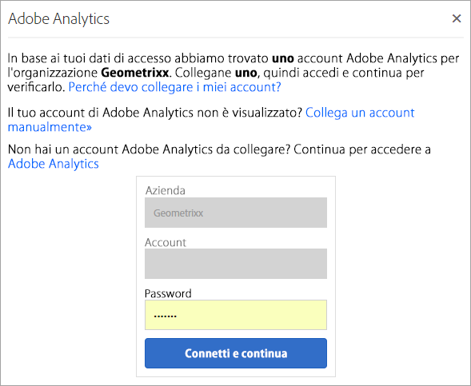

# Organizzazioni in Experience Cloud

Un *organizzazione* (ID organizzazione) è l&#39;entità che consente all&#39;amministratore di configurare gruppi e utenti e di controllare il single sign-on in Experience Cloud.

L’organizzazione funziona come un’azienda che può effettuare un log-in che comprende tutti i prodotti e le applicazioni Experience Cloud. Nella maggior parte dei casi, un’organizzazione è il nome dell’azienda. Tuttavia, un’azienda può avere più organizzazioni.

Per verificare di aver effettuato l&#39;accesso all&#39;organizzazione corretta, fare clic su **[!UICONTROL Profilo]** per visualizzare il nome dell&#39;organizzazione predefinita. Se hai accesso a più organizzazioni, puoi anche visualizzare e passare a un’altra organizzazione nella barra dell’intestazione.

>[!NOTE]
>
>Il passaggio tra le organizzazioni consente di accedere ad Admin Console per quell’organizzazione specifica. Se l’organizzazione desiderata non viene visualizzata nell’elenco, potrebbe essere necessario richiedere l’accesso a un amministratore dell’organizzazione. Se hai bisogno di unire più istanze di Admin Console, contatta l’Assistenza clienti di Adobe per ricevere assistenza.

## Federated ID

Se la tua organizzazione usa Federated ID, Experience Cloud ti consente accedere in modalità single sign-on, senza inserire l’indirizzo e-mail e la password. Aggiungi `#/sso:@domain` all’URL di Experience Cloud (`https://experience.adobe.com`) per eseguire questa attività.

Ad esempio, per un’organizzazione con Federated ID e il dominio `adobecustomer.com`, imposta il link dell’URL su `https://experience.adobe.com/#/sso:@adobecustomer.com`. Puoi anche passare direttamente a una specifica applicazione salvando come segnalibro o preferito l’URL seguito dal percorso dell’applicazione. Ad esempio, per Adobe Analytics: `https://experience.adobe.com/#/sso:@adobecustomer.com/analytics`.

## Visualizza l&#39;ID organizzazione {#concept_EA8AEE5B02CF46ACBDAD6A8508646255}

Puoi individuare l’ID organizzazione assegnato a scopo di supporto. Puoi verificare di essere nell&#39;organizzazione corretta o cambiare organizzazione utilizzando il selettore **[!UICONTROL Organizzazione]** nell&#39;intestazione.

L’ID organizzazione è l’ID associato all’azienda con provisioning di Experience Cloud. Questo ID è una stringa alfanumerica composta da 24 caratteri, seguita da (deve includere) `@AdobeOrg`.

Per visualizzare l&#39;ID organizzazione e altre informazioni sull&#39;account, utilizzare la scelta rapida da tastiera **Ctrl+i** da qualsiasi pagina in `https://experience.adobe.com`.

**Per visualizzare l&#39;ID organizzazione**

1. In [Experience Cloud](https://experience.adobe.com), premi **Ctrl+i** sulla tastiera.

   

1. In **[!UICONTROL Informazioni utente]**, cerca **[!UICONTROL ID organizzazione corrente]** ed è possibile individuare l&#39;ID organizzazione.

   In alternativa, gli amministratori possono accedere ad Admin Console (passare a [https://adminconsole.adobe.com](https://adminconsole.adobe.com)) e visualizzare l&#39;ID organizzazione nell&#39;URL.

   Ad esempio, nell’URL seguente:

   `https://adminconsole.adobe.com/C538193582390300A495CC9@AdobeOrg/overview`

   L’ID è:

   `C538193582390300A495CC9@AdobeOrg`

## Collegamento di un account applicazione a un Adobe ID {#task_FD389E78640848919E247AC5E95B8369}

In genere, gli amministratori di Experience Cloud concedono l’accesso ad applicazioni e servizi. In rare circostanze, è possibile collegare le credenziali dell’applicazione a un Adobe ID.

1. Segui i passaggi contenuti nell’invito e-mail ad Experience Cloud.

1. Accedi utilizzando il tuo Adobe ID o Enterprise ID.

1. Fare clic sul **[!UICONTROL selettore applicazioni]**. ( ).

   

   Le applicazioni a cui hai accesso sono colorate.

1. Fai clic sull’applicazione desiderata.

   

   Questo tipo di messaggio mostra se fai parte del gruppo appropriato (e disponi dell’autorizzazione per l’applicazione) ma non hai ancora collegato le credenziali del tuo account al tuo Adobe ID.

1. Fai clic su **[!UICONTROL Collega account]**, quindi immetti le tue credenziali.

## Specificare un&#39;organizzazione predefinita {#concept_6A191B42A9874A9780882903BA18F071}

È possibile specificare un&#39;organizzazione predefinita da utilizzare al momento dell&#39;accesso.

1. Nell&#39;intestazione fare clic su **[!UICONTROL Profilo]**, quindi su Preferenze.

1. In [!UICONTROL Generale], selezionare un&#39;organizzazione predefinita.

## Risoluzione dei problemi di collegamento dell&#39;account {#concept_DFCB29A3B4834FC59AA29E0BBA301584}

Assistenza per problemi derivanti dal collegamento dell’account.

In genere, il collegamento dell’account ha esito negativo perché l’Adobe ID è collegato a un utente precedente. Quando non è possibile eseguire il collegamento, prova le seguenti operazioni:

* [Contatta l’Assistenza Adobe](https://experienceleague.adobe.com/?support-solution=General&amp;lang=it#support).
* Durante la risoluzione del problema, accedi all’applicazione con la procedura standard.
