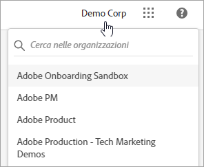
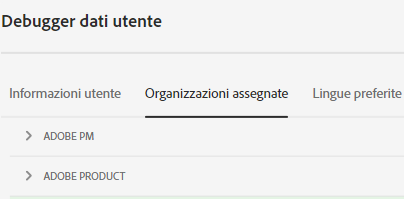
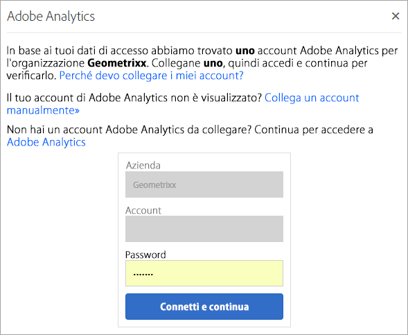

# Organizzazioni e account

Una *organizzazione* (ID organizzazione) è l&#39;entità che consente all&#39;amministratore di configurare gruppi e utenti e di controllare il single sign-on in CX Enterprise.

L&#39;organizzazione funziona come una società di accesso che abbraccia tutti i prodotti e le applicazioni aziendali CX. Nella maggior parte dei casi, un’organizzazione è il nome dell’azienda. Tuttavia, un’azienda può avere più organizzazioni.

Per verificare di aver effettuato l&#39;accesso all&#39;organizzazione corretta, fare clic su **[!UICONTROL Profilo]** per visualizzare il nome dell&#39;organizzazione predefinita. Se hai accesso a più organizzazioni, puoi anche visualizzare e passare a un’altra organizzazione nella barra dell’intestazione.

>[!NOTE]
>
>Il passaggio tra le organizzazioni consente di accedere ad Admin Console per quell’organizzazione specifica. Se l’organizzazione desiderata non viene visualizzata nell’elenco, potrebbe essere necessario richiedere l’accesso a un amministratore dell’organizzazione. Se hai bisogno di unire più istanze di Admin Console, contatta l’Assistenza clienti di Adobe per ricevere assistenza.

## Federated ID

Se la tua organizzazione utilizza Federated ID, CX Enterprise ti consente di accedere con il Single Sign-On della tua organizzazione senza dover immettere l’indirizzo e-mail e la password. Aggiungere `#/sso:@domain` all&#39;URL aziendale CX (`https://experience.adobe.com`) per eseguire questa attività.

Ad esempio, per un’organizzazione con Federated ID e il dominio `example.com`, imposta il link dell’URL su `https://experience.adobe.com/#/sso:@example.com`. Puoi anche passare direttamente a una specifica applicazione salvando come segnalibro o preferito l’URL seguito dal percorso dell’applicazione. Ad esempio, per Adobe Analytics: `https://experience.adobe.com/#/sso:@example.com/analytics`.

### Account guest federati

Puoi abilitare [l&#39;accesso come ospite federato](https://helpx.adobe.com/it/business/enterprise/using/federated-guest-access.html) per autenticare in modo sicuro gli utenti guest nel tuo dominio. Gli utenti possono passare da un account all&#39;altro all&#39;interno dell&#39;organizzazione esistente in qualsiasi pagina di CX Enterprise.

Per passare a un account guest federato, individuare **[!UICONTROL Altri account]** nel menu **[!UICONTROL Organizzazione]** in qualsiasi pagina di [CX Enterprise](https://experience.adobe.com).

## Visualizza l&#39;ID organizzazione

Puoi individuare l’ID organizzazione assegnato a scopo di supporto. Puoi verificare di essere nell&#39;organizzazione corretta o cambiare organizzazione utilizzando il selettore **[!UICONTROL Organizzazione]** nell&#39;intestazione.

L&#39;ID organizzazione è l&#39;ID associato all&#39;azienda con provisioning CX Enterprise. Questo ID è una stringa alfanumerica composta da 24 caratteri, seguita da (deve includere) `@AdobeOrg`.

Per visualizzare l&#39;ID organizzazione e altre informazioni sull&#39;account, utilizzare la scelta rapida da tastiera **Ctrl+i** da qualsiasi pagina in `https://experience.adobe.com`.

**Per visualizzare l&#39;ID organizzazione**

1. In [CX Enterprise](https://experience.adobe.com), premere **Ctrl+i** sulla tastiera.

   

1. In **[!UICONTROL Informazioni utente]**, cerca **[!UICONTROL ID organizzazione corrente]** ed è possibile individuare l&#39;ID organizzazione.

   In alternativa, gli amministratori possono accedere ad Admin Console (passare a [https://adminconsole.adobe.com](https://adminconsole.adobe.com)) e visualizzare l&#39;ID organizzazione nell&#39;URL.

   Ad esempio, nell’URL seguente:

   `https://adminconsole.adobe.com/C538193582390300A495CC9@AdobeOrg/overview`

   L’ID è:

   `C538193582390300A495CC9@AdobeOrg`

## Collegamento di un account applicazione a un Adobe ID

In genere, gli amministratori di CX Enterprise concedono l&#39;accesso ad applicazioni e servizi. In rare circostanze, è possibile collegare le credenziali dell’applicazione a un Adobe ID.

1. Segui i passaggi contenuti nell&#39;e-mail di invito a CX Enterprise.

1. Accedi utilizzando il tuo Adobe ID o Enterprise ID.

1. Fare clic sul **[!UICONTROL selettore applicazioni]**. ( ).

   

   Le applicazioni a cui hai accesso sono colorate.

1. Fai clic sull’applicazione desiderata.

   

   Questo tipo di messaggio mostra se fai parte del gruppo appropriato (e disponi dell’autorizzazione per l’applicazione) ma non hai ancora collegato le credenziali del tuo account al tuo Adobe ID.

1. Fai clic su **[!UICONTROL Collega account]**, quindi immetti le tue credenziali.

## Specificare un&#39;organizzazione predefinita

È possibile specificare un&#39;organizzazione predefinita da utilizzare al momento dell&#39;accesso.

1. Nell&#39;intestazione fare clic su **[!UICONTROL Profilo]**, quindi su Preferenze.

1. In [!UICONTROL Generale], selezionare un&#39;organizzazione predefinita.

## Risoluzione dei problemi di collegamento dell&#39;account

Assistenza per problemi derivanti dal collegamento dell’account.

In genere, il collegamento dell’account ha esito negativo perché l’Adobe ID è collegato a un utente precedente. Quando non è possibile eseguire il collegamento, prova le seguenti operazioni:

* [Contatta l’Assistenza Adobe](https://experienceleague.adobe.com/it?support-solution=General&lang=it#support).
* Durante la risoluzione del problema, accedi all’applicazione con la procedura standard.

