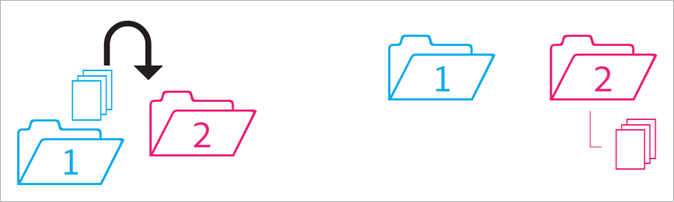

# Comportamento delle cartelle condivise

Regole per il comportamento delle cartelle condivise in caso di spostamento, eliminazione e ripristino delle stesse.

>[!NOTE]
>
>Le cartelle e le risorse condivise di Experience Cloud si riflettono sul desktop di Creative Cloud in una relazione 1:1. Se un utente di Experience Cloud modifica una cartella (elimina, aggiunge o rimuove condivisioni) l&#39;azione si riflette sul desktop e sul Web di Creative Cloud. Di conseguenza, se una cartella non è più condivisa, la cartella e le relative risorse vengono eliminate dal computer locale. Una volta rimossa la condivisione, la cartella e il suo contenuto vengono spostati nel cestino del computer locale, dal quale è possibile ripristinarli manualmente in locale.

## Cartella non condivisa in una cartella condivisa {#section_A9BAC1A244A246A984AC62660E61E0C0}

Sposti una cartella non condivisa in una cartella condivisa:

**Risultato**: entrambe le cartelle vengono condivise.

## Cartella condivisa in una cartella non condivisa {#section_8BA83001DCEC4CF084B980C4A660F59A}

Sposti una cartella condivisa in una cartella non condivisa.

**Risultato**: la cartella non condivisa rimane non condivisa. La cartella condivisa rimane condivisa.

## Contenuto di una cartella non condivisa in una cartella condivisa {#section_2941ED0DC52E4573AC1AB4C22313DD8E}

Sposti il contenuto di una cartella non condivisa in una cartella condivisa.

**Risultato:** il contenuto ora è condiviso e tutti i collaboratori possono visualizzarlo. Lo spazio di archiviazione usato aumenta in base alla dimensione del contenuto.

## Contenuto condiviso archiviato ed eliminato {#section_5210D5F4943A44D0BA675D8EB4EAE20F}

Archivi o elimini il contenuto di una cartella condivisa.

**Risultato:** il contenuto viene archiviato per il proprietario della cartella. I collaboratori che non possiedono il contenuto non potranno più accedervi.

## Contenuto di proprietà condiviso in una cartella non condivisa {#section_3810A364B67E4B8C9CA244BC52BF91BB}

Sposti il contenuto da una cartella condivisa di tua proprietà a una cartella non condivisa.

**Risultato:** il contenuto non è più condiviso. I collaboratori della cartella condivisa non hanno più accesso al contenuto.

## Contenuto non di proprietà in una cartella non condivisa {#section_310766EBF0DC4C0BB4AB3E8A4DAEBE07}

Sposti il contenuto da una cartella condivisa di proprietà di un altro utente a una cartella non condivisa.

**Risultato:** il contenuto viene visualizzato nella cartella non condivisa e rimosso dalla cartella condivisa. I collaboratori della cartella condivisa non hanno più accesso al contenuto. Il contenuto viene archiviato per il proprietario della cartella condivisa.

I proprietari e gli editor possono spostare contenuti di cui non sono proprietari; gli utenti con sole autorizzazioni di visualizzazione non possono effettuare tali spostamenti. Se i proprietari e gli editor spostano i contenuti, questi non saranno disponibili in una cartella condivisa per alcun utente.

## Cartella di proprietà archiviata o eliminata {#section_B314B13512A5409C87C49DFDB7602E14}

Archivi (via web) o elimini (via desktop) una cartella condivisa di tua proprietà.

**Risultato:** la cartella non è più condivisa e viene quindi archiviata. I collaboratori non hanno più accesso alla cartella.

## Cartella condivisa in un’altra cartella condivisa {#section_0A3F203D048D4D1586E9850DC92C51E9}

Sposti una cartella condivisa di tua proprietà in un’altra cartella condivisa, che sia di tua proprietà o meno.

**Risultato:** quando la cartella viene spostata nella seconda cartella, viene condivisa con i nuovi collaboratori.

## Contenuto condiviso in un’altra cartella condivisa {#section_69F6C312792A4CD2831BD14A340F850E}

Sposti il contenuto da una cartella condivisa a un’altra cartella condivisa.

**Risultato:** il contenuto viene visualizzato nella seconda cartella e ora è condiviso con i nuovi collaboratori. Il contenuto viene rimosso dalla prima cartella e il proprietario lo visualizza come archiviato; gli altri collaboratori non possono più accedervi.

## Contenuto ripristinato dall’archivio {#section_DEA990B3581741F89FBB81D18C2AB449}

Ripristini il contenuto da un archivio che apparteneva a una cartella condivisa. Il contenuto era di tua proprietà al momento dell’archiviazione.

**Risultato:** il contenuto viene ripristinato nella cartella condivisa e tutti i collaboratori possono di nuovo accedervi. Se la cartella condivisa non esiste più, il contenuto viene inserito in una copia non condivisa delle cartelle principali originali.
