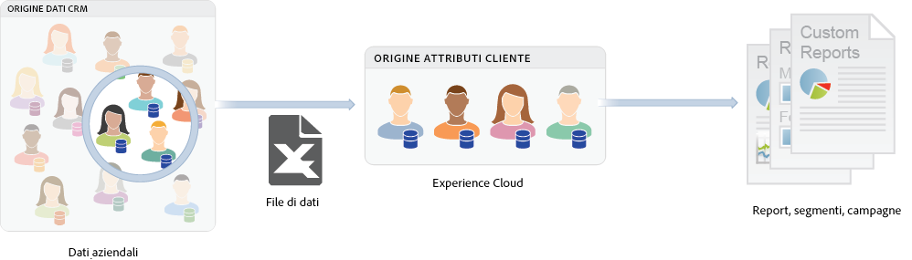

# [!DNL Customer Attributes] nell’Experience Cloud

[!DNL Customer Attributes] in Experience Cloud consente di caricare i dati aziendali acquisiti da un database di gestione delle relazioni con i clienti (CRM). Puoi caricare i dati in un’origine dati di attributi cliente in Experience Cloud, quindi utilizzarli in [!DNL Adobe Analytics] e [!DNL Adobe Target].

## Individua il [!DNL Customer Attributes] funzionalità

1. Accedere a Experience Cloud.

1. Accedi a **[!DNL Experience Platform]** > **[!UICONTROL Persone]** > **[!UICONTROL Attributi del cliente]**.

## Prerequisiti per il caricamento [!DNL Customer Attributes] {#section_BD38693AFBF34926BA28E964963B4EA0}

* **Abilitazione della soluzione:** [abilita le soluzioni per i servizi Experience Platform](core-services.md#concept_07ED1D5C64234E77976E6D572E78FB9C).

* **Iscrizione al gruppo:** per caricare dati di Attributi del cliente, gli utenti devono essere membri del [gruppo Attributi del cliente](admin-getting-started.md#task_3295A85536BF48899A1AB40D207E77E9). Devi anche appartenere a un gruppo Adobe Analytics o Adobe Target.

  Per sapere se l&#39;azienda ha accesso a Attributi del cliente, l&#39;amministratore [!DNL Experience Cloud] deve effettuare l&#39;accesso a [Experience Cloud](https://experience.adobe.com). Vai a **[!UICONTROL Amministrazione]** > **[!UICONTROL Admin Console]** > **[!UICONTROL Prodotti]**. Se *[!DNL Customer Attributes]* viene visualizzato come uno dei [!UICONTROL profili di prodotto], sei pronto per iniziare.

  Utenti aggiunti a [!DNL Customer Attributes] vedi la [!UICONTROL Attributi del cliente] voce di menu sul lato sinistro dell&#39;interfaccia Experience Cloud.

* Qualsiasi versione di `at.js` o la versione 58 o successiva di `mbox.js` di **Adobe Target** sono necessarie per Attributi del cliente.

  Consulta [Come distribuire at.js](https://experienceleague.adobe.com/docs/target-dev/developer/client-side/overview.html?lang=en).

## Cosa sono i dati cliente Enterprise? {#section_6F34C29F11414842AA57D2B1248FA3C6}

I dati Enterprise risiedono in altri sistemi. Possono risultare complessi e diversi a seconda delle persone. Questi dati includono informazioni come appartenenze, livello di fedeltà, età, genere, prodotti posseduti, interessi e lifetime value.

L&#39;immagine seguente è un esempio di un file di dati che mostra i dati dell&#39;utente con sottoscrizione per prodotti, inclusi gli ID membro, i prodotti autorizzati, i prodotti più lanciati e così via.

Dopo aver generato il file dati, puoi caricarlo nell’origine di Attributi del cliente creata in **[!UICONTROL Experience Cloud]** > **[!UICONTROL Attributi del cliente]**.

Consulta [Caricamento dei dati degli attributi del cliente](t-crs-usecase.md#task_BCC327B2A0EF4A1BBB2934013AB92B78) per conoscere questo flusso di lavoro.

## Esempi di Attributi del cliente in Analytics e Target {#section_4E77650F6CEE4C4ABCD0B3221A5AE5D9}

Una volta che i dati sono presenti in Experience Cloud, puoi personalizzarli e condividerli con soluzioni per reporting, segmentazione, attività e campagne.

Esempio:

| Soluzione | Vantaggi e casi d&#39;uso |
|--- |--- |
| Adobe Analytics | Gli esperti di marketing e gli analisti sono pienamente consapevoli dei seguenti fatti:<ul><li>Le campagne online sono più efficaci con i tuoi clienti di livello Gold.</li><li>Quali sono i prodotti ricercati dai clienti di livello gold rispetto a clienti di livello platinum.</li><li>Se la nuova progettazione del tuo sito web sta avendo un impatto positivo sui tassi di conversione per i clienti meno recenti.</li><li>Quali sono i prodotti più ricercati nel sito dai clienti con un valore lifetime basso.</li></ul> |
| Adobe Target | I dati attributo consentono agli utenti di Adobe Target di:<ul><li>Mostrare sconti e offerte speciali ai membri del club fedeltà.</li><li>Consigliare prodotti più costosi ai clienti di lusso.</li><li>Per i clienti che già ricevono le e-mail, inserisci un&#39;offerta di upselling nello spazio normalmente riservato alle iscrizioni e-mail.</li></ul> |

{style="table-layout:auto"}
