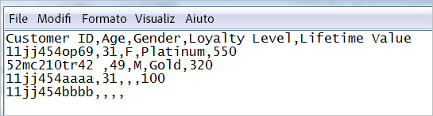

# Informazioni sui file di dati e le origini dati per gli attributi del cliente

Requisiti del file di dati e origini dati multiple per il caricamento degli attributi del cliente in Experience Cloud.

Dovrai disporre dell&#39;accesso a CRM o a dati simili dal proprio enterprise. I dati da caricare in Experience Cloud devono essere un file [!DNL .csv]. Se effettui il caricamento mediante FTP o sFTP, puoi caricare anche un file [!DNL .fin].

La funzione Attributi del cliente è progettata per gestire alcuni file al giorno. Per limitare il problema di avere numero elevato di file di piccole dimensioni a ritardare l’elaborazione, i file inviati nei 30 minuti di una batch precedente della stessa organizzazione vengono indirizzati a una coda di priorità inferiore.

<!-- <p>Articulate difference between this and SAINT. </p> -->

## Tipi di file consentiti e requisiti per la denominazione {#section_6F64FA02ACCC4215B0862CB6A1821FBF}


<table id="table_C27955F6B52A45B28BEEAAF14FFC86D8"> 
 <thead> 
  <tr> 
   <th colname="col1" class="entry"> Tipo file </th> 
   <th colname="col2" class="entry"> Descrizione </th> 
  </tr> 
 </thead>
 <tbody> 
  <tr> 
   <td colname="col1"> <p> <span class="filepath"> .csv </span> </p> </td> 
   <td colname="col2"> <p>Un file con valori separati da file (come quello creato in Excel). Questo è il file che contiene i dati attributo cliente. </p> <p> <b>Requisiti per la denominazione:</b> verifica che le estensioni del nome del file non contengano spazi. </p> </td> 
  </tr> 
  <tr> 
   <td colname="col1"> <p> <span class="filepath"> .fin </span> </p> </td> 
   <td colname="col2"> <p>(Necessario) Il file <span class="filepath">.fin</span> informa il sistema che il caricamento dei dati è terminato. Il nome del file <span class="filepath">.fin</span> deve corrispondere al nome del file <span class="filepath">.csv</span>. </p> <p>Adobe consiglia di creare un file di testo vuoto con estensione <span class="filepath">.fin</span>. Un file vuoto consente di risparmiare spazio e tempi per il caricamento. </p> <p> <p>Nota: non puoi rinominare un file <span class="filepath">.fin</span> dopo averlo caricato. Devi caricare il file <span class="filepath">.fin</span> separatamente e non può essere un file caricato precedentemente e rinominato. </p> </p> <p>Dopo aver caricato il file <span class="filepath">.fin</span> nell'FTP degli attributi del cliente, il sistema recupera i dati velocemente (in un minuto). In questo si distingue da altri sistemi Adobe basati su FTP, che raccolgono i dati meno frequentemente (una volta all'ora circa). </p> <p>Il file <span class="filepath">.fin</span> non è necessario quando si utilizza il metodo di caricamento di trascinamento della selezione. </p> </td> 
  </tr> 
  <tr> 
   <td colname="col1"> <p> <span class="filepath"> .gz</span> o <span class="filepath">.zip </span> </p> </td> 
   <td colname="col2"> <p> <span class="filepath"> .gz</span> (gzip) o <span class="filepath">.zip</span> - per file compressi. Un file <span class="filepath">.zip</span> non può contenere più di un file nell'archivio. </p> <p> <b>Requisiti per la denominazione:</b> il nome del file <span class="filepath">.zip</span> o <span class="filepath">.gz</span> deve corrispondere al nome del file <span class="filepath">.csv </span>. Ad esempio, se il nome del file <span class="filepath">.csv</span> è <span class="filepath">crm_small.csv</span>, il file <span class="filepath">.zip</span> deve essere denominato <span class="filepath">crm_small.csv.zip </span>. </p> <p>Il file .fin deve corrispondere al file .csv. </p> </td> 
  </tr> 
 </tbody> 
</table>


## Requisiti per i file di dati degli attributi {#section_169FBF5B7BBA47CE825B7A330CF3FE98}


**Esempio CSV**

Il file CSV deve aderire al formato seguente:

CSV di esempio:


Lo stesso file visualizzato in un editor di testo:



**Linee guida**

<table id="table_A9849CC9AA784763921DE057F0F61515"> 
 <thead> 
  <tr> 
   <th colname="col1" class="entry"> Elemento </th> 
   <th colname="col2" class="entry"> Descrizione </th> 
  </tr> 
 </thead>
 <tbody> 
  <tr> 
   <td colname="col1"> <p>Trascinamento della selezione </p> </td> 
   <td colname="col2"> <p>Il file da trascinare deve essere inferiore a 100 MB. </p> <p>Il file <span class="filepath">.fin</span> non è necessario quando si utilizza il metodo di caricamento di trascinamento della selezione. </p> </td> 
  </tr> 
  <tr> 
   <td colname="col1"> <p>Colonna ID cliente </p> </td> 
   <td colname="col2"> <p> La prima colonna deve essere un ID cliente univoco. L'ID usato deve corrispondere all'ID passato al servizio Experience Cloud ID. </p> <p>Per Analytics, l'ID archiviato in una prop o eVar. </p> <p>Per Target, il valore setCustomerID (Consulta <a href="../core-services/core-services.md#section_AD473A6A21C1446498E700363F9A8437" format="dita" scope="local">Analytics e Target - Sincronizzazione dell'ID cliente </a>) </p> <p> Questo ID cliente è l'unico identificatore che CRM usa per ciascuna persona nel database. Le colonne rimanenti sono attributi derivanti da CRM. Dovrai scegliere quanti attributi caricare. </p> <p>Si consiglia l'utilizzo di nomi semplici e facili da leggere per l'intestazione della colonna, ma ciò non è obbligatorio. Quando si convalida lo schema per il caricamento, puoi mappare i nomi alle righe e alle colonne caricate. </p> <p> <b>Gli ID cliente</b> </p> <p>Solitamente, un'azienda usa un ID cliente da un sistema CRM. Tale ID viene impostato usando la chiamata <span class="codeph">setCustomerIDs</span> quando una persona effettua l'accesso. Questo ID viene anche usato come chiave nel file CRM che viene caricato in Experience Cloud. Un <a href="../attributes/t-crs-usecase.md#task_09DAC0F2B76141E491721C1E679AABC8" format="dita" scope="local"> ID alias</a> è un nome semplificato per i dati archiviati in Audience Manager, dove vengono archiviati i dati alias. Il sistema invia alias a tale archivio dati (tramite setCustomerIDs). Il file CRM viene applicato ai dati presenti nell'archivio dati. </p> <p>Per informazioni su <span class="codeph">setCustomerIDs</span> consulta <a href="https://marketing.adobe.com/resources/help/it_IT/mcvid/?f=mcvid-authenticated-state" format="https" scope="external">ID cliente e stati di autenticazione </a>. </p> </td> 
  </tr> 
  <tr> 
   <td colname="col1"> <p>Intestazioni e colonne successive </p> </td> 
   <td colname="col2"> <p>Le intestazioni successive devono rappresentare il nome di ciascun attributo. </p> <p> Queste colonne devono contenere gli attributi del cliente derivanti dal CRM. </p> </td> 
  </tr> 
  <tr> 
   <td colname="col1"> <p>Limiti attributi </p> </td> 
   <td colname="col2"> <p>In Experience Cloud, nel servizio attributo cliente puoi caricare centinaia di colonne <span class="filepath">.csv</span>. Durante la configurazione delle sottoscrizioni e la selezione degli attributi vengono tuttavia applicate le seguenti limitazioni, in base alle soluzioni che possiedi: </p> <p> 
     <ul id="ul_2BB85067918D4BB3B59394F3E3E37A6D"> 
      <li id="li_93703988B9934384B4B94A839D028380"> <b>Analytics Standard</b>: 3 in totale </li> 
      <li id="li_D1E5E7BD24C54591B14D15DE97447835"> <b>Analytics Premium</b>: 200 per suite di report </li> 
      <li id="li_8C891FE3D1EF49FA9F81E2E32CD0B9CA"> <b>Target Standard:</b> 5 </li> 
      <li id="li_2B66D43023F34EA685CE2C38A9250CEA"> <b>Target Premium:</b> 200 </li> 
     </ul> </p> </td> 
  </tr> 
  <tr> 
   <td colname="col1"> <p>Limiti riga </p> </td> 
   <td colname="col2"> <p>Non c'è alcun limite noto per il numero di righe. </p> </td> 
  </tr> 
  <tr> 
   <td colname="col1"> <p>Limiti colonna </p> </td> 
   <td colname="col2"> <p>Per praticità, limita il numero delle colonne a circa 200. </p> </td> 
  </tr> 
  <tr> 
   <td colname="col1"> <p>Limiti caratteri </p> </td> 
   <td colname="col2"> <p>Quando si crea una sottoscrizione Analytics, le lunghezze dei campi per i file caricati vengono troncate a 255. </p> </td> 
  </tr> 
  <tr> 
   <td colname="col1"> <p>Linee guida e limiti di dimensioni per FTP </p> </td> 
   <td colname="col2"> <p> 
     <ul id="ul_E157EE6F98914EADA0C103D1D1E705D3"> 
      <li id="li_84FBD455DD164A28AC16F4A5AB19E4B3">La dimensione massima del file per l’FTP è 4 GB per ciascun caricamento. </li> 
      <li>La dimensione minima del file è di 10 MB per ogni caricamento. </li>
      <li>puoi caricare un file ogni mezz’ora. </li>
      <li id="li_B69A20C51D824727AA99C1F6F78537A4"> Devi rilasciare il file <span class="filepath">.csv</span> (e <span class="filepath">.fin</span>) nella cartella root del sito FTP. </li> 
     </ul> </p> <p> <p>Importante: lo spazio totale consentito per l'account FTP è 40 GB. L'eliminazione dei file elaborati è una tua responsabilità. </p> </p> </td> 
  </tr> 
  <tr> 
   <td colname="col1"> <p>Requisiti del file </p> </td> 
   <td colname="col2"> <p> Ciascuna fonte attributo deve contenere lo stesso numero di campi separati da virgola. </p> <p> I campi contenenti un'interruzione di riga, virgolette o virgole devono essere citati. </p> <p> Le virgolette in un campo devono essere precedute da una barra rovesciata (\). </p> <p> Le colonne vuote vengono archiviate come <span class="term"> nulle </span>. </p> </td> 
  </tr> 
  <tr> 
   <td colname="col1"> <p>File multipli </p> </td> 
   <td colname="col2"> <p>Durante il caricamento dei dati dell’attributo del cliente, se devi caricare diversi file in rapida successione, in particolare se sono di grandi dimensioni, accertati che il file precedente sia stato elaborato prima di caricare il file successivo. Puoi monitorare questa situazione verificando se il file precedente è stato spostato nella cartella dei file elaborati o in quella dei non elaborati all’interno dell’account FTP degli attributi del cliente. </p> <p> La suddivisione di un file di grandi dimensioni in file più piccoli inviandoli in rapida successione potrebbe rallentare l’elaborazione, se non ti assicuri che ogni file sia elaborato completamente prima di inviare quello successivo. </p> </td> 
  </tr> 
  <tr> 
   <td colname="col1"> <p>Codifica dei caratteri </p> </td> 
   <td colname="col2"> <p>Per il Giappone, è obbligatoria la codifica UTF-8. </p> </td> 
  </tr> 
   <tr> 
   <td colname="col1"> <p>Dati presenti nella cronologia </p> </td> 
   <td colname="col2"> <p> In Analytics, gli attributi del cliente sono legati al profilo del visitatore sottostante. Pertanto, in Analytics, gli attributi del cliente sono associati al visitatore per l'intero ciclo di vita di tale profilo del visitatore. Ciò include i comportamenti che si sono verificati prima del primo accesso del cliente. </p> <p> Se usi il metodo di recupero di informazioni del data warehouse, i dati vengono legati a post_visid_high/low che si basa sull'Analytics ID (AID). Se utilizzi un servizio Experience Cloud ID, i dati vengono collegati a post_visid_high/low che si basa sul Experience Cloud ID (MID). </p> </td> 
  </tr> 
  <tr> 
   <td colname="col1"> <p>Feed dati </p> </td> 
   <td colname="col2"> <p>Gli attributi del cliente non sono disponibili nei feed dati. </p> </td> 
  </tr> 
 </tbody> 
</table>


## Utilizzo di più origini dati {#section_76DEB6001C614F4DB8BCC3E5D05088CB}

Quando crei, modifichi o elimini le origini attributo del cliente, si verifica un ritardo di circa un&#39;ora prima della effettiva sincronizzazione degli ID con la nuova origine dati.

L&#39;ID alias per ciascuna origine attributo cliente deve essere univoco. Se hai più origini dati che corrispondono allo stesso ID, devi impostarle come indicato di seguito:

**In VisitorAPI.js o nello strumento Experience Cloud ID in Dynamic Tag Management:**

Imposta due ID cliente corrispondenti alle origini dati appropriate:

```
Visitor.setCustomerIDs({ 
     "ds_id1”:"123456", 
     "ds_id2":"123456" 
});
```

(Consulta [ID cliente e stati di autenticazione](https://marketing.adobe.com/resources/help/it_IT/mcvid/?f=mcvid_customer_ids) per ulteriori informazioni.)

In **[!UICONTROL Experience Cloud]** &gt; **[!UICONTROL Persone]** &gt; **[!UICONTROL Attributi del cliente]**:

Crea due origini attributo del cliente con ID alias univoci corrispondenti agli ID cliente sopra. Questo metodo consente di inviare lo stesso ID riferimento a più origini attributo del cliente
