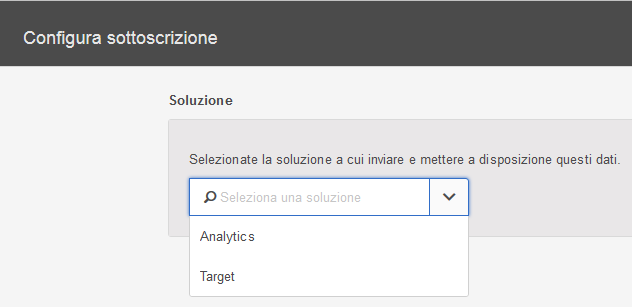

# Configurazione delle sottoscrizioni

Scopri le origini di dati della soluzione e la configurazione delle sottoscrizioni. Le sottoscrizioni consentono il flusso di dati dell'attributo cliente tra Experience Cloud e le soluzioni (Analytics e Target).

Ad esempio, una sottoscrizione Adobe Analytics abilita i dati degli attributi nei report. Se usi Adobe Target, puoi caricare gli attributi del cliente per l'impostazione della destinazione e la segmentazione.

**[!UICONTROL Origine attributo del cliente]** &gt; **[!UICONTROL Crea nuova origine attributo del cliente]** &gt; **[!UICONTROL Nuovo]**

| Elemento | Descrizione |
|--- |--- |
| Soluzione | **Adobe Analytics** Seleziona Analytics e specifica la suite di rapporti in cui vuoi ricevere i dati degli attributi e gli attributi da includere. **Adobe Target** Puoi caricare gli attributi del cliente per l’impostazione della destinazione e la segmentazione. Questa funzionalità è utile se vuoi destinare un test sulla base di dati di attributi o se vuoi rendere disponibili i dati per la segmentazione in Analytics. I dati dell'attributo del cliente caricato per un visitatore è disponibile all'accesso, in **Target** &gt; **Audience**. Sono supportate più origini di dati. Quando [imposti gli ID cliente](../core-services/core-services.md) sul tuo sito Web, verifica che almeno uno degli alias sia iscritto a Target. |
| Suite di rapporti (Analytics) | Le suite di rapporti da Analytics. Non puoi aggiungere più di 10 suite di rapporti alle sottoscrizioni di Analytics in un'unica origine attributo. Quando scegli quale suite di rapporti includere, prendi in considerazione i seguenti suggerimenti:<ul><li>Scegli suite di rapporti che hanno un set comune di clienti autenticati. Se i clienti autenticati in una suite di rapporti non superano i clienti autenticati in un'altra suite di rapporti, separa queste suite di rapporti in diverse origini attributi.</li><li>Se possibile, le suite di rapporti incluse in un'origine attributo devono avere lo stesso volume di traffico.</li></ul> Se hai più di 10 suite di rapporti con un set di clienti autenticati simile, puoi configurare altre origini attributi cliente, ciascuna con al massimo 10 suite di rapporti. |
| Attributi da includere (Analytics e Target) | Gli attributi che desiderate inviare alla soluzione.  Durante la configurazione delle sottoscrizioni e la selezione degli attributi, si applicano i seguenti limiti per suite di rapporti, a seconda delle soluzioni che possedete:<ul><li>Foundation: 0</li><li>Select: 3</li><li>Prime: 15</li><li>Ultimate: 200</li><li>Standard: 3 totali</li><li>Premium: 200 per suite di report</li><li>Target Standard: 5</li><li>Target Premium: 200</li></ul> **Nota:** quando esegui l'aggiornamento ad Analytics Premium, si verifica un ritardo di 24 ore prima che gli attributi aggiuntivi siano disponibili. Potresti visualizzare un errore Sottoscrizione attributi max durante questo ritardo. |
