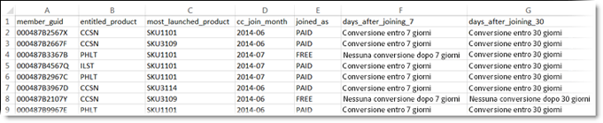
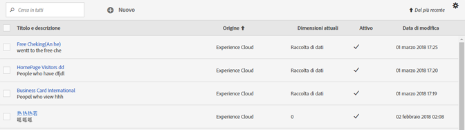
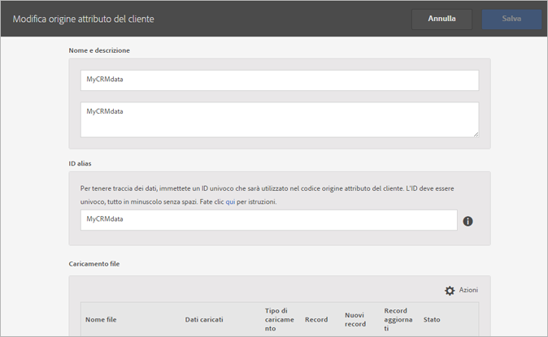
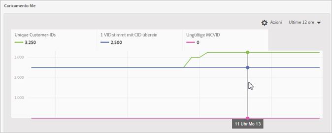
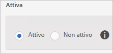
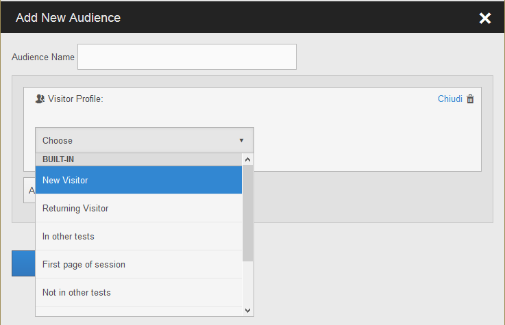

# Creazione di una sorgente attributo cliente e caricamento del file di dati

Creazione della sorgente attributo cliente (file CSV e FIN) e caricamento dei dati. Puoi attivare l&#39;origine dati quando lo desideri. Quando la sorgente dati è attiva, condividi i dati attributo in Analytics e Target.

## Flusso di lavoro attributi cliente {#concept_BF0AF88E9EF841219ED4D10754CD7154}


1. [Creazione di un file di dati](../attributes/t-crs-usecase.md#task_B5FB8C0649374C7A94C45DCF2878EA1A)
1. [Creazione di una sorgente attributo e caricamento del file di dati](../attributes/t-crs-usecase.md#task_09DAC0F2B76141E491721C1E679AABC8)
1. [Convalida dello schema](../attributes/t-crs-usecase.md#task_09DAC0F2B76141E491721C1E679AABC8)
1. [Configurazione delle sottoscrizioni e attivazione dell&#39;origine attributo](../attributes/t-crs-usecase.md#task_1ACA21198F0E46A897A320C244DFF6EA)

Dopo l&#39;attivazione dell&#39;origine dati puoi:

* [Utilizzo degli Attributi del cliente in Adobe Analytics](../attributes/t-crs-usecase.md#task_7EB0680540CE4B65911B2C779210915D)
* [Utilizzo degli Attributi del cliente in Adobe Target](../attributes/t-crs-usecase.md#task_FC5F9D9059114027B62DB9B1C7D9E257)

>[!IMPORTANT]
>
>Per accedere a questa funzione, gli utenti devono essere assegnati al profilo di prodotto Attributi del cliente (Attributi del cliente - Accesso standard). Vai a **[!UICONTROL Amministrazione]** > **[!UICONTROL Admin Console]** > **[!UICONTROL Prodotti]**. Se *Attributi del cliente* compare in uno dei [!UICONTROL Profili del prodotto], puoi iniziare. Gli utenti che vengono aggiunti al gruppo Attributi del cliente visualizzeranno il menu [!UICONTROL Attributi del cliente] presente sul lato sinistro dell&#39;interfaccia Experience Cloud.
>
>Per utilizzare la funzione Attributi del cliente, gli utenti devono appartenere anche a gruppi a livello di soluzione (Analytics o [!DNL Target]).

Consulta [Gestione di utenti e prodotti Experience Cloud](../admin-getting-started/admin-getting-started.md#task_3295A85536BF48899A1AB40D207E77E9).

## Creazione di un file di dati {#task_B5FB8C0649374C7A94C45DCF2878EA1A}

Questi dati sono dati aziendali dei clienti provenienti dal tuo sistema di gestione delle relazioni con i clienti. Possono includere i dati degli utenti con sottoscrizione relativi ai prodotti, inclusi ID membro, prodotti autorizzati, prodotti più lanciati e così via.

1. Crea un `.csv`.

   >[!NOTE]
   >
   >Successivamente in questa procedura, trascinerai il `.csv` per caricare il file. Tuttavia, se [effettui il caricamento tramite FTP](../attributes/t-upload-attributes-ftp.md#task_591C3B6733424718A62453D2F8ADF73B), serve anche un file `.fin` con la stessa denominazione del file `.csv`.

   Esempio di un file di dati di un cliente aziendale:

   

1. Prima di continuare, controlla le informazioni importanti in [Requisiti dei file di dati](../attributes/crs-data-file.md#concept_DE908F362DF24172BFEF48E1797DAF19) prima di caricare il file.
1. [Crea un&#39;origine attributo del cliente e carica il di dati](../attributes/t-crs-usecase.md#task_BCC327B2A0EF4A1BBB2934013AB92B78) come descritto.

## Creazione di una sorgente attributo cliente e caricamento del file di dati {#task_09DAC0F2B76141E491721C1E679AABC8}

Segui questi passaggi nella pagina Crea nuova origine attributo del cliente in Experience Cloud.

>[!IMPORTANT]
>
>Quando crei, modifichi o elimini origini attributo del cliente, si verifica un ritardo di circa un&#39;ora prima della effettiva sincronizzazione degli ID con la nuova origine dati. Devi disporre di diritti di amministratore in Audience Manager per creare o modificare origini degli attributi del cliente. Contatta l&#39;Assistenza clienti o la consulenza di Audience Manager per ottenere i diritti di amministratore.

1. In [!DNL Experience Cloud], fai clic sull&#39;icona Menu .
1. In **[!DNL Experience Platform]**, fai clic su **[!UICONTROL Persone]** > **[!UICONTROL Attributi del cliente]**.

   La pagina [!UICONTROL Attributi del cliente] è il luogo in cui puoi gestire e modificare l&#39;origine dati degli attributi esistenti.

   
1. Fai clic su **[!UICONTROL Nuovo]**.

   
1. Nella pagina [!UICONTROL Modifica origine attributo del cliente] configura i campi seguenti:

   * **[!UICONTROL Nome:]** un nome descrittivo per l&#39;origine dell&#39;attributo dei dati. In [!DNL Adobe Target], i nomi degli attributi non possono includere spazi. Se viene passato un attributo con uno spazio, [!DNL Target] lo ignora. Altri caratteri non supportati sono: `< , >, ', "`.

   * **[!UICONTROL Descrizione:]** (facoltativo) una descrizione per la sorgente attributi dei dati.

   * **[!UICONTROL ID alias:]** rappresenta un&#39;origine dei dati attributo del cliente come specificato nel sistema di gestione delle relazioni con i clienti. Un ID univoco utilizzato nel codice origine attributo del cliente. L&#39;ID deve essere univoco, in lettere minuscole e non deve comprendere spazi. Il valore immesso nel campo ID alias per l&#39;origine attributi del cliente nell&#39;interfaccia utente di Experience Cloud deve corrispondere ai valori ricevuti dall&#39;implementazione (sia tramite Dynamic Tag Management che JavaScript dell&#39;SDK di Mobile).

      L&#39;ID alias corrisponde ad alcune aree in cui puoi impostare valori ID cliente aggiuntivi. Ad esempio:

      * **Dynamic Tag Management:** l&#39;ID alias corrisponde al valore del *Codice di integrazione* in [!UICONTROL Impostazioni cliente], nello strumento del [servizio Experience Cloud ID](https://docs.adobe.com/content/help/it-IT/dtm/using/tools/macid.html).

      * **API visitatore:** l&#39;ID alias corrisponde agli [ID cliente](https://docs.adobe.com/content/help/it-IT/id-service/using/reference/authenticated-state.html) aggiuntivi che puoi associare a ogni visitatore.

         Ad esempio, *“crm_ id”* in:

         ```
         "crm_id":"67312378756723456"
         ```

      * **iOS:** l&#39;ID alias corrisponde a *“idType”* in [visitorSyncIdentifiers:identifiers](https://docs.adobe.com/content/help/it-IT/mobile-services/ios/overview.html).

         Ad esempio:

         `[ADBMobile visitorSyncIdentifiers:@{@<`**`"idType"`**`:@"idValue"}];`

      * **Android:** l&#39;ID alias corrisponde a *“idType”* in [syncIdentifiers](https://docs.adobe.com/content/help/it-IT/mobile-services/android/overview.html).

         Ad esempio:

         `identifiers.put(`**`"idType"`**`, "idValue");`

         Consulta [Utilizzo di più origini dati](../attributes/crs-data-file.md#section_76DEB6001C614F4DB8BCC3E5D05088CB) per ulteriori informazioni sull&#39;elaborazione dei dati in merito al campo ID alias e agli ID cliente.
   * **[!UICONTROL Caricamento file:]** puoi trascinare il file di dati `.csv` o caricare i dati tramite FTP. (Con un FTP serve anche un file `.fin`.) Consulta [Caricamento dei dati tramite FTP](../attributes/t-upload-attributes-ftp.md#task_591C3B6733424718A62453D2F8ADF73B).

      >[!IMPORTANT]
      >
      >Esistono dei requisiti del file di dati specifici. Consulta [Requisiti dei file di dati](../attributes/crs-data-file.md#concept_DE908F362DF24172BFEF48E1797DAF19) per ulteriori informazioni.


      Dopo aver caricato il file, i dati della tabella vengono visualizzati nell&#39;intestazione [!UICONTROL Caricamento file] di questa pagina. È possibile convalidare lo schema, configurare sottoscrizioni o impostare l&#39;FTP.

      **Grafico caricamento del file**

      

   * **[!UICONTROL ID cliente univoco:]** mostra quanti ID univoci hai caricato in questa origine attributo.

   * **[!UICONTROL ID forniti dal cliente come alias degli ID visitatore di Experience Cloud:]** mostra quanti ID sono impostati come alias degli ID visitatore di Experience Cloud.

   * **[!UICONTROL ID forniti dal cliente con soglia degli alias elevata:]** visualizza il numero di ID forniti dal cliente con 500 o più ID visitatore di Experience Cloud con alias. Questi ID forniti dal cliente non rappresentano individui ma accessi condivisi. Il sistema distribuisce gli attributi associati a questi ID ai 500 ID visitatore di Experience Cloud con alias più recenti, fino a raggiungere la soglia di 10.000. Una volta raggiunto tale numero, il sistema invalida l&#39;ID fornito dal cliente e non distribuisce più attributi associati.


## Convalida dello schema {#task_404AAC411B0D4E129AB3AC8B7BE85859}

Il procedimento di convalida consente di mappare i nomi e le descrizioni visualizzati agli attributi caricati (stringhe, interi, numeri e così via). Puoi anche eliminare gli attributi aggiornando lo schema.

Consulta [Convalida dello schema](../attributes/validate-schema.md#concept_B3A01A15D04E4F998118E09B3A9B5043).

Per eliminare gli attributi, consulta [(Facoltativo) Aggiornare lo schema (eliminare gli attributi)](../attributes/t-crs-usecase.md#task_6568898BB7C44A42ABFB86532B89063C).

## (Facoltativo) Aggiornare lo schema (eliminare gli attributi) {#task_6568898BB7C44A42ABFB86532B89063C}

Informazioni su come eliminare e sostituire gli attributi nello schema.

1. Nella pagina [!UICONTROL Modifica origine attributo del cliente], rimuovi la sottoscrizione a **[!UICONTROL Target]** o **[!UICONTROL Analytics]** (in [!UICONTROL Configura sottoscrizioni]).
1. [Carica un nuovo file di dati con campi aggiornati](../attributes/t-crs-usecase.md#task_09DAC0F2B76141E491721C1E679AABC8).

## Configurazione delle sottoscrizioni e attivazione dell&#39;origine attributo {#task_1ACA21198F0E46A897A320C244DFF6EA}

La configurazione di una sottoscrizione imposta il flusso di dati tra Experience Cloud e le soluzioni. L&#39;attivazione della sorgente attributi consente il flusso dei dati verso le soluzioni sottoscritte. I record cliente che hai caricato vengono associati ai segnali ID in entrata provenienti dal sito web o dall&#39;applicazione.

Consulta [Configurazione delle sottoscrizioni](../attributes/subscription.md#concept_ECA3C44FA6D540C89CC04BA3C49E63BF).

**Per attivare un&#39;origine attributo**

Nella pagina [!UICONTROL Crea nuova [o Modifica] origine attributi del cliente], individua l&#39;intestazione [!UICONTROL Attiva], quindi fai clic su **[!UICONTROL Attivo]**.



## Utilizzo degli Attributi del cliente in Adobe Analytics {#task_7EB0680540CE4B65911B2C779210915D}

Con i dati ora disponibili in soluzioni come Adobe Analytics, puoi creare rapporti sui dati, analizzarli e intraprendere azioni appropriate nelle campagne di marketing.

L’esempio seguente mostra un segmento di [!DNL Analytics] basato sugli attributi caricati. Questo segmento mostra gli utenti con sottoscrizione a [!DNL Photoshop Lightroom] il cui prodotto maggiormente lanciato è Photoshop.


Quando pubblichi un segmento in Experience Cloud, esso diventa disponibile in Experience Cloud Audiences e in Audience Manager.

Consulta [Rapporto sugli attributi del cliente](https://docs.adobe.com/content/help/it-IT/core-services/interface/customer-attributes/attributes.html) nella guida di Analytics per ulteriori informazioni.

## Utilizzo degli Attributi del cliente in Adobe Target {#task_FC5F9D9059114027B62DB9B1C7D9E257}

In [!DNL Target], puoi selezionare un attributo del cliente dalla sezione [!UICONTROL Profilo visitatore] al momento della creazione di un pubblico. Tutti gli Attributi del cliente avranno il prefisso [!DNL crs.] nella lista. Per creare di tipi di pubblico combina questi attributi con altri attributi di dati.



Consulta [Creazione di un nuovo pubblico](https://docs.adobe.com/content/help/it-IT/target/using/audiences/create-audiences/audiences.html) nella guida di [!DNL Target].
