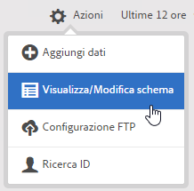
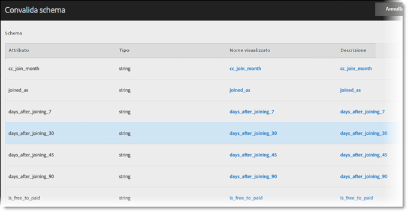

# Convalida dello schema

Il procedimento di convalida consente di mappare i nomi e le descrizioni visualizzati agli attributi caricati (stringhe, interi, numeri e così via). Uno schema viene creato in base a queste impostazioni. Lo schema viene utilizzato per convalidare tutti i dati futuri caricati in questa sorgente dati. Questo processo di mappatura non altera i dati originali.

>[!NOTE]
>
>L&#39;aggiornamento dello schema dopo la convalida elimina gli attributi del cliente. Consulta [Aggiornare lo schema (elimina anche gli attributi)](../attributes/t-crs-usecase.md#task_6568898BB7C44A42ABFB86532B89063C).

**[!UICONTROL Origine degli attributi del cliente]** > **[!UICONTROL Crea nuova origine degli attributi del cliente]** > **[!UICONTROL Visualizza/Modifica schema]**

Nella pagina [!UICONTROL Convalida schema] ciascuna riga dello schema rappresenta una colonna del file CSV caricato.

* **[!UICONTROL Aggiungi dati:]** consente di caricare nuovi dati dell&#39;attributo in questa origine dati.

* **[!UICONTROL Visualizza/Modifica schema:]** consente di mappare i nomi visualizzati ai dati attributo come descritto nel passaggio successivo.

* **[!UICONTROL Configurazione FTP:]** [carica i dati tramite FTP](../attributes/t-upload-attributes-ftp.md#task_591C3B6733424718A62453D2F8ADF73B).

* **[!UICONTROL Ricerca ID:]** immetti un ID cliente (CID) dal file `.csv` per ricercare informazioni di Experience Cloud per l&#39;ID. Questa funzionalità è utile per risolvere i problemi relativi alla mancata visualizzazione dei dati attributo di un visitatore:

   * **[!UICONTROL ECID (Experience Cloud ID):]** indica se stai utilizzando il servizio Experience Cloud ID più recente. Se ti trovi nel servizio MCID ma non è visualizzato alcun ID, significa che Experience Cloud non ha ricevuto un alias per quel CID. Ciò significa che il visitatore non ha effettuato l&#39;accesso o la tua implementazione non trasmette quell&#39;ID.

   * **[!UICONTROL CID (ID cliente):]** gli attributi associati a questo CID. Se stai usando una prop o un&#39;eVar per caricare CID (AVID) e sono visualizzati degli attributi ma nessun AVID, significa che il visitatore non ha effettuato l&#39;accesso al tuo sito.

   * **[!UICONTROL AVID (ID visitatore di Analytics):]** mostra se utilizzi una prop o eVar per caricare CID. Se tali ID vengono passati a Experience Cloud, tutti gli ID visitatore associati al CID che hai immesso vengono visualizzati qui.

Puoi caricare i dati tramite FTP anche dopo la creazione di un&#39;origine attributo del cliente e un account FTP in Experience Cloud. Puoi creare un account FTP per ogni sorgente attributo. I file caricati vengono memorizzati nella cartella root di tale account. I dati devono essere in formato .csv e un secondo file .fin deve indicare il completamento del caricamento.

I nomi applicati a stringhe, interi e numeri vengono utilizzati per creare metriche di [!DNL Analytics]. Consulta [Rapporto sugli attributi del cliente](https://docs.adobe.com/content/help/it-IT/core-services/interface/customer-attributes/attributes.html) nella guida di [!DNL Analytics] per ulteriori informazioni.

* **[!UICONTROL Attributo:]** dati degli attributi letti dal file `.csv` caricato.

* **[!UICONTROL Tipo:]** il tipo di dati, ad esempio:

   * **Stringa:** una sequenza di caratteri.

   * **Interi:** numeri interi.

   * **Numeri:** possono contenere fino a due posizioni decimali.

* **[!UICONTROL Nome visualizzato:]** un nome descrittivo per l&#39;attributo. Ad esempio, puoi rinominare l&#39;attributo *età del cliente* in *Cliente dal*.

* **[!UICONTROL Descrizione:]** una descrizione dell&#39;attributo.
