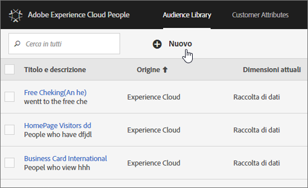

# Tipi di pubblico {#topic_679810123CAA4E0CA4FA3417FB0100C7}

Un tipo di pubblico, o audience, è un insieme di visitatori (un elenco di ID visitatori). I servizi Adobe permettono di gestire la trasformazione dei dati dei visitatori in segmenti di pubblico. La creazione e la gestione dei tipi di pubblico sono simili alla creazione e all'uso dei segmenti, e in più permettono di condividere i segmenti di pubblico in [!DNL Experience Cloud].

Puoi creare o derivare tipi di pubblico da diverse fonti, come ad esempio:

* Fonti nuove create in [!DNL Experience Cloud]
* Da segmenti di [!DNL Analytics] pubblicati in [!DNL Experience Cloud]
* Da [!DNL Audience Manager]

**Tipi di pubblico in tempo reale e basati sullo storico**

Tutti i tipi di pubblico, a prescindere da dove provengono, sono accessibili per l'uso in tempo reale. Tuttavia, i tipi di pubblico condivisi da Analytics ad Audience Manager non sono accessibili per il targeting in tempo reale. Il sistema valuta il pubblico in due modi:

* I dati storici provengono dalle analisi e vengono valutati ogni 12 ore. Questi includono sempre i visitatori ricorrenti.
* I dati in tempo reale provengono dal servizio Experience Cloud Audiences e sono valutati in tempo reale.

## Utilizzo dei tipi di pubblico da parte delle soluzioni {#concept_01EB9345C5344597BC94A864EDD38EE1}

Nella tabella seguente è descritto l'utilizzo dei tipi di pubblico nelle soluzioni Experience Cloud.

| Soluzione | Descrizione |
|--- |--- |
| Experience Cloud Audiences | Crea, gestisci e condividi tipi di pubblico in modo nativo mediante l’interfaccia della [Libreria Pubblico](../audience-library/audience-library.md). È possibile:<ul><li>utilizzare i dati in tempo reale con gli attributi di analisi;</li><li>combinare più tipi di pubblico per creare un pubblico composito, unire dati in tempo reale e dati storici;</li><li>vedere visualizzazioni grafiche della dimensione stimata del pubblico.</li></ul> Per suggerimenti sul tipo di pubblico da creare, consultare: [Experience Cloud Audiences](https://helpx.adobe.com/marketing-cloud-core/kb/People/Audience-Creation-Options.html). |
| Analytics | Durante l'attività di segmentazione, puoi costruire un segmento, combinarlo con una suite di rapporti e quindi  [ pubblicarlo in Experience Cloud](../audience-library/audience-library.md). Il segmento pubblicato viene visualizzato nella pagina [Audiences](../audience-library/audience-library.md). Il tipo di pubblico è inoltre disponibile come pubblico di destinazione per un'esperienza di campagna in Adobe Target e in Audience Manager.   Quando un pubblico viene condiviso da Analytics e selezionato per l'utilizzo in una campagna attiva, tutti i profili visitatore che soddisfano i requisiti di definizione del segmento per i precedenti 90 giorni vengono inviati alla piattaforma dei servizi Audiences di Experience Cloud.   Importante: devi limitare il numero di tipi di pubblico condivisi da Analytics a 20 per evitare ulteriori ritardi di elaborazione. Il pubblico condiviso con Experience Cloud da Analytics non può superare i 20 milioni di membri unici. Inoltre, a causa della cache, sono necessarie 12 ore prima che l'eliminazione delle suite di rapporti di Analytics possa essere visibile in Experience Cloud. |
| Mobile Services | Analisi del traffico mobile mediante la visualizzazione con grafica a raggiera nel report [!UICONTROL Tipi dispositivo]. |
| Target | Il [servizio ID](https://docs.adobe.com/content/help/en/id-service/using/home.html) unisce gli ID visitatore e i dati in un unico profilo utilizzabile tra le varie soluzioni. La casella di controllo [Pubblica in Experience Cloud](../audience-library/audience-library.md), selezionabile in fase di creazione del segmento in Adobe Analytics, permette di rendere disponibile il segmento nella libreria di tipi di pubblico personalizzata di Adobe Target. Puoi utilizzare un segmento creato in Analytics o Audience Manager per attività in Target.  Ad esempio, puoi creare campagne sulla base delle metriche di conversione di Analytics e sui segmenti di pubblico creati in Analytics. |
| Audience Manager | I tipi di pubblico condivisi sono disponibili nella segmentazione di Audience Manager. Tutti i tipi di pubblico di Experience Cloud sono disponibili in formato nativo in Audience Manager, che fornisce:<ul><li>Automazione incorporata per la modalità di condivisione e consumo nei flussi di lavoro della soluzione</li><li>Destinazioni fuori sede</li><li>Modellazione simile</li></ul> |
| Campaign | <ul><li>importare i tipi di pubblico condivisi da diverse soluzioni Adobe Experience Cloud in Adobe Campaign;</li><li>esportare gli elenchi dei destinatari sotto forma di tipi di pubblico condivisi. I tipi di pubblico condivisi possono essere utilizzati nelle varie soluzioni Adobe Experience Cloud normalmente utilizzate.</li></ul> |
| Media Optimizer | Utilizzo dei tipi di pubblico come destinazioni. |

>[!IMPORTANT]
>
>Quando un visitatore diventa idoneo per la condivisione del pubblico da Analytics, trascorrono 24-48 ore prima che tale informazione sia fruibile in Target, Media Optimizer e Campaign.

## Ulteriore aiuto: domande, guida e casi di utilizzo {#section_C7F151644D8A45F7B6FC54F58845635D}

| Aiuto con | Risorsa |
|--- |--- |
| Non riesci a trovare Audiences? | Verifica di avere il provisioning. Consulta  [Guida introduttiva: Abilitare le soluzioni per i servizi principali](../core-services/core-services.md). Fai clic [qui](https://www.adobe.com/go/audiences) per richiedere l'accesso a Profili e pubblico (modulo di provisioning integrazioni). |
| Casi di utilizzo | Per ulteriore assistenza sulla soluzione da utilizzare, vai a [Opzioni di creazione pubblico](https://helpx.adobe.com/marketing-cloud-core/kb/People/Audience-Creation-Options.html) nella Knowledge Base. |
| Forum | Il [forum di Audiences](https://forums.adobe.com/community/experience-cloud/platform/core-services/people-service/audiences) è una risorsa aggiuntiva per ricevere aiuto sui tipi di pubblico. |

## Elementi dell'interfaccia libreria di tipi di pubblico {#section_D04ACEF61CEF4B189AE6BA9F40D0DBF4}

[!DNL Experience Cloud] fornisce una libreria per la creazione e la gestione dei tipi di pubblico, con identificazione nativa e in tempo reale.

**[!UICONTROL Experience Cloud]** &gt; **[!UICONTROL Experience Platform]** &gt; **[!UICONTROL Persone]** &gt; **[!UICONTROL Libreria Pubblico]**

| Elemento | Descrizione |
|--- |--- |
| Nuovo | [Creazione di un pubblico](../audience-library/audience-library.md). |
| Titolo e descrizione | Intestazione della colonna per identificare e descrivere il pubblico. |
| Autore | Persona che ha creato il segmento di pubblico. |
| Origine | Consente di identificare dove è stato creato il pubblico.<ul><li>**Analytics:** un segmento creato in Reports &amp; Analytics o Ad Hoc Analysis e [pubblicato in Experience Cloud](../audience-library/audience-library.md).</li><li>**Experience Cloud:** un nuovo pubblico [creato in Experience Cloud Audiences](../audience-library/audience-library.md).</li><li>**Audience Manager:** i tipi di pubblico creati da Audience Manager vengono visualizzati automaticamente in Experience Cloud Audiences.</li></ul> |
| Dimensioni attuali | Dimensione corrente del pubblico. |
| Attivo | Stato attivo del segmento. |
