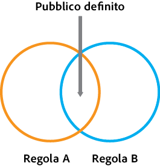
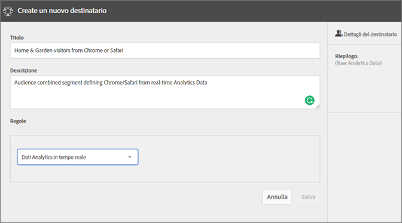
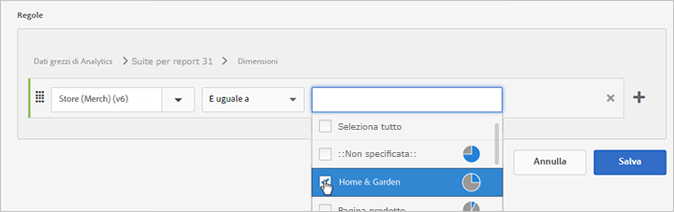
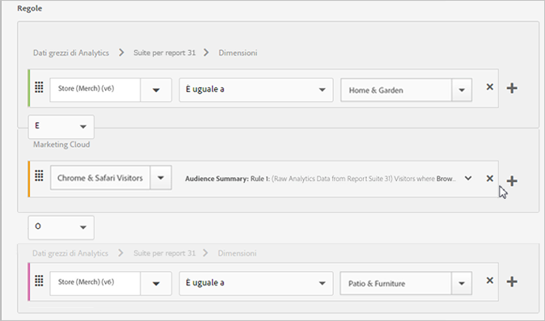
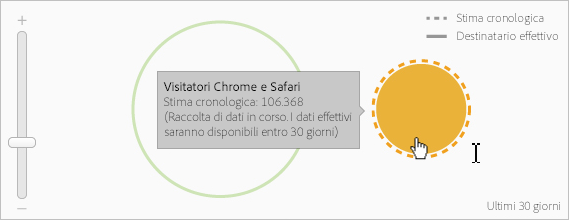

# Creazione di un pubblico

Impara a usare le regole dell’attributo per creare un pubblico e definire un pubblico composito in Experience Cloud.

Questo articolo è utile per comprendere come:

* Creazione di un pubblico
* Creare una regola
* Usare le regole per definire un pubblico composito

Il grafico seguente rappresenta due regole in un pubblico composito.

Ciascun cerchio rappresenta una regola che definisce l'appartenenza al pubblico. I visitatori che si qualificano come membri in entrambe le regole del pubblico diventano il pubblico composito definito.

>[!NOTE]
>
>Il pubblico è completamente definito al termine della raccolta dei dati per il periodo specificato.
L'esempio seguente mostra come creare le regole per un pubblico composito. Questo pubblico si compone di:

* Sezione Home &amp; Garden (casa e giardino) derivata da dati pagina o dati grezzi di Analytics
* Utenti Chrome e Safari derivati da un segmento [!DNL Adobe Analytics] [pubblicato](../audience-library/audience-library.md#task_32FEEFE0B32E4E388CD4D892D727282A) in [!DNL Experience Cloud].

   

1. In the [!DNL Experience Cloud], under [!DNL Experience Platform], click **[!UICONTROL People]** &gt; **[!UICONTROL Audience Library]**.
1. Nella pagina [!UICONTROL Pubblico] fai clic su **[!UICONTROL Nuovo]**. 

1. Nella pagina [!UICONTROL Crea nuovo pubblico] specifica un titolo e una descrizione.
1. In [!UICONTROL Regole], seleziona un'origine attributo:

* **[!UICONTROL Dati Analytics in tempo reale:]** (o dati non elaborati) si tratta di dati attributo derivati da richieste di immagini Analytics in tempo reale e includono dati come eVar ed eventi. Quando usi questa origine attributo devi selezionare una suite di rapporti e definire la dimensione o l'evento da includere. Questa selezione di suite di rapporti fornisce la struttura della variabile usata dalla suite di rapporti.

   >[!NOTE]
   >
   >A causa della memorizzazione nella cache, sono necessarie 12 ore prima che l’eliminazione delle suite di rapporti di Analytics possa essere visibile in Experience Cloud.

* **[!UICONTROL Experience Cloud:]** dati attributo derivati dalle origini di [!DNL Experience Cloud]. Ad esempio, potrebbe trattarsi dei dati dei segmenti di pubblico che hai creato in [!DNL Analytics] o dei dati di [!DNL Audience Manager].

1. Definisci le regole da applicare ai tipi di pubblico.

>[!NOTE]
>
>Quando definisci le regole per i tipi di pubblico, devi conoscere le variabili di implementazione.

In [!UICONTROL Regole], definisci le selezioni dell’attributo *`Home & Garden`*:

* **[!UICONTROL Origine attributo:]** dati grezzi di Analytics
* **[!UICONTROL Suite di rapporti:]** Suite di rapporti 31
* Dimensione = **[!UICONTROL Store (Merch) (v6)]** &gt; **[!UICONTROL È uguale a]** &gt; **[!UICONTROL Home &amp; Garden]**

   

   *Chrome &amp; Safari Visitors* è un segmento di pubblico condiviso da Analytics:

* **[!UICONTROL Origine attributo:]** Experience Cloud
* **[!UICONTROL Dimensione:]** Chrome &amp; Safari Visitors (visitatori di Chrome e Safari)

   

   Per un confronto, potresti aggiungere una regola *OR* per visualizzare tutti i visitatori in una sezione del sito, ad esempio Patio &amp; Furniture.

   

1. Visualizza i risultati.

La regola risultante è un pubblico definito comprendente gli utenti di Chrome e Safari che hanno visitato la pagina Home &amp; Garden (casa e giardino). Il segmento Patio &amp; Furniture (cortile e mobili) fornisce un approfondimento aggiuntivo su tutti i visitatori di quella sezione del sito.

**Stima storica:** (cerchio punteggiato) rappresenta le regole create basandosi sui dati di [!DNL Analytics].

**Destinatario effettivo:** (cerchio con linea continua) tutte le regole create contenenti 30 giorni di dati da Audience Manager. Quando i dati di Audience Manager raggiungono i 30 giorni, la linea punteggiata diventa continua e rappresenta i numeri effettivi.

Al completamento della raccolta dei dati per il periodo specificato, i cerchi vengono uniti per mostrare un pubblico definito.

1. Dopo la definizione della regola fai clic su **[!UICONTROL Salva]**.

Una volta salbvato, il pubblico diventa disponibile per altre soluzioni. Ad esempio, puoi includere un pubblico condiviso in un'attività di Target.
