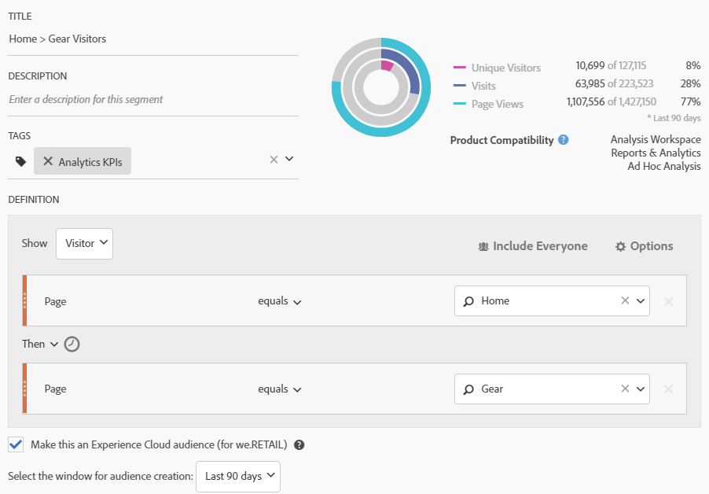

# Pubblicazione di un segmento di pubblico di Analytics

Pubblica un segmento di pubblico, o audience, di Analytics in Experience Cloud e Adobe Target, per attività di marketing relative all’audience.

1. In Analytics, [genera un segmento](https://marketing.adobe.com/resources/help/en_US/analytics/segment/seg_build.html).
1. On the Segment Builder, enable the **[!UICONTROL Publish this segment to the Experience Cloud]** option.

   

   | Elemento | Descrizione |
   |--- |---|
   | Pubblica questo segmento in Experience Cloud (per &lt; nome suite di rapporti &gt;) | Pubblica questo segmento in Experience Cloud. Puoi utilizzare l'audience per attività di marketing e segmentazione in Adobe Target, Audience Manager, Advertising Cloud, Campaign e Audience Analytics. I campi Titolo e Descrizione sono obbligatori per pubblicare il segmento. Quando questa opzione viene attivata, vengono condivisi il titolo e la definizione del segmento di pubblico, ma non i dati effettivi. Quando quel pubblico viene associato a un'attività in Target, Analytics inizia a inviare ID per i visitatori idonei per quel pubblico Experience Cloud e Target. A questo punto, il nome del pubblico e i dati corrispondenti iniziano a essere visualizzati sulla pagina di Experience Cloud Audiences. Il pubblico condiviso con Experience Cloud da Analytics non può superare i 20 milioni di membri. A causa della memorizzazione nella cache, sono necessarie 12 ore prima che l’eliminazione delle suite di rapporti di Analytics possa essere visibile in Experience Cloud. Per eliminare un segmento pubblicato in Experience Cloud, devi annullarne la pubblicazione. To unpublish a segment, just **unclick** the checkbox that you used to publish it. **Non** puoi annullare la pubblicazione di un segmento attualmente in uso da una delle seguenti soluzioni Adobe: [!DNL Analytics] (in [!DNL Audience Analytics]), [!DNL Campaign]( [!DNL Advertising Cloud] per [!DNL Core Service] &amp; [!DNL Audience Manager] clienti) e tutti gli altri partner esterni (per [!DNL Audience Manager] i clienti). **** Puoi annullare la pubblicazione di un segmento utilizzato da [!DNL Target]. Quando un visitatore diventa idoneo per la condivisione del pubblico da Analytics, trascorrono 24-48 ore prima che tale informazione sia fruibile in Target, Advertising Cloud e Campaign. **Privacy dei dati** I tipi di pubblico non vengono filtrati sulla base dello stato di autenticazione di un visitatore. Se un visitatore può navigare nel sito come utente autenticato o non autenticato, le azioni che si verificano per un visitatore non autenticato possono comunque determinare l'inclusione del visitatore nel pubblico. Consulta [Panoramica sulla privacy di Analytics](https://marketing.adobe.com/resources/help/en_US/reference/?f=c_Privacy_Overview) per comprendere le tutte le implicazioni per la privacy relative alla condivisione del pubblico. |
   | Select the window for audience creation (Seleziona la finestra per la creazione del pubblico) | Nota che si tratta di una finestra temporale **mobile**, non fissa. |

1. Fai clic su **[!UICONTROL Salva]**.
1. Accedi a [!DNL Adobe Target], quindi fai clic su [!UICONTROL Audiences].
1. Nella pagina [!UICONTROL Audiences], individua il pubblico ottenuto da Experience Cloud.

   Questi tipi di pubblico sono disponibili per l’utilizzo nelle attività.
