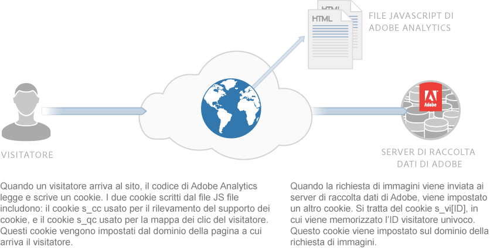
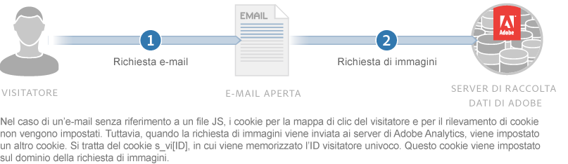

# Informazioni su cookie e privacy {#about-cookies-and-privacy}

Garantire la privacy dei clienti e la sicurezza dei dati sono le principali priorità di Adobe. Adobe partecipa a più organizzazioni sulla privacy e collabora con le autorità di regolamentazione della privacy e i principi di autoregolamentazione. Questa cooperazione include il programma Digital Advertising Alliance AdChoices per fornire ai clienti informazioni su come vengono usati i loro dati personali e sulle scelte relative al loro utilizzo.

La maggior parte dei cookie impostati dai prodotti Experience Cloud non contiene informazioni personali identificabili. Questi cookie e i dati associati sono protetti e utilizzati solo per i report della tua azienda e per fornire contenuti e annunci pertinenti. I dati non sono disponibili per terze parti o altri clienti Adobe, a meno che non siano utilizzati nei report aggregati sul settore. Ad esempio, [!DNL Digital Marketing Insight Report] analizza dati aggregati e anonimi attraverso i rivenditori.

Adobe non unisce le informazioni del browser all’interno delle aziende. Per proteggere la privacy e la sicurezza dei dati dei clienti, alcuni servizi all’interno di Experience Cloud offrono alle aziende la possibilità di utilizzare un set separato di cookie per ciascun sito tracciato. Alcune delle offerte della suite consentono ai clienti di utilizzare il proprio nome di dominio come proprietario del cookie. Questa procedura crea un ulteriore livello di privacy e sicurezza, in quanto rende i cookie di Experience Cloud *cookie di prime parti*, che appartengono definitivamente al sito dell’azienda.

I cookie possono memorizzare e fornire solo le informazioni precedentemente archiviate. Non sono in grado di eseguire codice o di accedere ad altre informazioni memorizzate nel computer. Inoltre, i browser web limitano l’accesso ai dati dei cookie. I browser impongono una policy di sicurezza dei cookie che rende tutti i dati dei cookie disponibili solo per il sito Web che ha inizialmente impostato le informazioni.

Ad esempio, i dati contenuti nei cookie impostati dal sito Web Adobe.com non possono essere visualizzati da siti Web diversi da Adobe.com.

Il diagramma seguente illustra l’utilizzo dei cookie per una richiesta di immagine standard:

Il diagramma seguente illustra l’utilizzo dei cookie per una richiesta di immagini diretta (utilizzata negli scenari in cui non viene caricato un file JS):

