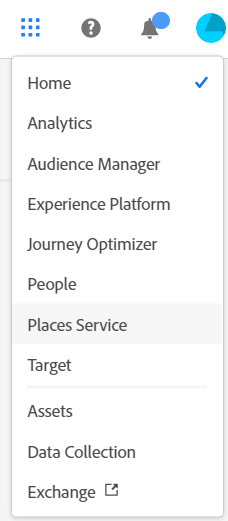

# Informazioni sui servizi di base {#topic_C1087DCC538F4F9A99D983C1BB29EBE0}

In Experience Cloud, fai clic sull’icona del menu  per accedere al menu a discesa.

| Elemento | Descrizione |
|--- |--- |
| [Activation](activation/activation.md) | Activation è il servizio di base che ti consente di implementare e distribuire le soluzioni Experience Cloud. Include:<ul><li>Experience Platform Launch (la più recente soluzione di gestione tag)</li><li>Dynamic Tag Management</li><li>Triggers</li></ul> |
| [Amministrazione](admin-getting-started/admin-getting-started.md) | Gestisci le adesioni degli utenti e i profili di prodotti di Experience Cloud. |
| [Risorse](experience-cloud-assets/experience-cloud-assets.md) | Il servizio di base Experience Cloud Assets fornisce un archivio unico e centralizzato di risorse pronte per le attività di marketing da condividere tra le diverse soluzioni. |
| [Exchange](https://experiencecloud.adobeexchange.com/) | Espandi le funzionalità di Adobe Experience Cloud con le migliori estensioni, script e molto altro. Esplora con la barra di ricerca oppure ordina per tipo di prodotto o app. |
| [Feed](feed.md) | Condividi o pubblica risorse e report di Analytics direttamente con altri tramite la funzione Feed di Experience Cloud. |
| [Mobile Services](https://marketing.adobe.com/resources/help/it_IT/mobile/) | Mobile Services riunisce le funzionalità di marketing mobile di applicazioni per dispositivi mobili da Adobe Marketing Cloud, consentendoti di comprendere e migliorare il coinvolgimento degli utenti con le applicazioni mobili. |
| [Persone](audience-library/audience-library.md) | Nella Libreria Pubblico puoi creare tipi di pubblico, combinare tipi di pubblico esistenti per creare un pubblico composito e visualizzare tutti i tipi di pubblico condivisi. In Attributi cliente puoi anche caricare i dati dei clienti aziendali su Experience Cloud. |
