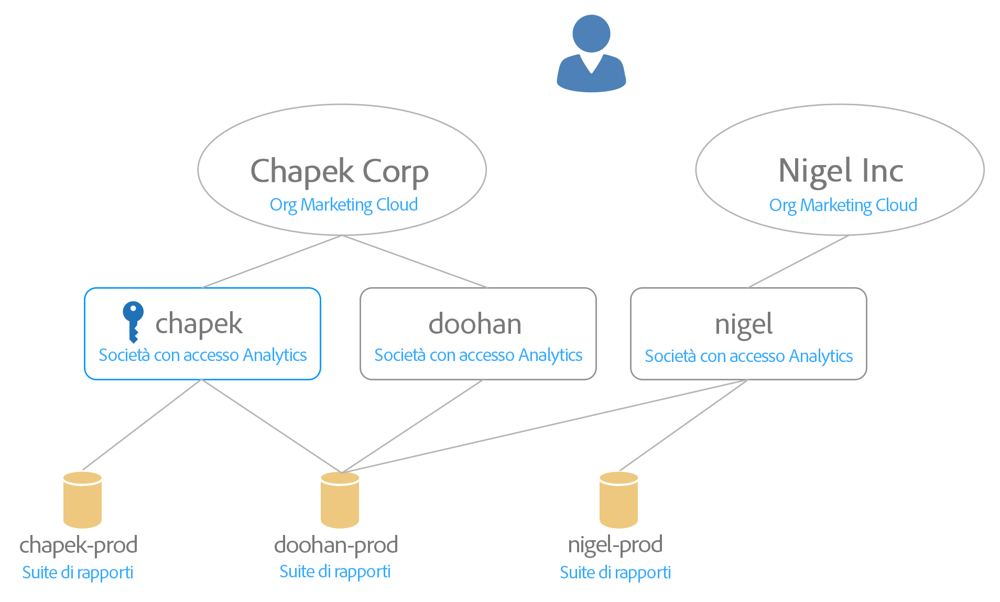

# Mappatura di suite di rapporti per un’organizzazione {#topic_7C4740559EAC4E0FA5F8DEF886B580DA}

Scopri come mappare una o più suite di rapporti per un’organizzazione.

Experience Cloud services (such as Experience Cloud ID Service and [!UICONTROL People]) are associated with an organization instead of an individual report suite. Per garantire il corretto funzionamento di questi servizi, ogni suite di rapporti di Analytics deve essere mappata su un&#39;organizzazione. Processo di mappatura:

* Imposta un&#39;organizzazione Experience Cloud come organizzazione principale per la suite di rapporti.
* Non modifica chi può accedere a una suite di rapporti (l&#39;accesso è ancora determinato dall&#39;account di accesso di Adobe Analytics per ogni utente)

## Requisiti

Devi essere un amministratore Analytics di una società di accesso che dispone dell&#39;accesso alla suite di rapporti da mappare. Inoltre, questo account deve essere [collegato a un&#39;organizzazione](../admin-getting-started/organizations.md#topic_C31CB834F109465A82ED57FF0563B3F1) Experience Cloud per mappare le suite di rapporti a tale organizzazione.

Le organizzazioni sono disattivate se non disponi delle autorizzazioni di amministratore Analytics per una società di accesso nell&#39;organizzazione con accesso alla suite di rapporti specificata.

## Mappatura di una suite di rapporti su un’organizzazione {#task_23993FE78DF6455FA8D7BE60686EA16C}

1. Click **[!UICONTROL Experience Cloud]** > **[!UICONTROL Administration]** > **[!UICONTROL Report Suite Mapping]**

1. Per visualizzare le società con accesso a ogni suite di rapporti, fai clic su **[!UICONTROL Visibile per le società di accesso]**.

   Questa visualizzazione ti aiuta a prendere una decisione informata sulla mappatura.

1. Fai clic sull&#39;elenco a discesa nella colonna **[!UICONTROL Organizzazione mappata]** vicino a una suite di rapporti e seleziona l&#39;organizzazione da mappare.

   Consulta la sezione successiva per suggerimenti sulla selezione di un’organizzazione Experience Cloud.

## Mappare più suite di rapporti su un’organizzazione {#task_94955B0D8ABA4CB1A38746ECF8E32711}

1. Click **[!UICONTROL Experience Cloud]** > **[!UICONTROL Administration]** > **[!UICONTROL Report Suite Mapping]**.

1. Seleziona le suite di rapporti da mappare.

   

1. Seleziona l&#39;organizzazione (Outdoors Inc, in questo esempio), quindi fai clic su **[!UICONTROL Seleziona]**.

   Consulta la sezione successiva per suggerimenti sulla selezione di un’organizzazione Experience Cloud.

1. Fai clic su **[!UICONTROL Salva mappatura]**.

## Suggerimenti per selezionare un&#39;organizzazione Experience Cloud {#mapping-tips}

Questa sezione contiene suggerimenti per aiutarti a selezionare l&#39;organizzazione Experience Cloud a cui mappare una suite di rapporti.

### Quale organizzazione dovrei scegliere?

If the Experience Cloud ID Service is currently deployed on the report suite, ensure the organization you select in the Report Suite Mapping tool is the same organization specified in the [!DNL visitorAPI.js] file on your site. You can use the instructions in [Test and Verify the Experience Cloud ID Service](https://docs.adobe.com/content/help/en/id-service/using/implementation-guides/test-verify.html) to find the org ID that is being used by the Visitor ID service.

Se il servizio ID visitatore non è ancora distribuito sui siti che raccolgono i dati per la suite di rapporti, se distribuisci il servizio ID visitatore Experience Cloud in futuro dovrai verificare che la distribuzione corrisponda all&#39;organizzazione scelta nello strumento di mappatura delle suite di rapporti.

### Perché alcune organizzazioni sono disattivate?

Ciò indica che non disponi di privilegi sufficienti per la mappatura sulla suite di rapporti disattivata. Prendi in considerazione l&#39;esempio seguente:

In questo schema, il tasto blu indica i privilegi di amministratore. Le linee grigie indicano la visibilità.

Questo utente ha accesso a due organizzazioni Experience Cloud. Ha eseguito le seguenti operazioni:

* Ha collegato il suo account amministratore nella società di accesso [!UICONTROL chapek] Analytics al suo account organizzazione [!UICONTROL Chapek] Corp Experience Cloud.
* Ha collegato il suo account non amministratore nella società di accesso [!UICONTROL doohan] Analytics al suo account organizzazione [!UICONTROL Chapek] Corp Experience Cloud.
* Ha collegato il suo account non amministratore nella società di accesso nigel Analytics al suo account organizzazione Experience Cloud Nigel Inc.

I punti seguenti elencano le azioni di mappatura che questo utente può e non può eseguire relativamente a queste suite di rapporti:

* [!UICONTROL La suite di rapporti Chapek-prod] può essere mappata sull&#39;organizzazione [!UICONTROL Chapek] Corp perché questo utente è un amministratore di una società di accesso Analytics collegata ([!UICONTROL chapek]) e il suo account è collegato a questa organizzazione.
* [!UICONTROL La suite di rapporti Nigel-prod] non può essere collegata da questo utente perché non è un amministratore in alcuna società di accesso alla quale è visibile questa suite di rapporti.
* [!UICONTROL La suite di rapporti Doohan-prod] può essere mappata su [!UICONTROL Chapek Corp] perché questo utente è un amministratore di una società di accesso ([!UICONTROL chapek]) collegata all’organizzazione Experience Cloud (notare che non è un amministratore della società di accesso doohan Analytics). It is important to be aware that the [!UICONTROL doohan-prod] report suite is also eligible to be mapped to the Nigel Inc Experience Cloud org, even though this user cannot perform that mapping. In questo caso, entrambe le organizzazioni Experience Cloud sono visualizzate nell&#39;elenco, ma [!UICONTROL Nigel Inc] è disattivata. Prima della mappatura, questo utente deve consultare un amministratore della società di accesso Nigel per determinare quale organizzazione è la migliore per la mappatura. L&#39;interfaccia utente visualizza un avviso di possibile conflitto se selezioni un&#39;organizzazione diversa dall&#39;organizzazione in cui è stata creata la suite di rapporti.

## Domande frequenti {#section_099E485805994C929FF9C9F75219BEE1}

### Perché non visualizzo tutte le mie suite di rapporti?

Alcune suite di rapporti potrebbero essere visibili in una società di accesso diversa. Puoi cambiare la società di accesso corrente utilizzando il menu a discesa nella parte superiore dello schermo.

### Cosa succede se non riconosco alcune delle organizzazioni elencate nel menu a discesa per una delle mie suite di rapporti?

The list shows you all the *possible* organizations your report suite could be mapped to, even you don’t have permission to map to all those report suites. Se non sei sicuro se la suite di rapporti deve essere mappata su una delle suite di rapporti disattivate nell&#39;elenco, consulta un amministratore Experience Cloud nella tua organizzazione per determinare la scelta migliore.

### Cosa succede se non riconosco alcune delle società di accesso elencate per una suite di rapporti nella colonna &quot;Visibile per le società di accesso&quot;?

A un certo punto questa suite di rapporti è stata condivisa con un&#39;altra società di accesso che potrebbe far parte di un&#39;organizzazione Experience Cloud diversa.

### Cos’è questo errore di “Possibile conflitto” sulla suite di rapporti generato da un’altra organizzazione? Perché è importante?

Si tratta di una notifica per aiutarti a prendere una decisione informata sulla mappatura della tua suite di rapporti. Desideriamo informarvi che la suite di rapporti è stata creata originariamente in un&#39;organizzazione diversa nel caso in cui l&#39;organizzazione fosse più appropriata per questa suite di rapporti.

### Come posso sapere se una suite di rapporti è mappata?

Le suite di rapporti mappate saranno visualizzate in un formato non modificabile. Se devi modificare una mappatura, contatta l&#39;Assistenza clienti.

### Cosa succede se conosco solo l&#39;ID organizzazione per la mia organizzazione Experience Cloud? Come posso cercare il nome per il mio ID organizzazione?

Potete trovare il nome della vostra organizzazione in [Organizzazioni e Impostazioni](https://docs.adobe.com/content/help/it-IT/core-services/interface/manage-users-and-products/organizations.html)account.

### Visualizzo una data nella colonna “Data di mappatura”. Chi ha eseguito la mappatura?

Puoi consultare il registro modifiche suite di rapporti nell&#39;interfaccia di Analytics per controllare l&#39;ID utente che ha apportato la modifica. Cerca l’evento &quot;Suite associated to IMS Organization&quot;.
