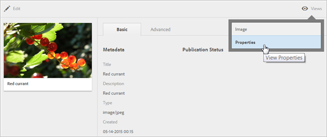

# Panoramica di Experience Cloud Assets

Experience Cloud Assets fornisce un archivio unico e centralizzato di risorse pronte per le attività di marketing da condividere tra le diverse applicazioni. Una risorsa è un documento, un’immagine, un video o un file audio (o parte di essi) che può avere più rappresentazioni e risorse secondarie (ad esempio, livelli in un file [!DNL Photoshop], slide in un file [!DNL PowerPoint], pagine in un PDF e file in un file ZIP).

I servizi Assets includono:

* Archivio delle risorse, interfaccia di gestione, interfaccia di selezione incorporata (accessibile dall’interno di altre applicazioni).
* Integrazioni con Creative Cloud, collaborazione con Experience Cloud e applicazioni Experience Cloud.

L’utilizzo di Assets migliora la coerenza e la conformità al marchio, velocizzando il time-to-market. Puoi semplificare i flussi di lavoro nelle applicazioni:

* **[!DNL Social]**: pubblicazione su canali social, Facebook, Twitter, LinkedIn, Google+.
* **[!DNL Target]**: creazione di esperienze per A/B e test multivariati.
* **[!DNL Media Optimizer]**: sviluppo di unità tra diversi canali e campagne.
* **[!DNL Campaign]**: posizionamento di risorse nelle newsletter e campagne via e-mail.

In [!UICONTROL Experience Cloud Assets] puoi eseguire le seguenti operazioni:

* [Passare a Experience Cloud Assets](experience-cloud-assets.md#section_3657039DD3524F2AA88753BFF4781125)
* [Accedere alla barra degli strumenti](experience-cloud-assets.md#section_EC2E401D225148818F3753248556BE6B)
* [Modificare le risorse](experience-cloud-assets.md#section_CD3C55A9D4574455B94D0955391C8FEC)
* [Cercare risorse](experience-cloud-assets.md#section_50FE049010B446FC9640AA6A30E5A730)
* [Annotare le risorse](experience-cloud-assets.md#section_67FE1DFAAB744DA5B1CD3AD3CCEABF7A)
* [Visualizzare risorse a tutto schermo e usare lo zoom](experience-cloud-assets.md#section_A9F50D7D6BE341A2AB8244A4E42A4EF7)
* [Visualizzare le proprietà della risorsa](experience-cloud-assets.md#section_FED28711DAB14E1BBEEA7CA890EE9573)
* [Eseguire rapporti sull’utilizzo](experience-cloud-assets.md#section_15D782FFB8D74CF4A735116CC03AD902)
* [Condivisione di risorse con Experience Manager](experience-cloud-assets.md#section_45C1B72F4D274F54BC6CCB64D2580AC5)

## Passare a Experience Cloud Assets {#section_3657039DD3524F2AA88753BFF4781125}

## Accedere alla barra degli strumenti {#section_EC2E401D225148818F3753248556BE6B}

Passa a una risorsa (o una directory di risorse), quindi seleziona **[!UICONTROL Seleziona]**.

La barra degli strumenti consente di accedere rapidamente a funzioni quali: Cerca, Timeline, Rappresentazioni, Modifica, Annota e Scarica.

! Per eliminare le risorse utilizzate o in uso in Target, devi rimuovere tutti gli utilizzi di tali risorse.

## Modificare le risorse {#section_CD3C55A9D4574455B94D0955391C8FEC}

La modifica di una risorsa abilita funzionalità quali:

* Ritaglio
* Rotazione
* Capovolgimento

## Cercare risorse {#section_50FE049010B446FC9640AA6A30E5A730}

Puoi cercare per parola chiave, tipo di file, dimensione, ultima modifica, stato di pubblicazione, orientamento e stile.

## Annotare le risorse {#section_67FE1DFAAB744DA5B1CD3AD3CCEABF7A}

Seleziona **[!UICONTROL Annota]** per disegnare cerchi o frecce su un’immagine e annota la risorsa per la revisione da parte di colleghi.

## Visualizzare risorse a tutto schermo e usare lo zoom {#section_A9F50D7D6BE341A2AB8244A4E42A4EF7}

Seleziona **[!UICONTROL Viste]** > **[!UICONTROL Immagine]** per visualizzare l’immagine della risorsa completa e abilitare lo zoom.

## Visualizzare le proprietà della risorsa {#section_FED28711DAB14E1BBEEA7CA890EE9573}

Scegli tra la vista della scheda con proprietà, la vista dell&#39;elenco e la vista della colonna per trovare più facilmente le risorse.

Seleziona **[!UICONTROL Viste]** > **[!UICONTROL Proprietà]** per visualizzare le proprietà di una risorsa:

## Eseguire rapporti sull’utilizzo {#section_15D782FFB8D74CF4A735116CC03AD902}

Visualizza il numero di utenti, l&#39;archiviazione usata e le risorse totali.

Seleziona **[!UICONTROL Strumenti]** > **[!UICONTROL Rapporti]** > **[!UICONTROL Rapporto utilizzo]**

