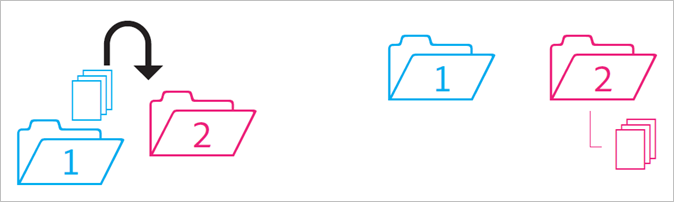
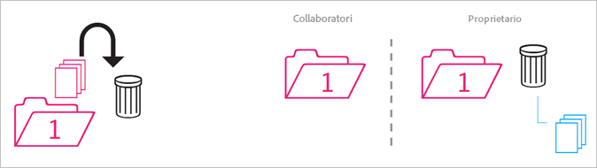
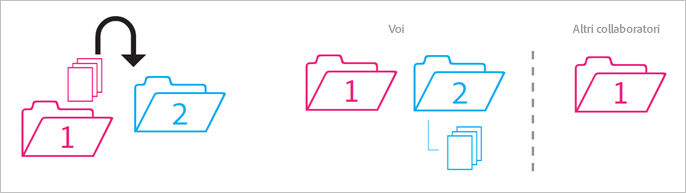
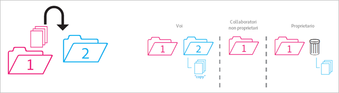
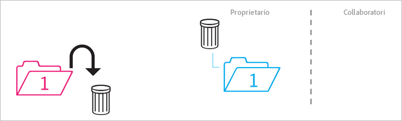
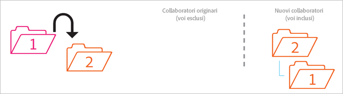
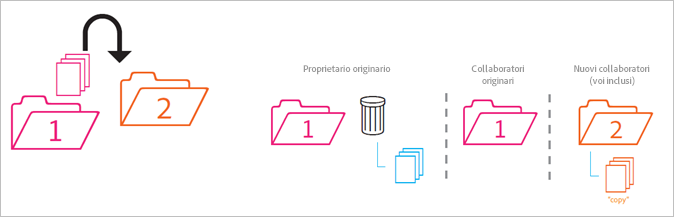

# Comportamento delle cartelle condivise

Regole per il comportamento delle cartelle condivise in caso di spostamento, eliminazione e ripristino delle stesse.

>[!NOTE]
>
>Le cartelle e le risorse condivise di Experience Cloud si riflettono sul desktop Creative Cloud in una relazione 1:1. Se un utente di Experience Cloud modifica una cartella (elimina, aggiunge o rimuove condivisioni) l&#39;azione si riflette sul desktop e sul Web di Creative Cloud. Nello stesso modo, se rimuovi una cartella dalla condivisione, la cartella e le risorse vengono eliminate dal computer locale. Dopo che la risorsa è stata rimossa, la cartella e il relativo contenuto vengono spostati nel cestino del computer locale, da dove puoi ripristinarli manualmente sul computer in uso.

## Cartella non condivisa nella cartella condivisa {#section_A9BAC1A244A246A984AC62660E61E0C0}

Sposta una cartella non condivisa in una cartella condivisa:

**Risultato**: entrambe le cartelle sono condivise.

## Cartella condivisa in cartella non condivisa {#section_8BA83001DCEC4CF084B980C4A660F59A}

Sposta una cartella condivisa in una cartella non condivisa.

**Risultato**: la cartella non condivisa rimane non condivisa. La cartella condivisa rimane condivisa.

## Contenuto da cartella non condivisa nella cartella condivisa {#section_2941ED0DC52E4573AC1AB4C22313DD8E}

Sposta il contenuto di una cartella non condivisa in una cartella condivisa.

**Risultato:** il contenuto ora è condiviso e tutti i collaboratori possono vederlo. Lo spazio di archiviazione aumenta in base alla dimensione del contenuto.

## Contenuto condiviso archiviato ed eliminato {#section_5210D5F4943A44D0BA675D8EB4EAE20F}

Archivia o elimina il contenuto presente in una cartella condivisa.

**Risultato:** il contenuto è archiviato per il proprietario della cartella. I collaboratori che non possiedono il contenuto non possono più accedervi.

## Contenuto condiviso di proprietà in una cartella non condivisa {#section_3810A364B67E4B8C9CA244BC52BF91BB}

Sposta il contenuto da una cartella condivisa di proprietà in una cartella non condivisa.

**Risultato:** il contenuto ora non è condiviso. I collaboratori della cartella condivisa non possono più accedere al contenuto.

## Contenuto non di proprietà in una cartella non condivisa {#section_310766EBF0DC4C0BB4AB3E8A4DAEBE07}

Sposta il contenuto da una cartella condivisa di proprietà di qualcun&#39;altro in una cartella non condivisa.

**Risultato:** il contenuto compare nella cartella non condivisa e viene rimosso dalla cartella condivisa. I collaboratori della cartella condivisa non possono più accedere al contenuto. Il contenuto è archiviato per il proprietario della cartella.

I proprietari e gli editor possono spostare contenuti non di loro proprietà, ma i visualizzatori no. Se i proprietari e gli editor spostano contenuto, questo non sarà disponibile in una cartella condivisa per gli utenti.

## Cartella di proprietà archiviata o eliminata {#section_B314B13512A5409C87C49DFDB7602E14}

Archivia (via Web) o elimina (via desktop) una cartella condivisa di proprietà.

**Risultato:** la cartella viene rimossa dalla condivisione, quindi archiviata. I collaboratori non possono più accedere alla cartella.

## Cartella condivisa in un&#39;altra cartella condivisa {#section_0A3F203D048D4D1586E9850DC92C51E9}

Sposta una cartella condivisa di proprietà in un&#39;altra cartella condivisa di proprietà o non di proprietà.

**Risultato:** poiché la cartella viene spostata nella cartella 2, viene condivisa con i nuovi collaboratori.

## Contenuto condiviso in un&#39;altra cartella condivisa {#section_69F6C312792A4CD2831BD14A340F850E}

Sposta il contenuto di una cartella condivisa in un&#39;altra cartella condivisa.

**Risultato:** il contenuto compare nella cartella 2 e ora è condiviso con i nuovi collaboratori. Il contenuto viene rimosso dalla cartella 1 e il proprietario lo visualizza come archiviato, mentre i collaboratori non possono più accedervi.

## Contenuto ripristinato dall&#39;archivio {#section_DEA990B3581741F89FBB81D18C2AB449}

Ripristina il contenuto da un archivio che apparteneva a una cartella condivisa. Quando archiviato, il contenuto era di proprietà.

**Risultato:** il contenuto viene ripristinato nella cartella condivisa e tutti i collaboratori possono nuovamente accedervi. Se la cartella condivisa non esiste più, il contenuto viene messo in una copia non condivisa della(e) cartella(e) principale(i) originale(i).
