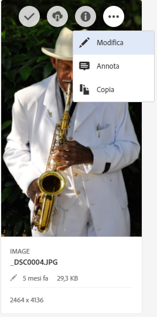
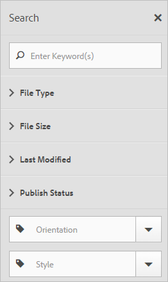

# Risorse

Il servizio di base Experience Cloud Assets fornisce un archivio unico e centralizzato di risorse pronte per le attività di marketing da condividere tra le diverse soluzioni. Una risorsa è un documento, un&#39;immagine, un video o dell&#39;audio digitale (o parte di essi) che può avere più rappresentazioni e risorse secondarie (ad esempio, livelli in un file Photoshop, slide in un file PowerPoint, pagine in un file PDF e file un file ZIP).

<!-- asset.xml -->
I servizi delle risorse includono:

* Archivio delle risorse, interfaccia di gestione, interfaccia di selezione incorporata (a cui puoi accedere tramite le soluzioni).
* Integrazioni con Creative Cloud, collaborazione Experience Cloud e soluzioni Experience Cloud.

L&#39;utilizzo delle risorse migliora la coerenza e la conformità al marchio, velocizzando i tempi sul mercato. Puoi semplificare i flussi di lavoro nelle soluzioni:

* **[!DNL Social]**: pubblicazione su canali social, Facebook, Twitter, LinkedIn, Google+.
* **[!DNL Target]**: creazione di esperienze per A/B e test multivariati.
* **[!DNL Media Optimizer]**: sviluppo di unità tra diversi canali e campagne.
* **[!DNL Campaign]**: posizionamento di risorse nelle newsletter e campagne via e-mail.

In [!UICONTROL Experience Cloud Assets] puoi:

* [Passare a Experience Cloud Assets](../experience-cloud-assets/experience-cloud-assets.md#section_3657039DD3524F2AA88753BFF4781125)
* [Accedere alla barra degli strumenti](../experience-cloud-assets/experience-cloud-assets.md#section_EC2E401D225148818F3753248556BE6B)
* [Modifica delle risorse](../experience-cloud-assets/experience-cloud-assets.md#section_CD3C55A9D4574455B94D0955391C8FEC)
* [Cercare risorse](../experience-cloud-assets/experience-cloud-assets.md#section_50FE049010B446FC9640AA6A30E5A730)
* [Annotare risorse](../experience-cloud-assets/experience-cloud-assets.md#section_67FE1DFAAB744DA5B1CD3AD3CCEABF7A)
* [Condividere una risorsa sul proprio feed](../experience-cloud-assets/experience-cloud-assets.md#section_2CD53A99600D4A3D9AA82C3CDA666E6B)
* [Visualizzare risorse a tutto schermo e usare lo zoom](../experience-cloud-assets/experience-cloud-assets.md#section_A9F50D7D6BE341A2AB8244A4E42A4EF7)
* [Visualizzare le proprietà della risorsa](../experience-cloud-assets/experience-cloud-assets.md#section_FED28711DAB14E1BBEEA7CA890EE9573)
* [Eseguire report d&#39;utilizzo](../experience-cloud-assets/experience-cloud-assets.md#section_15D782FFB8D74CF4A735116CC03AD902)
* [Condivisione di risorse con Experience Manager](../experience-cloud-assets/experience-cloud-assets.md#section_45C1B72F4D274F54BC6CCB64D2580AC5)

## Passare a Experience Cloud Assets {#section_3657039DD3524F2AA88753BFF4781125}

## Accedere alla barra degli strumenti {#section_EC2E401D225148818F3753248556BE6B}

Passa a una risorsa (o una directory di risorse), quindi fai clic su **[!UICONTROL Seleziona]**.

La barra degli strumenti fornisce un accesso rapido alle funzionalità, incluse Cerca, Timeline, Rappresentazione, Modifica, Annota e Scarica.

## Modifica delle risorse {#section_CD3C55A9D4574455B94D0955391C8FEC}

La modifica di una risorsa abilita funzionalità, tra cui:

* Ritaglio
* Rotazione
* Capovolgimento

## Cercare risorse {#section_50FE049010B446FC9640AA6A30E5A730}

Puoi cercare per parola chiave, tipo di file, dimensione, ultima modifica, stato pubblicazione, orientamento e stile.

## Annotare risorse {#section_67FE1DFAAB744DA5B1CD3AD3CCEABF7A}

Fai clic su **[!UICONTROL Annota]**disegnando dei cerchi o delle frecce su un&#39;immagine e annota la risorsa per la revisione da parte di colleghi.

<!-- ## Share an asset to your feed {#section_2CD53A99600D4A3D9AA82C3CDA666E6B}

**Experience Cloud Feed will no longer be supported starting Nov 01, 2019 and shall be deprecated by Dec, 2019.**

Click **[!UICONTROL Share]** from the toolbar to share the asset as [feed](../feed.md#concept_9256B8768A294009A777282DD8719213) to other Experience Cloud users. 

 

Sharing displays the image on your Feed page and with whomever you have shared the card.  -->

## Visualizzare risorse a tutto schermo e usare lo zoom {#section_A9F50D7D6BE341A2AB8244A4E42A4EF7}

Fai clic su **[!UICONTROL Viste]**>**[!UICONTROL  Immagine]** per visualizzare l&#39;immagine della risorsa completa e abilitare lo zoom.

## Visualizzare le proprietà della risorsa {#section_FED28711DAB14E1BBEEA7CA890EE9573}

Scegli tra la vista della scheda con proprietà, la vista dell&#39;elenco e la vista della colonna per trovare più facilmente le risorse.

Fai clic su **[!UICONTROL Viste]**>**[!UICONTROL  Proprietà]** per visualizzare le proprietà di una risorsa:

## Eseguire report d’utilizzo {#section_15D782FFB8D74CF4A735116CC03AD902}

Visualizza il numero di utenti, l&#39;archiviazione usata e le risorse totali.

Fai clic su **[!UICONTROL Strumenti]**>**[!UICONTROL  Rapporto]** > **[!UICONTROL Rapporto utilizzo]**.

