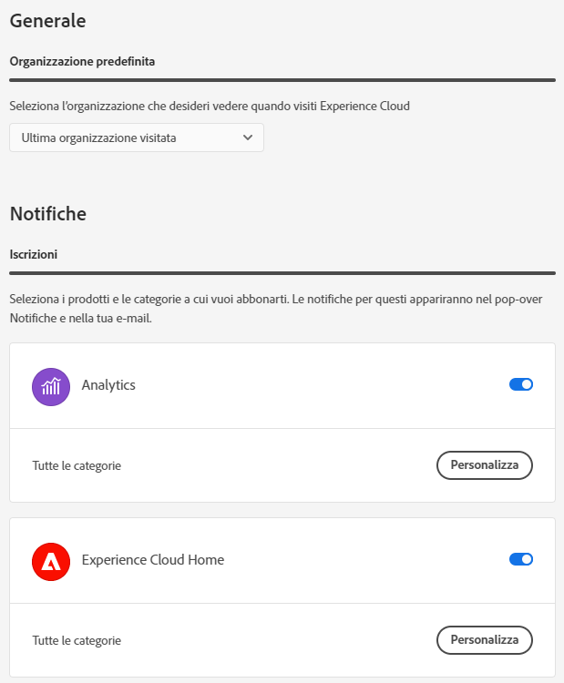

# Componenti dell’interfaccia centrale di Experience Cloud

I componenti dell’interfaccia centrale di Experience Cloud includono funzioni che consentono di:

* Accedere e utilizzare applicazioni e servizi
* Trovare informazioni sul prodotto e oggetti di business tramite una ricerca globale
* Gestire le preferenze dell’account (avvisi, notifiche e abbonamenti)

## Supporto dei browser in Experience Cloud

Per prestazioni ottimali, Experience Cloud è stato ottimizzato per i browser più diffusi, comprese l’ultima versione e le due versioni precedenti.

* Chrome
* Edge
* Firefox
* Opera
* Safari

Se il tuo browser non è elencato, potrebbe comunque essere supportato, ma si consiglia di usare uno dei browser elencati.

>[!NOTE]
>
>Non tutte le applicazioni in esecuzione nel dominio Experience Cloud supportano tutti i browser. In caso di dubbi, consulta la documentazione delle specifiche applicazioni.

## Supporto delle lingue in Experience Cloud

Experience Cloud supporta le lingue preferite per ciascun utente, impostate nelle preferenze del proprio account utente Adobe. Sono supportate le seguenti lingue:

* Cinese
* Inglese
* Francese
* Tedesco
* Italiano
* Giapponese
* Coreano
* Portoghese
* Spagnolo
* Taiwanese

Tutti i team delle applicazioni sono orientati al supporto globale delle lingue; tuttavia, non tutte le applicazioni sono disponibili in tutte le lingue sopraelencate. Se la tua lingua principale non è supportata in un’applicazione Experience Cloud, puoi impostare una lingua secondaria che, all’occorrenza, verrà usata per impostazione predefinita. Puoi impostare queste opzioni nelle [preferenze utente di Experience Cloud](https://experience.adobe.com/preferences).

## Accedere a Experience Cloud

Accedi e verifica di essere nell’organizzazione corretta.

1. Passa ad [Adobe Experience Cloud](https://experience.adobe.com).
1. Fai clic su **[!UICONTROL Sign in with an Adobe ID]**.
1. Verifica di essere nell’organizzazione giusta.

   

   Per verificare di aver effettuato l&#39;accesso all&#39;organizzazione corretta, fare clic su **[!UICONTROL Profile]** per visualizzare il nome dell&#39;organizzazione. Se si dispone dell&#39;accesso a più organizzazioni, è inoltre possibile visualizzare e passare a un&#39;altra organizzazione utilizzando il selettore **[!UICONTROL Organization]**.

   Se la tua organizzazione usa Federated ID, Experience Cloud ti consente accedere in modalità single sign-on, senza inserire l’indirizzo e-mail e la password. Aggiungi `#/sso:@domain` all’URL di Experience Cloud (`https://experience.adobe.com`) per eseguire questa attività.

   Ad esempio, per un’organizzazione con Federated ID e il dominio `adobecustomer.com`, imposta il link dell’URL su `https://experience.adobe.com/#/sso:@adobecustomer.com`. Puoi anche passare direttamente a una specifica applicazione salvando come segnalibro o preferito l’URL seguito dal percorso dell’applicazione. Ad esempio, per Adobe Analytics: `https://experience.adobe.com/#/sso:@adobecustomer.com/analytics`.

## Accedere alle applicazioni di Experience Cloud

Dopo aver effettuato l’accesso ad Experience Cloud, è possibile accedere rapidamente a tutte le applicazioni, i servizi e le organizzazioni dall’lintestazione unificata.

Fai clic sul selettore delle applicazioni  per accedere ai servizi Experience Cloud di tua proprietà.

## Ricerca e supporto in Experience Cloud

La funzione di ricerca di Experience Cloud consente di trovare risorse utili (documentazione, tutorial e corsi) su [Experience League](https://experienceleague.adobe.com/it?lang=it#home).

Il menu [!UICONTROL Help] consente inoltre di accedere a:

* **[!UICONTROL Support]:** Crea un ticket di supporto o contatta [!UICONTROL Support] tramite Twitter.
* **[!UICONTROL Feedback]:** Contatta Adobe tramite Feedback e inviaci i tuoi commenti.
* **[!UICONTROL Status]:** Passare a `https://status.adobe.com/experience_cloud` e verificare lo stato operativo del prodotto e [!UICONTROL Manage Subscriptions].
* **[!UICONTROL Developer Connection]:** Navigazione a `adobe.io` e ricerca documentazione per sviluppatori.

## Preferenze dell’account

Nel menu delle preferenze dell’account puoi effettuare le seguenti operazioni:

* Specificare un tema scuro (non tutte le applicazioni supportano questo tema)
* Cerca organizzazioni
* Uscire
* Configurare [preferenze, notifiche e abbonamenti](#preferences) dell’account

### Gestisci Experience Cloud [!UICONTROL Preferences]

Le preferenze di Experience Cloud includono notifiche, abbonamenti e avvisi.

* Fai clic su **[!UICONTROL Preferences]** dal menu dell&#39;account  per gestire le preferenze.

In [!UICONTROL Experience Cloud preferences] è possibile configurare le seguenti funzionalità:

| Funzione | Descrizione |
|--- |--- |
| Organizzazione predefinita | Seleziona l’organizzazione da visualizzare all’avvio di Experience Cloud. |
| [!UICONTROL Subscriptions] | Seleziona i prodotti e le categorie a cui desideri abbonarti. Notifiche nel riquadro a comparsa [!UICONTROL Notifications] e nell&#39;e-mail. |
| [!UICONTROL Priority] | Seleziona le categorie a cui vuoi assegnare la priorità alta. Queste categorie sono contrassegnate con il tag Alta e possono essere configurate per la distribuzione come avvisi. |
| [!UICONTROL Alerts] | Seleziona le notifiche per le quali desideri visualizzare gli avvisi nel browser. Gli avvisi vengono visualizzati per alcuni secondi nell’angolo in alto a destra della finestra. |
| E-mail | Specifica la frequenza con cui desideri ricevere le e-mail di notifica: Non inviata, Immediata, Giornaliera o Settimanale. |

{style="table-layout:auto"}

## Notifiche e annunci

Fai clic su **[!UICONTROL Notifications]** per visualizzare le notifiche che ti interessano e gli annunci di Adobe.

Puoi configurare le notifiche in [Preferenze di Experience Cloud](#preferences).
