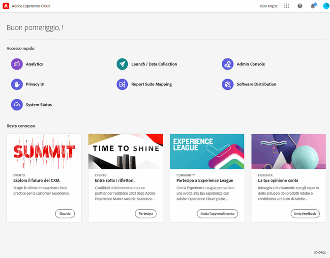
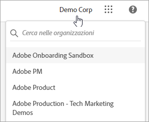
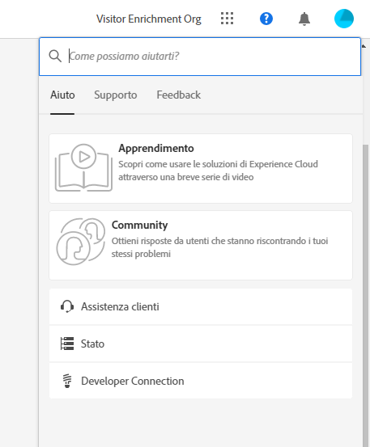
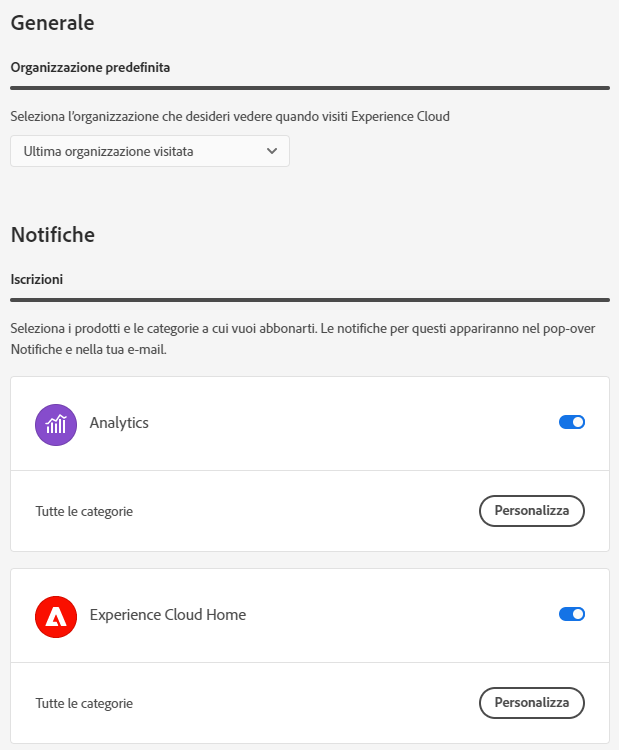
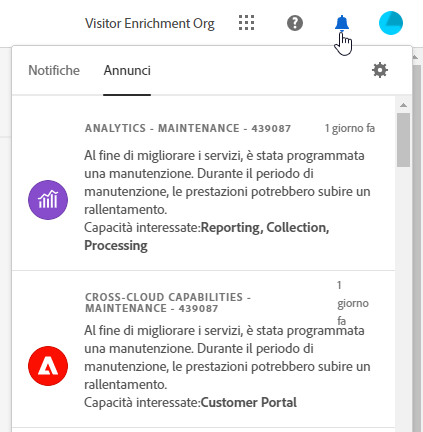

# Guida ai componenti dell’interfaccia centrale di Experience Cloud

[La famiglia integrata di applicazioni, prodotti e servizi di marketing digitale di Experience ](https://experience.adobe.com) Cloud Adobe. L&#39;interfaccia intuitiva ti consente di accedere rapidamente alle applicazioni cloud, alle funzionalità di prodotto e ai servizi.

Dall’intestazione dell’Experience Cloud, puoi:

* Accedere alle applicazioni e ai servizi
* Cercare documentazione di prodotto, esercitazioni e post della community
* Ricerca globale di oggetti aziendali tramite una ricerca globale (solo per gli utenti di Experienci Platform)
* Gestire le preferenze dell’account (avvisi, notifiche e abbonamenti)

## Accedere a Experience Cloud

Accedi e verifica di essere nell&#39;[organizzazione](organizations.md) corretta.

1. Passa ad [Adobe Experience Cloud](https://experience.adobe.com).
1. Seleziona **[!UICONTROL Accedi con un Adobe ID]**.
1. In Adobe Experience Cloud, seleziona la tua organizzazione.

   

   L’amministratore può aiutarti a verificare di essere nell’[organizzazione](organizations.md) corretta.

## Accedere alle applicazioni di Experience Cloud {#navigation}

Dopo aver effettuato l’accesso ad Experience Cloud, è possibile accedere rapidamente a tutte le applicazioni, i servizi e le organizzazioni dall’lintestazione unificata.

Per accedere ai servizi Experience Cloud di tua proprietà, vai al selettore dell&#39;applicazione .

## Assistenza e supporto {#search}

La Guida unificata fornisce una posizione all’interno del prodotto per cercare e accedere ai contenuti dell’Aiuto (documentazione, esercitazioni e corsi) all’ [Experience League](https://experienceleague.adobe.com/?lang=it#home). Puoi anche inviare feedback aperti e creare ticket di supporto con priorità.

Il menu [!UICONTROL Aiuto] consente inoltre di accedere a:

* **[!UICONTROL Supporto]:** crea un ticket di supporto o contatta il [!UICONTROL Supporto] tramite Twitter.
* **[!UICONTROL Feedback]:** condividi un feedback sulla tua esperienza Experience Cloud. Il tuo feedback viene utilizzato per migliorare i prodotti e i servizi di Adobe.
* **[!UICONTROL Stato]:** passa a `https://status.adobe.com/experience_cloud` per controllare lo stato operativo del prodotto e [!UICONTROL gestire gli abbonamenti].
* **[!UICONTROL Developer Connection]:** naviga in `adobe.io` e accedi alla documentazione per gli sviluppatori.

## Ricerca globale di oggetti ed entità

La ricerca globale consente di trovare oggetti o entità aziendali ricercabili in un’esperienza semplice, coerente e semplice. Questa ricerca superfici gli oggetti a cui hai effettuato l’accesso di recente.

>!![NOTE]
La ricerca globale è disponibile solo per gli utenti di Experienci Platform e Journey Orchestration.

## Gestisci preferenze account {#preferences}

Le preferenze di Experience Cloud includono notifiche, abbonamenti e avvisi. Nel menu delle preferenze dell’account puoi effettuare le seguenti operazioni:

* Specificare un tema scuro (non tutte le applicazioni supportano questo tema)
* Cercare le [organizzazioni](organizations.md)
* Uscire
* Configurare preferenze, notifiche e abbonamenti dell’account

Per gestire le preferenze, seleziona **[!UICONTROL Preferenze]** dal menu dell&#39;account .

Nelle [!UICONTROL preferenze di Experience Cloud], è possibile configurare le seguenti funzioni:

| Funzione | Descrizione |
|--- |--- |
| [Organizzazione](organizations.md) predefinita | Seleziona l’organizzazione da visualizzare all’avvio di Experience Cloud. |
| [!UICONTROL Abbonamenti] | Seleziona i prodotti e le categorie a cui desideri abbonarti. Notifiche nel riquadro a comparsa [!UICONTROL Notifiche] e via e-mail. |
| [!UICONTROL Priorità] | Seleziona le categorie a cui vuoi assegnare la priorità alta. Queste categorie sono contrassegnate con il tag Alta e possono essere configurate per la distribuzione come avvisi. |
| [!UICONTROL Avvisi] | Seleziona le notifiche per le quali desideri visualizzare gli avvisi nel browser. Gli avvisi vengono visualizzati per alcuni secondi nell’angolo in alto a destra della finestra. |
| E-mail | Specifica la frequenza con cui desideri ricevere le e-mail di notifica: Non inviata, Immediata, Giornaliera o Settimanale. |

{style=&quot;table-layout:auto&quot;}

## Notifiche e annunci {#notifications}

Seleziona **[!UICONTROL Notifiche]** per ricevere avvisi sugli aggiornamenti rilevanti e fruibili, ad esempio versioni di prodotto, avvisi di manutenzione, elementi condivisi e richieste di approvazione.

## Assistenza per l’amministrazione e i servizi tra applicazioni

Questa guida fornisce informazioni utili per l’amministrazione di utenti e prodotti Experience Cloud tramite Admin Console e l’abilitazione delle soluzioni per i servizi Platform. Puoi anche accedere all’Aiuto per Libreria tipi di pubblico, Attributi del cliente, Experience Cloud Assets e altro ancora:

* [[!UICONTROL Libreria pubblico]](audience-library.md)
* [[!UICONTROL Attributi del cliente]](attributes.md)
* [[!UICONTROL Triggers]](triggers.md)
* [Experience Cloud [!UICONTROL Assets]](experience-cloud-assets.md)
* [Cookie di Experience Cloud](cookies-privacy.md)
* [Gestione di utenti e prodotti](admin-getting-started.md) (Admin Console)
* [Abilitare le soluzioni per i servizi principali](core-services.md)
* [Domande frequenti](admin-getting-started.md)
* [Organizzazioni e collegamento di account](organizations.md)
* [Integrazioni](marketing-cloud-integrations.md)
* [Integrazione di Adobe Target con Experience Cloud](https://experienceleague.adobe.com/docs/target/using/integrate/a4t/a4t.html?lang=it)
* [Panoramica sulla privacy e sulla sicurezza di Experience Cloud](assets/Adobe-Marketing-Cloud-Privacy-and-Security-Overview.pdf)
* [Recupero preventivo del DNS](admin-getting-started.md#concept_6BC8C6856E3644F8956D7AD0A96383B7)

## Guide

Le guide correlate a Experience Cloud includono:

* [Adobe Mobile](https://experienceleague.adobe.com/docs/mobile-services/using/home.html?lang=it)
* [Grafico Co-op di Experience Platform](https://experienceleague.adobe.com/docs/device-co-op/using/home.html?lang=en)
* [Exchange](https://exchange.adobe.com/experiencecloud)
* [Servizio Experience Cloud ID](https://experienceleague.adobe.com/docs/id-service/using/home.html?lang=it)
* [Raccolta dati/Launch di Experience Platform](https://experienceleague.adobe.com/docs/launch.html?lang=en)
* [Experience Cloud Debugger](https://experienceleague.adobe.com/docs/debugger/using/experience-cloud-debugger.html?lang=en)
* [API del regolamento generale sulla protezione dei dati (RGPD)](https://www.adobe.io/apis/experiencecloud/gdpr.html)
* [[!UICONTROL Dynamic Tag Management]](https://experienceleague.adobe.com/docs/dtm/using/dtm-home.html?lang=it)

## Tutorial

Sfrutta i tutorial e le guide pratiche disponibili in Experience League:

* [Tutti i tutorial in Experience League](https://experienceleague.adobe.com/?lang=it#quick-how-tos)
* [Tutorial su Experience Platform](https://experienceleague.adobe.com/docs/launch-learn/tutorials/overview.html?lang=en)
* [Real-time Customer Data Platform](https://experienceleague.adobe.com/docs/platform-learn/tutorials/application-services/rtcdp/understanding-the-real-time-customer-data-platform.html?lang=en)

## Note sulla versione e guide relative a Experience Cloud

* [Documentazione del prodotto per tutte le soluzioni Experience Cloud](https://experienceleague.adobe.com/docs/home.html?lang=it): cerca aiuto all&#39;interno di Informazioni e supporto di Experience Cloud
* [Note sulla versione e aggiornamenti dei prodotti](https://experienceleague.adobe.com/docs/release-notes/experience-cloud/current.html?lang=it): le novità di Experience Cloud, tutti gli aggiornamenti per chi si abbona
* [Esercitazioni per l&#39;implementazione dei servizi core](https://experienceleague.adobe.com/docs/launch-learn/tutorials/overview.html?lang=en): video ed esercitazioni sui servizi core
* [Assistenza degli esperti di Experience League](https://experienceleague.adobe.com/?lang=it): ottieni informazioni guidate dagli esperti e dalla community
* [Istruzione e formazione](https://helpx.adobe.com/it/learning.html?promoid=KAUDK) : interagisci con l&#39;Adobe per trarre il massimo dai prodotti Adobe
* [Blog sull&#39;esperienza dei clienti](https://blog.adobe.com/en/topics/digital-transformation.html): leggi il blog Experience Cloud
* [Assistenza clienti](https://experienceleague.adobe.com/?support-solution=General&amp;lang=it#support): contatta l&#39;Assistenza clienti Adobe
