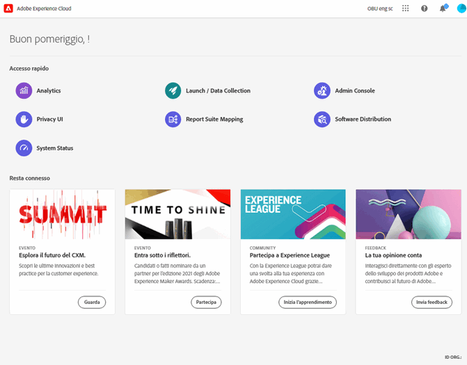
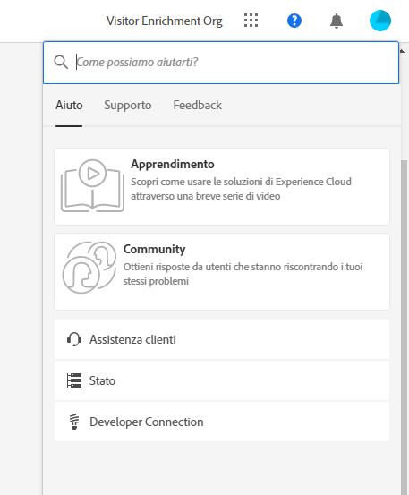
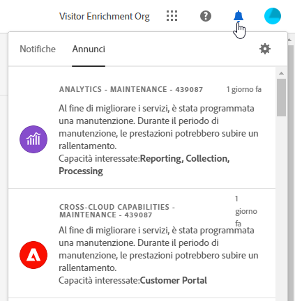

# Guida all&#39;amministrazione e all&#39;interfaccia di Adobe CX Enterprise

[Adobe CX Enterprise](https://experience.adobe.com) (Customer Experience Enterprise) è un insieme integrato di applicazioni, prodotti e servizi Adobe per il marketing digitale. L’interfaccia intuitiva consente di accedere rapidamente alle applicazioni cloud, alle funzionalità dei prodotto e ai servizi.

<!--  -->

Dall&#39;intestazione CX Enterprise è possibile effettuare le operazioni riportate di seguito.

* Accesso a tutte le applicazioni e i servizi aziendali CX
* Dal menu Aiuto, cercare la documentazione del prodotto, i tutorial e i post della community. Visualizzare i risultati in Experience League.
* Eseguire ricerche globali sugli oggetti business utilizzando la ricerca globale (solo per gli utenti di Experience Platform) nel campo Ricerca.
* Gestire le [preferenze](features/account-preferences.md) dell’account (avvisi, notifiche e abbonamenti)

## Accesso a CX Enterprise

Accedi e verifica di essere nell&#39;[organizzazione](administration/organizations.md) corretta.

1. Passare a [Adobe CX Enterprise](https://experience.adobe.com).
1. Digita il tuo indirizzo e-mail Adobe, quindi fai clic su **[!UICONTROL Continua]**.
1. Fai clic su un account.
1. Digita la tua password.
1. Verifica di essere nell’organizzazione giusta.

   

   **Verifica l’organizzazione**

   L’[organizzazione](administration/organizations.md) viene visualizzata nell’intestazione dell’interfaccia.

   Se la tua organizzazione utilizza Federated ID, CX Enterprise ti consente di accedere con il Single Sign-On della tua organizzazione senza dover immettere l’indirizzo e-mail e la password. Aggiungere `#/sso:@domain` all&#39;URL aziendale CX (`https://experience.adobe.com`) per eseguire questa attività.

   Ad esempio, per un’organizzazione con Federated ID e il dominio `example.com`, imposta il link dell’URL su `https://experience.adobe.com/#/sso:@example.com`. Puoi anche passare direttamente a una specifica applicazione salvando come segnalibro o preferito l’URL seguito dal percorso dell’applicazione. Ad esempio, per Adobe Analytics: `https://experience.adobe.com/#/sso:@example.com/analytics`.

   **Nota:** l&#39;amministratore dell&#39;organizzazione può limitare l&#39;accesso ai prodotti Adobe per indirizzo IP. In tal caso, è possibile che venga visualizzato un messaggio di errore dopo aver effettuato l&#39;accesso a CX Enterprise o il passaggio a un&#39;organizzazione con questa opzione abilitata. Ulteriori informazioni sono disponibili in [Limitare l&#39;accesso ai prodotti per indirizzi IP](https://helpx.adobe.com/enterprise/using/ip-based-access.html).

## Accesso alle applicazioni aziendali CX

Dopo aver effettuato l&#39;accesso a CX Enterprise, è possibile accedere rapidamente a tutte le applicazioni, i servizi e le organizzazioni dall&#39;intestazione unificata.

Per accedere alle applicazioni e ai servizi CX Enterprise per i quali disponi dei diritti di accesso nella tua organizzazione, passa al selettore delle applicazioni .

## Ottenere assistenza e supporto

Accedi all&#39;apprendimento e alla guida utilizzando il **[!UICONTROL Centro assistenza]** () nell&#39;intestazione, incluso il contenuto della guida (documentazione, tutorial e corsi) in [Experience League](https://experienceleague.adobe.com/?lang=it#home), nonché risorse aggiuntive per le singole applicazioni. Puoi anche inviare feedback aperti e creare ticket di supporto con priorità.

Il menu [!UICONTROL Guida] consente inoltre di accedere a:

* **[!UICONTROL Supporto]:** Crea un ticket di supporto o contatta il [!UICONTROL Supporto] tramite Twitter.
* **[!UICONTROL Feedback]:** Condividi feedback sulla tua esperienza CX Enterprise. Il tuo feedback viene utilizzato per migliorare i prodotti e i servizi di Adobe.
* **[!UICONTROL Stato]:** Passa a `https://status.adobe.com/experience_cloud`, verifica lo stato operativo del prodotto e [!UICONTROL Gestisci abbonamenti].
* **[!UICONTROL Developer Connection]:** Navigazione a `adobe.io` e ricerca la documentazione per gli sviluppatori.

## Gestione del profilo utente

Nel menu [!UICONTROL Profilo] puoi:

* Specificare un tema scuro (non tutte le applicazioni supportano questo tema)
* Gestisci [Preferenze](features/account-preferences.md) di CX Enterprise
* Selezionare o cercare un’[Organizzazione](administration/organizations.md)
* Visualizza [!UICONTROL Note legali]
* Uscire
* Configurare preferenze, notifiche e abbonamenti dell’account

## Visualizzare notifiche e annunci interni al prodotto

Fai clic sull’icona a forma di campana per visualizzare notifiche e annunci. Gli annunci possono riferirsi ad aggiornamenti rilevanti e fruibili, inclusi rilasci di prodotto, avvisi di manutenzione, elementi condivisi e richieste di approvazione.

Per gestire notifiche e avvisi, vedere [Preferenze account e notifiche](features/account-preferences.md)

