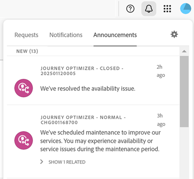

# Guida dei componenti dell’interfaccia centrale di Experience Cloud

[Experience Cloud](https://experience.adobe.com) è un insieme integrato di applicazioni, prodotti e servizi Adobe per il marketing digitale. L’interfaccia intuitiva consente di accedere rapidamente alle applicazioni cloud, alle funzionalità dei prodotto e ai servizi.

Dall’area dell’intestazione di Experience Cloud, è possibile:

* Accedere alle applicazioni e ai servizi
* Cercare documentazione di prodotto, tutorial e post della community
* Eseguire ricerche globali sugli oggetti business (solo per gli utenti di Experience Platform)
* Gestire le preferenze dell’account (avvisi, notifiche e abbonamenti)

## Accedere a Experience Cloud {#signin}

Accedi e verifica di essere nell&#39;[organizzazione](organizations.md) corretta.

1. Passa ad [Adobe Experience Cloud](https://experience.adobe.com).
1. Seleziona **[!UICONTROL Accedi con un Adobe ID]**.
1. Verifica di essere nell’organizzazione corretta.

   

   **Verificare la propria organizzazione**

   Per verificare di aver effettuato l&#39;accesso alla [organizzazione](organizations.md) corretta, fai clic sull&#39;avatar del tuo profilo per visualizzare il nome dell&#39;organizzazione. Se hai accesso a più organizzazioni, puoi anche visualizzare e passare a un’altra organizzazione direttamente nella barra dell’intestazione.

   Se l’organizzazione utilizza Federated ID, Experience Cloud consente di accedere con il single sign-on dell’organizzazione senza la necessità di immettere l’indirizzo e-mail e la password. A questo scopo, aggiungi `#/sso:@domain` all&#39;URL dell&#39;Experience Cloud (`https://experience.adobe.com`).

   Ad esempio, per un’organizzazione con Federated ID e il dominio `adobecustomer.com`, imposta il collegamento URL su `https://experience.adobe.com/#/sso:@adobecustomer.com`. Puoi anche accedere direttamente a un&#39;applicazione specifica segnalando questo URL, aggiunto al percorso dell&#39;applicazione. (Ad esempio, per Adobe Analytics, `https://experience.adobe.com/#/sso:@adobecustomer.com/analytics`.)

## Accedere alle applicazioni di Experience Cloud {#navigation}

Dopo aver effettuato l’accesso ad Experience Cloud, è possibile accedere rapidamente a tutte le applicazioni, i servizi e le organizzazioni dall’lintestazione unificata.

Per accedere alle applicazioni e ai servizi di Experience Cloud forniti all&#39;interno della tua organizzazione, vai al selettore delle applicazioni .

## Supporto browser in Experience Cloud {#browser}

Per ottenere le migliori prestazioni, Experience Cloud è ottimizzato per i browser più popolari, inclusa la versione più recente, e per le due versioni precedenti.

* Chrome
* Bordo
* Firefox
* Opera
* Safari

Se il browser in uso non è presente nell’elenco, potrebbe essere comunque supportato, ma si consiglia di utilizzare uno dei browser elencati.

>[!NOTE]
>
>Non tutte le applicazioni in esecuzione sul dominio Experience Cloud supportano tutti i browser. Se non sei sicuro, controlla la documentazione di un&#39;applicazione specifica.

## Supporto linguistico in Experience Cloud {#languages}

Experience Cloud supporta le lingue preferite per ogni utente, come impostato nelle preferenze dell’account utente di Adobe. Le lingue supportate al momento sono:

* Cinese
* Inglese
* Francese
* Tedesco
* Italiano
* Giapponese
* Coreano
* Portoghese
* Spagnolo
* Taiwanese

Sebbene tutti i team applicativi si siano impegnati a supportare le lingue globali, non tutte le applicazioni sono disponibili in tutte le lingue indicate in precedenza. Se la lingua principale non è supportata in un&#39;applicazione Experience Cloud, è inoltre possibile impostare una lingua secondaria su predefinita, se applicabile. Questo può essere fatto in [Experience Cloud preferenze utente](https://experience.adobe.com/preferences).

## Ottenere assistenza e supporto {#support}

Accedi a informazioni e aiuto utilizzando l’icona Aiuto () nell’intestazione, compresi i contenuti della guida (documentazione, esercitazioni e corsi) su [Experience League](https://experienceleague.adobe.com/?lang=it#home), e le risorse aggiuntive per le singole applicazioni. Puoi anche inviare feedback aperti e creare ticket di supporto con priorità.

Il menu [!UICONTROL Aiuto] consente inoltre di accedere a:

* **[!UICONTROL Supporto]:** crea un ticket di supporto o contatta il [!UICONTROL Supporto] tramite Twitter.
* **[!UICONTROL Feedback]:** invia feedback sulla tua esperienza nell’uso di Experience Cloud. Il tuo feedback viene utilizzato per migliorare i prodotti e i servizi di Adobe.
* **[!UICONTROL Stato]:** passa a `https://status.adobe.com/experience_cloud` per controllare lo stato operativo del prodotto e [!UICONTROL gestire gli abbonamenti].
* **[!UICONTROL Developer Connection]:** naviga in `adobe.io` e accedi alla documentazione per gli sviluppatori.

## Ricerca globale di oggetti ed entità {#search}

La ricerca globale consente di trovare oggetti o entità business ricercabili in modalità semplice, coerente e immediata. Questa ricerca fa emergere gli oggetti utilizzati di recente.

>[!NOTE]
>
>La ricerca globale non è disponibile in tutte le applicazioni Experience Cloud, ma man mano che viene indicizzato più contenuto, verrà aggiunta alle applicazioni pertinenti. Disponibilità a partire da luglio 2021:

* Experience Platform
* Journey Optimizer

## Preferenze di profilo utente e account {#preferences}

Le preferenze di Experience Cloud includono notifiche, abbonamenti e avvisi. Nel menu delle preferenze dell’account puoi effettuare le seguenti operazioni:

* Specificare un tema scuro (non tutte le applicazioni supportano questo tema)
* Cercare le [organizzazioni](organizations.md)
* Uscire
* Configurare preferenze, notifiche e abbonamenti dell’account

Per gestire le preferenze, seleziona **[!UICONTROL Preferenze]** dal menu dell&#39;account .

Nelle [!UICONTROL preferenze di Experience Cloud], è possibile configurare le seguenti funzioni:

| Funzione | Descrizione |
|--- |--- |
| [Organizzazione](organizations.md) predefinita | Seleziona l’organizzazione da visualizzare all’avvio di Experience Cloud. |
| [!UICONTROL Abbonamenti] | Seleziona i prodotti e le categorie a cui desideri abbonarti. Notifiche nel riquadro a comparsa [!UICONTROL Notifiche] e via e-mail. |
| [!UICONTROL Priorità] | Seleziona le categorie a cui vuoi assegnare la priorità alta. Queste categorie sono contrassegnate con il tag Alta e possono essere configurate per la distribuzione come avvisi. |
| [!UICONTROL Avvisi] | Seleziona le notifiche per le quali desideri visualizzare gli avvisi nel browser. Gli avvisi vengono visualizzati per alcuni secondi nell’angolo in alto a destra della finestra. |
| E-mail | Specifica la frequenza con cui desideri ricevere le e-mail di notifica: Non inviata, Immediata, Giornaliera o Settimanale. |

{style=&quot;table-layout:auto&quot;}

## Notifiche e annunci {#notifications}

Seleziona **[!UICONTROL Notifiche]** per ricevere avvisi sugli aggiornamenti rilevanti e fruibili, ad esempio versioni di prodotto, avvisi di manutenzione, elementi condivisi e richieste di approvazione.

## domini di Experience Cloud {#domains}

Experience Cloud utilizza i seguenti host per distribuire l’applicazione, migliorare le prestazioni e l’esperienza di prodotto. Adobe consiglia di aggiungere questi domini all’elenco Consentiti del firewall, per garantire un’esperienza ottimale. Domini aggiuntivi possono essere utilizzati anche per applicazioni di Experience Cloud specifiche, come Adobe Analytics. Per ulteriori informazioni, consulta la documentazione di queste applicazioni .

| Tecnologia | Domini |
|--- |--- |
| Domini Adobe Experience Cloud | `adobe.com`, `adobe.net`, `adobe.io` |
| Servizio Adobe Identity Management (IMS) | `adobelogin.com` |
| Experience Cloud di font | `typekit.net` |
| Visibilità (per assistenza e guida sui prodotti) | `esp.aptrinsic.com` |

## Ottenere aiuto per l’amministrazione e i servizi tra diverse applicazioni

Questa guida fornisce informazioni utili per l’amministrazione di utenti e prodotti Experience Cloud tramite Admin Console e l’abilitazione delle soluzioni per i servizi Platform. Puoi anche accedere all’Aiuto per Libreria tipi di pubblico, Attributi del cliente, Experience Cloud Assets e altro ancora:

* [[!UICONTROL Libreria pubblico]](audience-library.md)
* [[!UICONTROL Attributi del cliente]](attributes.md)
* [[!UICONTROL Triggers]](triggers.md)
* [Experience Cloud [!UICONTROL Assets]](experience-cloud-assets.md)
* [Cookie di Experience Cloud](cookies-privacy.md)
* [Gestione di utenti e prodotti](admin-getting-started.md) (Admin Console)
* [Abilitare le soluzioni per i servizi principali](core-services.md)
* [Domande frequenti](admin-getting-started.md)
* [Organizzazioni e collegamento di account](organizations.md)
* [Integrazioni](marketing-cloud-integrations.md)
* [Integrazione di Adobe Target con Experience Cloud](https://experienceleague.adobe.com/docs/target/using/integrate/a4t/a4t.html?lang=it)
* [Panoramica sulla privacy e sulla sicurezza di Experience Cloud](assets/Adobe-Marketing-Cloud-Privacy-and-Security-Overview.pdf)
* [Recupero preventivo del DNS](admin-getting-started.md#concept_6BC8C6856E3644F8956D7AD0A96383B7)

## Guide

Le guide correlate a Experience Cloud includono:

* [Adobe Mobile](https://experienceleague.adobe.com/docs/mobile-services/using/home.html?lang=it)
* [Grafico Co-op di Experience Platform](https://experienceleague.adobe.com/docs/device-co-op/using/home.html?lang=it)
* [Exchange](https://exchange.adobe.com/experiencecloud)
* [Servizio Experience Cloud ID](https://experienceleague.adobe.com/docs/id-service/using/home.html?lang=it)
* [Experience Platform Data Collection/Launch](https://experienceleague.adobe.com/docs/launch.html?lang=it)
* [Experience Cloud Debugger](https://experienceleague.adobe.com/docs/debugger/using/experience-cloud-debugger.html?lang=it)
* [API del regolamento generale sulla protezione dei dati (RGPD)](https://www.adobe.io/apis/experiencecloud/gdpr.html)
* [[!UICONTROL Dynamic Tag Management]](https://experienceleague.adobe.com/docs/experience-platform/tags/home.html?lang=en)

## Tutorial

Sfrutta i tutorial e le guide pratiche disponibili in Experience League:

* [Tutti i tutorial in Experience League](https://experienceleague.adobe.com/?lang=it#quick-how-tos)
* [Tutorial su Experience Platform](https://experienceleague.adobe.com/docs/launch-learn/tutorials/overview.html?lang=it)
* [Real-time Customer Data Platform](https://experienceleague.adobe.com/docs/platform-learn/tutorials/application-services/rtcdp/understanding-the-real-time-customer-data-platform.html?lang=it)

## Note sulla versione e guide relative a Experience Cloud

* [Documentazione del prodotto per tutte le soluzioni Experience Cloud](https://experienceleague.adobe.com/docs/home.html?lang=en): cerca aiuto all&#39;interno di Informazioni e supporto di Experience Cloud
* [Note sulla versione e aggiornamenti dei prodotti](https://experienceleague.adobe.com/docs/release-notes/experience-cloud/current.html?lang=it): le novità di Experience Cloud, tutti gli aggiornamenti per chi si abbona
* [Esercitazioni per l&#39;implementazione dei servizi core](https://experienceleague.adobe.com/docs/launch-learn/tutorials/overview.html?lang=en): video ed esercitazioni sui servizi core
* [Assistenza degli esperti di Experience League](https://experienceleague.adobe.com/?lang=it): ottieni informazioni guidate dagli esperti e dalla community
* [Formazione e training](https://helpx.adobe.com/it/learning.html?promoid=KAUDK): interagisci con Adobe per trarre il massimo dai nostri prodotti.
* [Blog sull&#39;esperienza dei clienti](https://blog.adobe.com/it/topics/digital-transformation.html): leggi il blog Experience Cloud
* [Assistenza clienti](https://experienceleague.adobe.com/?support-solution=General&amp;lang=it#support): contatta l&#39;Assistenza clienti Adobe
