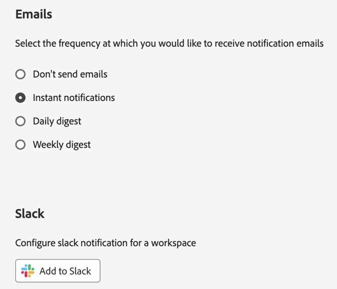

# Preferenze e notifiche dell’account

Per trovare le preferenze di Experience Cloud, fai clic su **[!UICONTROL Profile]**  nell&#39;intestazione, quindi su **[!UICONTROL Preferences]**.

{width="100" zoomable="yes"}

Nella pagina [!UICONTROL Experience Cloud preferences] è possibile gestire le seguenti funzionalità dell&#39;account:

| Funzione | Descrizione |
| --- | --- |
| [!UICONTROL Profile] | Aggiorna il tuo [profilo account Adobe](https://account.adobe.com/profile). 
La foto del tuo profilo e il tuo nome vengono visualizzati quando accedi a Adobe.com, prodotti e servizi Adobe e su siti pubblici come [!DNL Behance]. |
| [!UICONTROL General] | Seleziona un&#39;organizzazione [organizzazione](../administration/organizations.md).
Questa organizzazione è quella predefinita utilizzata quando accedi ad Experience Cloud. |
| [!UICONTROL Product usage data] | Puoi controllare quali dati di utilizzo del prodotto vengono condivisi con Adobe quando utilizzi le applicazioni Experience Cloud. Si tratta di dati sul modo in cui utilizzi i nostri prodotti, non il contenuto o i dati della tua organizzazione. Adobe utilizza queste informazioni per migliorare i nostri prodotti, fornirti supporto avanzato all’interno del prodotto e personalizzare la tua esperienza e le tue comunicazioni da noi. 
Per ulteriori informazioni, consulta [Dati sull&#39;utilizzo del prodotto](#product-usage-data) (in questa pagina). |
| [!UICONTROL Notifications] | Configura come e quando desideri ricevere [notifiche](#subscribe-to-notifications-in-experience-cloud) per il prodotto e avvisi: <ul><li>Seleziona i prodotti ai quali desideri abbonarti per ricevere gli avvisi</li><li>Configura il tipo di notifica ([!UICONTROL in-app], [!UICONTROL email] o [Slack](#slack-notifications))</li><li>Specifica la frequenza con cui desideri ricevere le e-mail di notifica: Non inviata, Immediata, Giornaliera o Settimanale.</li><li>Determinare la priorità dell&#39;avviso. Gli avvisi in-app vengono visualizzati nell’angolo in alto a destra della finestra per alcuni secondi. In alternativa, è possibile specificare se gli avvisi devono essere visualizzati fino a quando non vengono ignorati.</li></ul> |

## [!UICONTROL Product usage data]

I dati di utilizzo del prodotto che scegli di condividere con Adobe includono i seguenti tipi di informazioni su come utilizzi e interagisci con le applicazioni Adobe:

* Informazioni su browser e dispositivi, come modello e sistema operativo del dispositivo, informazioni su software e hardware, impostazioni del browser e del dispositivo, identificatori univoci (come indirizzo IP, ID cookie o ID dispositivo), quantità di memoria installata, impostazioni della lingua e risoluzione dello schermo;
* Come interagisci con le app Adobe Experience Cloud, incluse le funzioni che utilizzi e le opzioni selezionate;
* informazioni sul prodotto Adobe, ad esempio il numero di versione;
* Informazioni sul contenuto e sui documenti, ad esempio il numero di pagine e gli identificatori univoci, ma non il contenuto stesso;
* Informazioni sull’utilizzo dei contenuti, ad esempio quante volte accedi ai contenuti e come interagisci con i contenuti all’interno dell’app;
* Registri di arresti anomali ed errori.

Adobe utilizza queste informazioni per migliorare i nostri prodotti, fornirti supporto sia all’interno del prodotto che tramite l’assistenza clienti, e per personalizzare la tua esperienza e le tue comunicazioni da noi. Ulteriori informazioni su [esperienze personalizzate](personalized-learning.md).

## Abbonati alle notifiche in Experience Cloud

Puoi selezionare i prodotti e le categorie a cui desideri abbonarti. Le notifiche vengono visualizzate nel popover [!UICONTROL Notifications] (in-app), nell&#39;e-mail o in [Slack](#slack-notifications) (a seconda degli abbonamenti).

Le notifiche e-mail e Slack sono utili nelle situazioni in cui non hai effettuato l’accesso ad Experience Cloud.

### Abbonati per ricevere notifiche in-app ed e-mail

1. Passa a [preferenze](https://experience.adobe.com/preferences) di Experience Cloud.

1. In **[!UICONTROL Notifications]**, abilitare **[!UICONTROL In-app]** o **[!UICONTROL Email]**.

   Le modifiche alle notifiche vengono salvate automaticamente.

### Iscriviti a [!DNL Slack] notifiche

Puoi configurare le preferenze del tuo account per inviare notifiche Experience Cloud a un canale [!DNL Slack].

**Prerequisiti**

* Devi disporre di un account Experience Cloud.
* Devi avere un account [!DNL Slack]. L&#39;amministratore di [!DNL Slack] abilita l&#39;integrazione di Experience Cloud con [!DNL Slack].
* È necessario far parte di almeno un&#39;area di lavoro [!DNL Slack].

**Per iscriversi a [!DNL Slack] notifiche**

1. Passa a [Preferenze](https://experience.adobe.com/preferences) di Experience Cloud.

1. Individuare [!DNL Slack], quindi fare clic su **[!UICONTROL Add to Slack]**.

   

   Se [!DNL Slack] è installato, l&#39;applicazione viene aperta e viene visualizzato un messaggio di richiesta di autorizzazione. Se Slack non è installato, è necessario [richiedere l&#39;autorizzazione](#slack-troubleshoot).

1. Fai clic su **[!UICONTROL Allow]**.

1. In **[!UICONTROL Notifications]**, abilita [!DNL Slack] notifiche per i prodotti e le categorie desiderati.

   

   Gli aggiornamenti alle notifiche vengono salvati automaticamente.

### Richiedi autorizzazione in [!DNL Slack] (risoluzione dei problemi)

Se [!DNL Slack] non è installato, dopo aver fatto clic su _[!UICONTROL Request to install]_viene visualizzato un messaggio di **[!UICONTROL Add to Slack]**all&#39;apertura di Slack. Ad esempio:

**Per richiedere le autorizzazioni in Slack**

1. In [!DNL Slack], selezionare l&#39;area di lavoro dal menu **[!UICONTROL Workspace]** (angolo in alto a destra).

1. Per richiedere l&#39;approvazione dell&#39;applicazione per il gestore dell&#39;area di lavoro [!DNL Slack], fare clic su **[!UICONTROL Submit]**.

1. Riceverai una notifica in [!DNL Slack] dopo l&#39;approvazione della richiesta di applicazione.

1. Dopo aver ricevuto l&#39;approvazione di [!DNL Slack], torna ad Experience Cloud **[!UICONTROL Notifications]** e segui la procedura per [iscriverti a Slack](#slack-notifications) (come descritto in precedenza).

### Elementi visualizzati in [!DNL Slack]

Dopo aver integrato correttamente [!DNL Slack], le notifiche di [!DNL Slack] visualizzano le seguenti informazioni:

* Il messaggio personale verrà ricevuto dal nome applicazione _Adobe[!DNL Experience Cloud]_.
* Il messaggio include il logo del prodotto per l&#39;applicazione specifica, ad esempio Adobe [!DNL Experience Platform], Adobe [!DNL Experience Manager] e così via.
* Un collegamento per visualizzare tutte le notifiche su Experience Cloud.
* Un collegamento per gestire le preferenze di notifica su Experience Cloud.

## Visualizza [!UICONTROL notifications] e annunci in Experience Cloud

Nell&#39;intestazione [!DNL Experience Cloud] puoi visualizzare le notifiche alle quali hai [effettuato l&#39;abbonamento](#notifications), nonché gli annunci.

1. Fai clic sull’icona a forma di campana nell’intestazione. 

1. Fai clic su **[!UICONTROL Notifications]** o **[!UICONTROL Announcements]**.

   In questa posizione puoi ricevere informazioni importanti sui prodotti, sulla collaborazione con altri utenti e su altri aggiornamenti rilevanti. Gli aggiornamenti includono versioni di prodotto, avvisi di manutenzione, elementi condivisi e richieste di approvazione.

