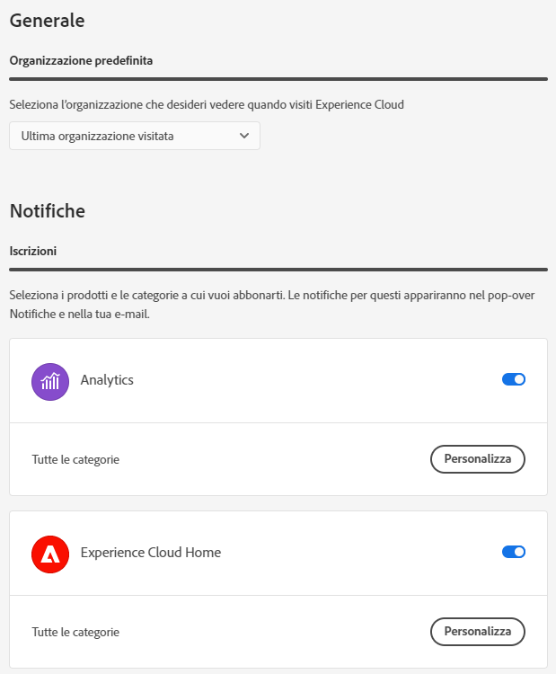

# Preferenze e notifiche dell’account {#preferences}

Le preferenze di Experience Cloud includono notifiche, abbonamenti e avvisi. Nel menu delle preferenze dell’account puoi effettuare le seguenti operazioni:

* Specificare un tema scuro (non tutte le applicazioni supportano questo tema)
* Cercare le [organizzazioni](../administration/organizations.md)
* Uscire
* Configurare preferenze, notifiche e abbonamenti dell’account

Per gestire le preferenze, seleziona **[!UICONTROL Preferenze]** nel menu dell’account .

Nelle [!UICONTROL preferenze di Experience Cloud], è possibile configurare le seguenti funzioni:

| Funzione | Descrizione |
|--- |--- |
| [Organizzazione](../administration/organizations.md) predefinita | Seleziona l’organizzazione da visualizzare all’avvio di Experience Cloud. |
| [!UICONTROL Raccolta dati sui prodotto] | Seleziona le tecnologie che Adobe può utilizzare per raccogliere i dati sul modo in cui utilizzi i suoi prodotti. |
| [!UICONTROL Promozioni e consigli personalizzati per l’apprendimento] | Seleziona il punto in cui desideri ricevere [aiuto personalizzato](personalized-learning.md) per i tuoi prodotti di Adobe. Questa guida è disponibile tramite e-mail, nel prodotto e nelle community di Experienci League. |
| [!UICONTROL Abbonamenti] | Seleziona i prodotti e le categorie a cui desideri abbonarti. Notifiche nel popover [!UICONTROL Notifiche] e nell&#39;e-mail. |
| [!UICONTROL Priorità] | Seleziona le categorie a cui vuoi assegnare la priorità alta. Queste categorie sono contrassegnate con un tag [!UICONTROL Elevato] e possono essere configurate per la consegna come avvisi. |
| [!UICONTROL Avvisi] | Seleziona le notifiche per le quali desideri visualizzare gli avvisi nel browser. Gli avvisi vengono visualizzati per alcuni secondi nell’angolo in alto a destra della finestra. |
| E-mail | Specifica la frequenza con cui desideri ricevere le e-mail di notifica: Non inviata, Immediata, Giornaliera o Settimanale. |

## [!UICONTROL Notifiche] e [!UICONTROL Annunci] {#notifications}

Seleziona **[!UICONTROL Notifiche]** per ricevere avvisi sugli aggiornamenti rilevanti e fruibili, inclusi rilasci di prodotto, avvisi di manutenzione, elementi condivisi e richieste di approvazione.

<!-- ## [!DNL Slack] notifications

Releasing: **September 2, 2024**

You can configure your account preferences to send Experience Cloud notifications to Slack.

**Prerequisites**

* You must have an Experience Cloud account
* You must have a [!DNL Slack] account
* You must be a part of at least one [!DNL Slack] workspace

### To configure Slack notifications

1. Sign in to Experience Cloud.

1. Click your account icon, then click **[!UICONTROL Preferences]**.

1. Under [!DNL Slack], click **[!UICONTROL Add to Slack]**.

1. When [!DNL Slack] opens, click **[!UICONTROL Allow]**.

1. In Experience Cloud Preferences, navigate to **[!UICONTROL Notifications]**.

   [Slack notifications](../assets/slack.png)

1. Enable [!DNL Slack] notifications for your desired products and categories.
 -->

## Supporto dei browser in Experience Cloud {#browser}

Per prestazioni ottimali, Experience Cloud è stato ottimizzato per i browser più diffusi, comprese l’ultima versione e le due versioni precedenti.

* Chrome
* Edge
* Firefox
* Opera
* Safari

Se il tuo browser non è elencato, potrebbe comunque essere supportato, ma si consiglia di usare uno dei browser elencati.

>[!NOTE]
>
>Non tutte le applicazioni in esecuzione nel dominio Experience Cloud supportano tutti i browser. In caso di dubbi, consulta la documentazione delle specifiche applicazioni.

## Supporto delle lingue in Experience Cloud {#languages}

Experience Cloud supporta le lingue preferite per ciascun utente, impostate nelle preferenze del proprio account utente Adobe. Sono supportate le seguenti lingue:

* Cinese
* Inglese
* Francese
* Tedesco
* Italiano
* Giapponese
* Coreano
* Portoghese
* Spagnolo
* Taiwanese

Tutti i team delle applicazioni sono orientati al supporto globale delle lingue; tuttavia, non tutte le applicazioni sono disponibili in tutte le lingue sopraelencate. Se la tua lingua principale non è supportata in un’applicazione Experience Cloud, puoi impostare una lingua secondaria che, all’occorrenza, verrà usata per impostazione predefinita. Puoi impostare queste opzioni nelle [preferenze utente di Experience Cloud](https://experience.adobe.com/preferences).