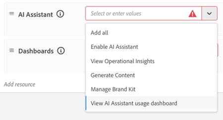
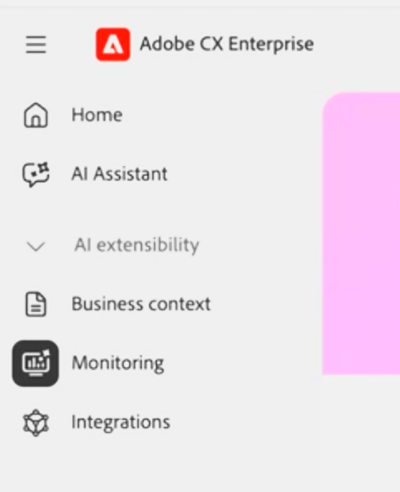

# Dashboard di monitoraggio di IA agente

Il dashboard di monitoraggio di IA per l’analisi dell’agente offre ai membri del Centro di eccellenza (COE) e ad altre parti interessate alla governance visibilità sull’utilizzo e l’adozione di IA per l’analisi dell’agente. Visualizzare le tendenze di 7 o 30 giorni per vedere chi utilizza [!DNL AI Assistant] o altre superfici (ad esempio [Adobe Marketing Agent for Microsoft 365 Copilot](https://experienceleague.adobe.com/it/docs/experience-cloud-ai/experience-cloud-ai/agents/ama-ms)) per interagire con [!DNL Experience Platform Agents] e il valore ricevuto. Insieme, queste visualizzazioni ti aiutano a guidare l’adozione degli agenti con dati anziché presupposti.

**Disponibilità**

* Attualmente, qualsiasi account con una licenza per almeno un’applicazione nativa di Experience Platform (Customer Journey Analytics, Journey Optimizer o Real-Time CDP) può accedere a questa dashboard
* Le metriche di utilizzo e adozione per [applicazioni AI-first](agentic-ai.md#ai-first-cx-enterprise-applications) come Experimentation Accelerator, LLM Optimizer e Sites Optimizer non rientrano nell&#39;ambito di questa dashboard.

Il dashboard [!UICONTROL Monitoraggio] include le visualizzazioni seguenti:

| Dashboard di | Scopo |
| --- | --- |
| **Panoramica** | Metriche aggregate per utenti, conversazioni, feedback e consumo di credito |
| **Utenti** | Frequenza di utilizzo, distribuzione e coinvolgimento per utente |
| **Feedback** | Segnali sulla qualità della risposta e sulla soddisfazione degli utenti |
| **Crediti IA** | Andamenti dei consumi di credito e saldo residuo |

Nella documentazione di [Agentic AI in Adobe CX Enterprise](agentic-ai.md) sono elencati gli agenti inclusi nell&#39;ambito del monitoraggio dell&#39;utilizzo in [agenti AI nelle app CX Enterprise esistenti](agentic-ai.md#existing-apps-table).

>[!VIDEO](https://video.tv.adobe.com/v/3491874?captions=ita&learn=on)

## Abilita autorizzazioni dashboard {#permissions}

Concedi l&#39;accesso al dashboard in [!DNL Adobe Experience Platform] aggiornando il profilo o il ruolo di prodotto per ogni utente autorizzato. La funzionalità [!UICONTROL Monitoraggio] viene visualizzata agli utenti della home page di CX Enterprise dopo l&#39;abilitazione delle autorizzazioni.

>[!IMPORTANT]
>
>I dati di monitoraggio sono disponibili solo nella sandbox di produzione predefinita. Le sandbox di sviluppo non sono supportate per la visualizzazione dei dati di monitoraggio. Gli utenti devono disporre delle autorizzazioni di monitoraggio richieste per la sandbox di produzione predefinita e passare a tale sandbox per visualizzare i dati di monitoraggio.
>
>Per evitare confusione, Adobe consiglia di concedere le autorizzazioni di monitoraggio in tutte le sandbox, inclusa la sandbox di produzione predefinita. In questo modo gli utenti possono accedere al dashboard di monitoraggio indipendentemente dalla sandbox attualmente selezionata e riduce la probabilità che una sandbox non supportata venga scambiata per una dashboard vuota o non funzionale.

**Per abilitare le autorizzazioni del dashboard**

1. Vai a [!DNL Experience Platform] **Amministrazione** > **Autorizzazioni**.

1. Apri il profilo di prodotto o il ruolo che desideri aggiornare.

   

1. In **[!UICONTROL Autorizzazioni dell&#39;Assistente AI]**, fai clic su **[!UICONTROL Aggiungi risorsa]**, quindi abilita **[!UICONTROL Visualizza dashboard di utilizzo dell&#39;Assistente AI]**.

   Questa autorizzazione consente di accedere alle dashboard di monitoraggio dell’utilizzo di IA per l’agente.

1. In **[!UICONTROL Dashboard]** autorizzazioni, configura l&#39;accesso al dashboard in base alle responsabilità di ogni utente.

   

   Autorizzazioni consigliate per gli utenti di governance autorizzati:

   * **[!UICONTROL Visualizza dashboard utilizzo licenze]**
   * **[!UICONTROL Visualizza dashboard standard]**
   * **[!UICONTROL Esporta dati dashboard]** (facoltativo, solo per utenti di governance approvati)

   Se necessario, puoi concedere altre autorizzazioni:

   * **[!UICONTROL Gestione dashboard personalizzati]**
   * **[!UICONTROL Visualizza dashboard personalizzati]**
   * **[!UICONTROL Gestione dashboard standard]**

1. Per visualizzare le dashboard, tornare alla home di CX Enterprise, quindi fare clic su **[!UICONTROL Monitoraggio]**.

   

## Dashboard panoramica

La dashboard Panoramica è il punto centrale per le metriche di adozione e coinvolgimento in tutta l’organizzazione. Collega le tendenze di alto livello ad analisi più approfondite. Per vedere cosa guida i numeri, approfondisci le singole conversazioni da qualsiasi metrica.

### Metriche nel dashboard Panoramica

* **Richieste nel tempo:** Tendenze generali di crescita dell&#39;utilizzo e di adozione.
* **Utenti e conversazioni attivi:** numero di utenti che interagiscono con [!DNL Experience Platform Agents].
* **Numero medio di richieste per conversazione:** Profondità di coinvolgimento per conversazione.
* **Feedback:** Distribuzione dei commenti degli utenti (solo per [!DNL AI Assistant] interazioni).

>[!VIDEO](https://video.tv.adobe.com/v/3491884?captions=ita&learn=on)

### Ripetizione conversazione

La ripetizione della conversazione mostra singole interazioni, non solo aggregati. Puoi analizzare i pattern in molte conversazioni e passare da tendenze di alto livello a una conversazione specifica.

* **Cronologia richieste e risposte:** La richiesta dell&#39;utente e le risposte inviate.
* **Segnali di feedback:** Interazioni contrassegnate da pollici in alto o in basso per identificare attriti, blocchi o esigenze di attivazione. Queste informazioni aiutano la tua organizzazione a migliorare la rilevanza dei messaggi immediati e consentono ad Adobe di migliorare la qualità della risposta nel tempo.

>[!VIDEO](https://video.tv.adobe.com/v/3491893?captions=ita&learn=on)

## Dashboard utenti

Il dashboard Utenti mostra come l’adozione e il coinvolgimento degli agenti variano nel tempo tra gli utenti. Puoi vedere chi utilizza attivamente [!DNL Experience Platform Agents], quale superficie utilizzano e con quale frequenza interagiscono. Gli amministratori e i membri del CDE possono approfondire le attività e le conversazioni dei singoli utenti per comprendere i modelli di coinvolgimento e il comportamento di utilizzo.

### Metriche nel dashboard Utenti

* **Tendenze di adozione e coinvolgimento nel tempo:** Tieni traccia del cambiamento dei segmenti utente durante il periodo selezionato. Gli utenti sono classificati come:
   * **Nuova:** prima attività nel periodo selezionato, senza attività nei 12 mesi precedenti.
   * **Ripeti:** attività nel periodo selezionato e nel periodo precedente.
   * **Restituzione:** attività nel periodo selezionato, ma non nel periodo precedente.
   * **Inattiva:** Nessuna attività nel periodo selezionato, ma attività nel periodo precedente.
* **Modelli di coinvolgimento degli utenti:** con quale frequenza gli utenti interagiscono con gli agenti e come il coinvolgimento cambia nel tempo.
* **Attività conversazione:** Numero di conversazioni e prompt per utente.
* **Utenti attivi principali:** Utenti e team altamente coinvolti che hanno adottato l&#39;agente motore.

>[!VIDEO](https://video.tv.adobe.com/v/3491926?captions=ita&learn=on)

## Dashboard feedback

Il dashboard Feedback mostra il feedback degli utenti inviato per le interazioni degli agenti. Puoi vedere quali conversazioni gli utenti hanno contrassegnato in modo positivo o negativo e indagare le interazioni dietro il feedback. Per esaminare i prompt, le risposte, i dettagli del ragionamento e le note di feedback, approfondisci le singole conversazioni dai riepiloghi dei feedback.

### Metriche nel dashboard Feedback

* **Tendenze del feedback nel tempo:** come cambia il feedback degli utenti nel tempo.
* **Miniature in alto e miniature in basso feedback:** segnali di interazione positivi e negativi.
* **Categorie di feedback:** Motivazione dietro ogni pollice verso l&#39;alto e verso il basso.
* **Cronologia richieste e risposte:** i prompt utente e le risposte associate ai feedback inviati.
* **Dettagli e note del feedback:** Contesto e commenti aggiuntivi degli utenti durante l&#39;invio del feedback.

>[!VIDEO](https://video.tv.adobe.com/v/3491917?captions=ita&learn=on)

## Dashboard crediti IA

Il dashboard Crediti AI mostra come l&#39;utilizzo di [!DNL Experience Platform Agents] da parte dell&#39;organizzazione si traduce nel consumo di crediti AI.

### Metriche nel dashboard Crediti AI

* **Totale crediti IA utilizzati:** Utilizzo complessivo dell&#39;agente nei crediti IA.
* **Tendenze giornaliere e mensili:** picchi, cali e cambiamenti nei modelli di consumo.
* **Crediti AI rimanenti:** Saldo rimanente per consentire una pianificazione proattiva ed evitare interruzioni.

>[!VIDEO](https://video.tv.adobe.com/v/3491908?captions=ita&learn=on)

## Ulteriori informazioni su questo argomento

* [Dashboard utilizzo licenze](https://experienceleague.adobe.com/it/docs/experience-platform/dashboards/guides/license-usage) in [!DNL Experience Platform]
* [IA agente in Adobe CX Enterprise](agentic-ai.md)
* [Processi agente e consumo credito IA](ai-credit-consumption.md)
* [Dashboard utilizzo licenze](https://experienceleague.adobe.com/it/docs/experience-platform/dashboards/guides/license-usage) (Experience Platform)
