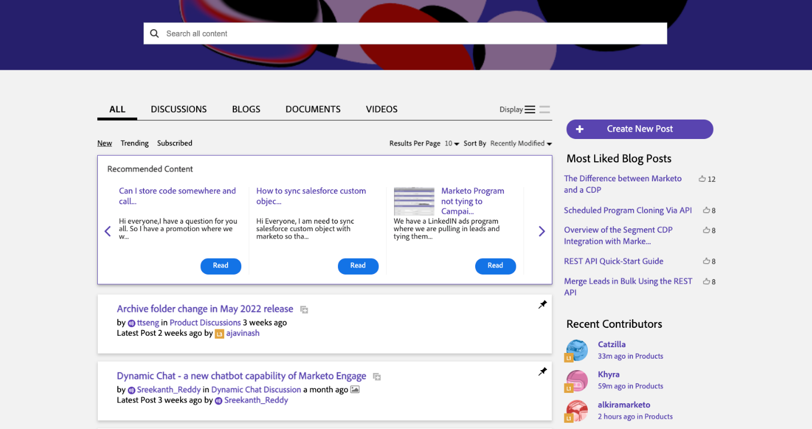

# Consigli e promozioni per l’apprendimento personalizzato

Puoi scegliere di consentire ad Adobe di fornirti contenuti utili personalizzati in base al modo in cui utilizzi i prodotti di Adobe. Seleziona le preferenze tra le opzioni seguenti per ricevere informazioni di apprendimento rilevanti per:

* Il tuo ruolo e livello di competenza
* I tuoi flussi di lavoro
* Funzioni che probabilmente userai
* E altro ancora!

{width="10%"}

Puoi aggiornare le selezioni in qualsiasi momento nella sezione di utilizzo e raccolta dati sui prodotti, nelle [Impostazioni preferenze utente](https://experience.adobe.com/preferences/).

## Consigli personalizzati per formazione e supporto sui prodotti e servizi di Adobe

Potrai ricevere best practice, suggerimenti, procedure guidate e altri contenuti mirati in base al modo in cui utilizzi i prodotti Adobe, in ciascuno di questi tre modi:

<table>
<tbody>
  <tr>
    <td>Nei prodotti Adobe </td>
    <td>Messaggi pop-up e descrizioni con assistenza in tempo reale.</td>
    <td rowspan="3">Possibili contenuti <ul><li>Guide dettagliate e suggerimenti degli esperti di Adobe</li> 
    <li>Tutorial video e procedure guidate informative</li> 
    <li>Formazione dettagliata</li> 
    <li>Video e post consigliati</li>
    </ul></td>
  </tr>
  <tr>
    <td>Nelle e-mail inviate da Adobe</td>
    <td>Contenuti di apprendimento relativi al modo in cui utilizzi i prodotti.</td>
  </tr>
  <tr>
    <td>Nelle community Experience League</td>
    <td>Consigli personalizzati su post e articoli in base alle operazioni che stai svolgendo.</td>
  </tr>
</tbody>
</table>

## Informazioni personalizzate su prodotti, servizi, eventi e promozioni di Adobe

Opportunità personalizzate per partecipare a eventi di apprendimento, sessioni di ricerca e integrazioni basate sul tuo lavoro, in ciascuno di questi tre modi:

<table>
<tbody>
  <tr>
    <td>Nei prodotti Adobe </td>
    <td>Messaggi pop-up e descrizioni per inviti e opportunità di tuo interesse.</td>
    <td rowspan="3">Possibili contenuti <ul>
    <li>Inviti a webinar ed eventi educativi</li> 
    <li>Possibilità di testare e fornire feedback sulle versioni future delle funzioni che utilizzi</li>
    <li>Suggerimenti per integrazioni tra i prodotti che possiedi</li> 
    <li>Punti salienti da sessioni chiave alla conferenza Adobe Summit in base al tuo lavoro</li>
    </ul></td>
  </tr>
  <tr>
    <td>Nelle e-mail inviate da Adobe</td>
    <td>Informazioni tempestive da Adobe su ulteriori opportunità di apprendimento.</td>
  </tr>
  <tr>
    <td>Nelle community Experience League</td>
    <td>Consigli personalizzati su eventi e servizi per migliorare il tuo apprendimento.</td>
  </tr>
</tbody>
</table>

{width="10%"}

## Guarda alcuni esempi di informazioni di apprendimento personalizzate.

### Nei prodotti di Adobe

{width="800"}

### Nelle e-mail inviate da Adobe

{width="400"}

### Nelle community Experience League

{width="800"}

{width="10%"}
