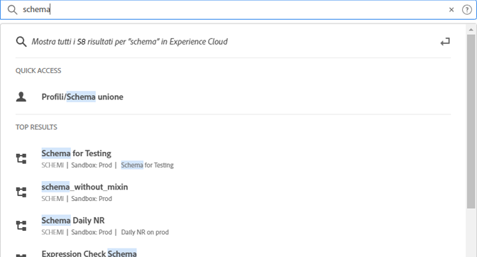
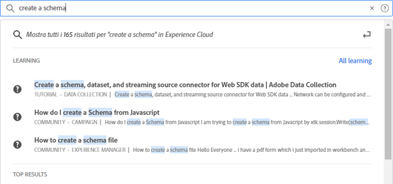

# [!UICONTROL Ricerca unificata] di oggetti ed entità {#globally-search}

La [!UICONTROL Ricerca unificata] consente di cercare oggetti o entità business ricercabili in modalità semplice, coerente e immediata. Questa ricerca fa emergere anche gli oggetti utilizzati di recente.

## Accesso alla ricerca unificata

La Ricerca unificata è disponibile in ogni pagina dell’intestazione dell’Experience Cloud nella parte superiore della pagina. È inoltre possibile utilizzare la scelta rapida da tastiera `command /` o `ctrl /` per accedere alla ricerca.

Questa funzione è disponibile solo per i prodotti supportati che al momento sono:

* Experience Platform (AEP)
* Journey Optimizer (AJO)

Poiché è stato indicizzato più contenuto, questa funzione viene aggiunta alle applicazioni pertinenti.

## Oggetti e campi ricercabili

Mentre si digita, compaiono i primi risultati corrispondenti degli Oggetti a cui si ha accesso.

I nostri algoritmi mostrano per primi i record più rilevanti. L’ordine dei risultati dipende da diversi fattori, quali:

Autorizzazioni relative a funzionalità e oggetti
Percentuale corrispondente
Se esiste una corrispondenza esatta

Gli oggetti business ricercabili includono:

* Segmenti (nome, descrizione, ID)
* Schema (nome, descrizione, ID)
* Set di dati (nome, descrizione, ID)
* Origini (nome, descrizione, ID)
* Destinazioni (nome, descrizione, ID)
* Query (nome, descrizione, ID)
* Messaggi (nome, descrizione, ID)
* Offerte (nome, descrizione, ID)
* Componenti (nome, descrizione, ID)
* Percorsi (nome, descrizione, ID)

Se una parola chiave corrisponde a una pagina di navigazione, puoi ottenere un collegamento di accesso rapido ai set di dati di esempio della pagina di navigazione. La sezione dei risultati principali mostra i primi 30 risultati.

Sono inoltre disponibili gli articoli della guida di Experience League e le community. Sono supportate le query per lingue naturali.

Ad esempio: _Come creare uno schema_ produce i risultati di Experience League in _[!UICONTROL Apprendimento]_:

Gli algoritmi di ricerca visualizzano per primi i record più rilevanti. L’ordine dei risultati dipende da diversi fattori, quali:

* Autorizzazioni utente per accedere agli oggetti
* Percentuale corrispondente
* Corrispondenze esatte
* La sezione _[!UICONTROL Risultati principali]_ mostra i primi 30 risultati.

Per perfezionare la ricerca, fai clic su una delle seguenti opzioni:

* **[!UICONTROL Tutto l’apprendimento]**: apre la ricerca in Experience League.
* **[!UICONTROL Mostra tutto...]**: consente di perfezionare e filtrare ulteriormente i risultati.

## Funzioni di ricerca unificata

In Ricerca unificata sono disponibili le seguenti funzioni.

| Funzione | Descrizione |
| ------- | ------- |
| Supporto linguistico globale | La ricerca globale comprende le query e produce risultati per tedesco, spagnolo, francese, italiano, giapponese, coreano, portoghese e cinese. |
| Tolleranza agli errori di battitura | La ricerca unificata offre una solida tolleranza agli errori di battitura utilizzando algoritmi avanzati. Questi algoritmi calcolano le modifiche e forniscono risultati appropriati. |
| Evidenziazione | La risposta di ricerca evidenzia la parola chiave corrispondente dalla query di ricerca in modo da poter trovare facilmente la sezione e le parole corrispondenti alla query. L&#39;evidenziazione funziona anche per le parole errate. |
| Snippet | Nella risposta di ricerca, puoi visualizzare uno snippet del risultato. I frammenti restituiscono le parole corrispondenti e alcuni contenuti attorno alle parole chiave corrispondenti. |
| Parole non consentite | Alcune parole comunemente usate in inglese sono definite come _parole non consentite_. Se le parole non significative sono incluse nella query di ricerca, viene assegnato loro un peso inferiore.  Le parole non consentite includono: _a, an, and, are, as, at, be, but, by, for, if, in, is, it, no, not, on, or, such, the, then, then, there, these, they, to, was, will, with_.  Le parole non sono supportate in altre lingue globali. |
| Query in linguaggio naturale | Quando si cerca un Experience League della Guida o una discussione da Community di, è possibile digitare la domanda utilizzando il linguaggio naturale e ottenere la risposta. Esempio di ricerca: &quot;Come si crea uno schema?&quot; |
| Ricerca esatta tra virgolette | È possibile eseguire una ricerca esatta utilizzando le virgolette nella query. Non viene eseguita alcuna correzione degli errori di battitura nelle query di corrispondenza esatte. Ad esempio: &quot;Percorso Luma 2022&quot;. |
| Filtri | È possibile applicare filtri come _Tipo di oggetto_ e altri filtri specifici dell&#39;oggetto nel popup dei risultati di ricerca completi. Quando si preme Invio dopo aver digitato la query di ricerca, viene visualizzato un pop-up a pagina intera che include i filtri. |

{style="table-layout:auto"}

## Non riesci a trovarlo?

Prova i seguenti suggerimenti:

* Immetti un termine di ricerca più specifico
* Controllo ortografico
* Prova a scrivere il termine di ricerca completo
* Assicurati di disporre delle autorizzazioni per gli oggetti che cerchi
