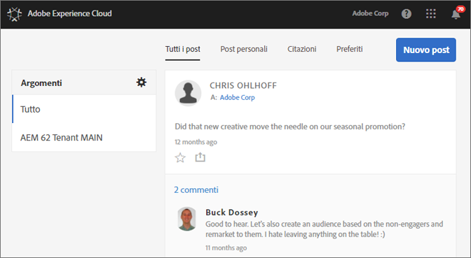
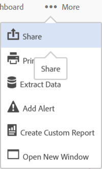

# Feed

**Il feed di Experience Cloud non sarà più supportato a partire dal 10 novembre 2019 e diventerà obsoleto entro dicembre 2019.**

Scopri come condividere o pubblicare risorse e report di Analytics da condividere con altri tramite la funzione Feed di Experience Cloud.

Al primo accesso a Experience Cloud, il feed potrebbe essere vuoto. Man mano che crei post e condividi elementi e altri utenti condividono con te i loro contenuti, il feed si popolerà in maniera automatica affinché tu e il suo team possiate essere costantemente aggiornati.

Le impostazioni in Feed includono:

* **Argomenti: Tutti \&lt;nome organizzazione\&gt;:** consente di visualizzare tutti i post che sono stati condivisi con te e tutti i post a cui puoi accedere.
* **Gestisci argomenti:** puoi seguire, non seguire più o suggerire argomenti. Inoltre, gli amministratori possono approvare, rifiutare, disattivare e creare argomenti.
* **Nuovo post:** crea post che i membri dei gruppi possono vedere.
* **Tutti i post:** visualizza tutti i post nel tuo feed.
* **Post personali:** visualizza solamente i tuoi post.
* **Riferimenti:** visualizza i post in cui sei citato o è citato il tuo gruppo.
* **Preferiti:** visualizza i post contrassegnati come preferiti.

## Condivisione di un progetto Analytics in Feed {#section_F2BDF9FEF4394686BAC5051CBE913EE5}

**Il feed di Experience Cloud non sarà più supportato a partire dal 10 novembre 2019 e diventerà obsoleto entro dicembre 2019.**

Puoi condividere report da [!UICONTROL Reports &amp; Analytics] in Experience Cloud Feed.

1. [Accedi](admin-getting-started/getting-started-experience-cloud.md#topic_AC564B6795334DE39359ADD87F52F2E0) a Experience Cloud con il tuo Adobe ID.

1. Passa a Reports &amp; Analytics e [crea un progetto](https://docs.adobe.com/content/help/en/analytics/analyze/analysis-workspace/build-workspace-project/freeform-overview.html).

1. Fai clic su **[!UICONTROL Altro]** &gt; **[!UICONTROL Condividi]**.

   

1. Nella finestra Condividi, aggiungi i destinatari e fai clic su **[!UICONTROL Condividi]**.
