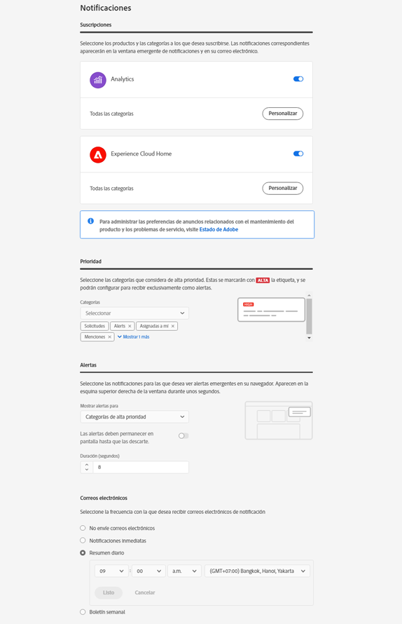

# Accesso e gestione delle impostazioni del profilo Experience Cloud

L’accesso a Experience Cloud (anziché a una singola applicazione) consente di accedere in modalità single sign-on a tutte le applicazioni e i servizi che hai acquistato. Il presente aiuto illustra come accedere a Experience Cloud, gestire le password e le notifiche e specificare una pagina di destinazione predefinita.

>[!IMPORTANT]
>
>Per informazioni sugli aggiornamenti di gestione utenti e prodotti, gli amministratori devono consultare [Amministrazione](admin-getting-started.md#topic_3FCB4099640647E3B2411ADBFCE81909).

## Accesso a Experience Cloud (amministratori) {#task_034FC955031347F3B02B686A09801A08}

Accedi e verifica di essere nell&#39;[organizzazione](organizations.md#topic_C31CB834F109465A82ED57FF0563B3F1) corretta.

1. Seleziona il menu di Experience Cloud () e poi **[!UICONTROL Amministrazione]**.

   Se il collegamento **[!UICONTROL Amministrazione]** non compare, significa che non sei un amministratore Experience Cloud per [l’organizzazione](organizations.md#topic_C31CB834F109465A82ED57FF0563B3F1) visualizzata. Per assistenza su come diventare amministratore, contatta l&#39;Assistenza clienti o un amministratore Experience Cloud della tua azienda.
1. Seleziona **[!UICONTROL Amministrazione]**.

1. Per procedere, seleziona uno dei collegamenti seguenti:

| Elemento | Descrizione |
|--- |--- |
| [Nozioni di base su Admin Console](experience-cloud.md) | Scopri i passaggi iniziali da intraprendere per iniziare a usare le applicazioni Experience Cloud. |
| [Impostare un&#39;identità](https://helpx.adobe.com/it/enterprise/using/set-up-identity.html) | Definisci e imposta un sistema di identità in base al quale verranno autenticati gli utenti finali. |
| [Gestione utente](https://helpx.adobe.com/it/enterprise/using/users.html) | Scopri come accedere ad Admin Console e gestire le autorizzazioni utente e i profili prodotto di Experience Cloud. |
| [Avvia Admin Console](admin-getting-started.md) | Admin Console è la posizione centrale per la gestione degli utenti Adobe e delle autorizzazioni ai prodotti dell&#39;intera l&#39;organizzazione. Puoi accedere ad Admin Console anche mediante un [collegamento diretto](https://adminconsole.adobe.com). |
| [Gestione degli utenti di Creative Cloud](t-admin-add-cc-user.md) | Experience Cloud Assets consente di collaborare, sincronizzare e condividere cartelle con designer e altri team creativi tramite Creative Cloud. Da qui puoi gestire gli utenti di Creative Cloud che sono stati approvati per collaborare con la tua organizzazione. |
| [Mappa le suite di rapporti](core-services.md) | (Solo Analytics): i servizi di base di Experience Cloud sono associati a un&#39;organizzazione invece che a una singola suite di rapporti. Per garantire il corretto funzionamento di questi servizi, ogni suite di rapporti di Analytics deve essere mappata su un&#39;organizzazione. (questa attività fa parte di un flusso di lavoro più ampio correlato alla sezione [abilitare Analytics per i servizi di base](core-services.md#concept_07ED1D5C64234E77976E6D572E78FB9C)). |
| [ID organizzazione](organizations.md) | L’*ID organizzazione* si trova nell’URL in Admin Console. Puoi trovarlo anche nella finestra a comparsa [!UICONTROL Debugger dati utente] (`ctrl+i` o `cmd+i`) da qualsiasi pagina in `https://experience.adobe.com`. L&#39;ID è associato all&#39;azienda con provisioning di Experience Cloud. Questo ID è una stringa alfanumerica composta da 24 caratteri, seguita da (deve includere) @AdobeOrg. |

{style=&quot;table-layout:auto&quot;}

## Accesso a Experience Cloud (utenti) {#task_1BFE87E20DCB44078CAC82F3CD44B985}

Aiuto per utenti non amministrativi che accedono a Experience Cloud.

1. Verifica con il tuo amministratore che l&#39;[organizzazione](organizations.md) disponga del provisioning in Experience Cloud.

1. Passa a [Adobe Experience Cloud](https://experience.adobe.com) ([!DNL experience.adobe.com]).
1. Seleziona **[!UICONTROL Accedi con Adobe ID]**.

   Il tuo amministratore Experience Cloud può aiutarti a determinare il tipo di account (Adobe ID o Enterprise ID).

1. Nella pagina di destinazione, seleziona l’icona del selettore  per accedere al menu a discesa.

   

   Le applicazioni e i servizi visualizzati in questo menu dipendono dai privilegi dell’applicazione definiti dall’[amministratore](admin-getting-started.md#topic_3FCB4099640647E3B2411ADBFCE81909).

## Configurare le impostazioni account personali predefinite {#task_73CBCAE6C91749D19C95421E5AC311BA}

Puoi modificare i dati personali e specificare un&#39; [organizzazione](admin-getting-started.md#concept_705C626560A54CA2A4215F1C870C42B2) e una pagina di destinazione predefinite dopo l&#39;accesso a Experience Cloud.

1. Accedi a Experience Cloud e seleziona l’icona del tuo profilo.

   
1. Seleziona **[!UICONTROL Modifica profilo]**.

   
1. Continua a configurare e modificare le informazioni personali, quindi seleziona **[!UICONTROL Salva modifiche]**.

## Abilitare notifiche {#concept_0105453AD71847B8BFCAF4A40915F157}

Ricevi notifiche (tramite e-mail o nel prodotto) su aggiornamenti di sistema, avvisi di manutenzione, post, menzioni e risorse condivise. Puoi inoltre specificare i prodotti e le soluzioni per cui desideri ricevere notifiche, incluso lo stato di caricamento per Attributi del cliente.

Per passare a Notifiche, seleziona l’icona **[!UICONTROL Notifiche]** , quindi l’icona **[!UICONTROL Impostazioni]** .

Puoi ordinare la visualizzazione delle notifiche in base ai tipi di messaggio che ti interessano e cercare le notifiche. È inoltre possibile:

* Ordinare i tipi di messaggio per importanza.
* Cercare le notifiche.

<!-- 
 <b>Analytics</b> 
 
<ul id="ul_91BF597858124FA5BF338C36F6C5533F"> 
 <li id="li_FAD3E93CDE6242F58F14D55C8A6E23D7">Contribution analysis completed </li> 
 <li id="li_03D33D3228884CECA371B58656B2F3E7">Guided analysis shared </li> 
 <li id="li_DCF710F89317487B8DAA86CC05C694CA">Scheduled report failure </li> 
</ul> 

 <b>Adobe Target</b> 
 

Test started or stopped 
 

 <b>Advertising Cloud</b> 
 

Performance alerts 
 

 <b>Dynamic Tag Manager</b> 
 
<ul id="ul_9ACDA418933E40918744D9C32A57DD4B"> 
 <li id="li_4DD0FFD3D9F84A428703611EF767D4D0">New web property created </li> 
 <li id="li_C6B923012E9D40BA91F4CBF7D2D72986">New user added </li> 
 <li id="li_EB0B9D1CFDE24E6987935CCCBFC7892A">Approvals - publishing and approval status for new rules, data elements, and tools </li> 
 <li id="li_17B0B176FF85435FB7EDD4317BC18201">Property has been published </li> 
</ul> -->

## Gestire profili e password {#task_7B89F4F38E5A4C4EB0FF842953856382}

Puoi modificare il tuo profilo Experience Cloud, specificare un&#39;organizzazione e una pagina di destinazione predefinite e molto altro.

1. Accedere a Experience Cloud.

1. In Experience Cloud, seleziona l’immagine del tuo profilo.

   
1. Seleziona **[!UICONTROL Modifica profilo]**.

   Nella pagina Profilo e password, completa i campi e le opzioni riportati sotto Dati personali.

## Recupero della password {#task_46541A2806164CB1A4AE8239604E4EB1}

1. Accedi alla pagina di accesso alla soluzione.
1. Seleziona **[!UICONTROL Password dimenticata]**.

   Reimpostando la password dovresti risolvere il problema del collegamento della password per Experience Cloud.

   Per gli utenti di Adobe Analytics, vai su [https://sc2.omniture.com/password_recovery.html](https://sc2.omniture.com/password_recovery.html).

## Configurare l’accesso alle applicazioni mediante un collegamento diretto {#concept_8BE493A08786469B88B210E13F78FF2F}

In alternativa, puoi accedere a una pagina specifica di una soluzione, utilizzando l&#39;autenticazione fornita dall&#39;interfaccia Experience Cloud.

### Modello URL

`https://experience.adobe.com/#/@<tenantId>/<solutionname>?destURL=<fullURL>`

URL di esempio:

`https://experience.adobe.com/#/@aem62tenant/analytics?destURL=https%3A%2F%2Fsc.omniture.com%2Freports%2F11562.html`

>[!NOTE]
>
>Devi codificare qualsiasi URL prima di trasmetterlo al parametro `destURL`. Sono disponibili siti di codifica come [URL Decoder/Encoder](https://meyerweb.com/eric/tools/dencoder/).

| Parametro | Descrizione | Esempio | Obbligatorio/facoltativo |
|--- |--- |--- |--- |
| `tenantId` | Nome del tenant a cui l&#39;utente deve accedere. | aem62tenant | Facoltativo |
| `destURL` | L&#39;URL completo del punto in cui l&#39;utente deve essere indirizzato. | http://sc.omniture.com/login/?r=%2Fx%2F1_7xxzf&amp;tenantId=obuengsc&amp;company=OBU+Eng+SC | Facoltativo |
| `solutionname` | Nome della soluzione MAC proprietaria del parametro `destURL`. Viene utilizzato per verificare che l’utente abbia accesso all’applicazione proprietaria dell’URL.  È responsabilità delle applicazioni verificare che `applicationname` sia sincronizzato con il parametro `destURL`.  Ad esempio: se l’URL contiene Social per `solutionname` e come valore `destURL` viene fornito un URL di Analytics, l’utente verrà reindirizzato all’URL anche se non ha accesso ad Analytics. MAC non verifica se il proprietario di `destURL` è sincronizzato con il nome della soluzione. | analytics | Obbligatorio se si utilizza il parametro `destURL`. |

{style=&quot;table-layout:auto&quot;}
