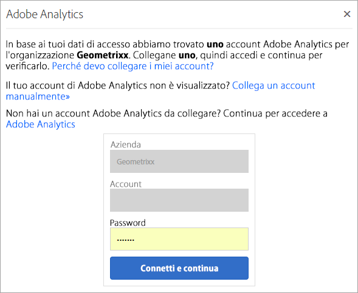

# Organizzazioni in Experience Cloud

Scopri come gestire e cambiare le organizzazioni in Experience Cloud.

## Identificazione della tua organizzazione {#concept_384D169B0B724B799D573B8ECB5C39BF}

Un&#39;*organizzazione* è l&#39;entità che consente all&#39;amministratore di configurare gruppi e utenti e di controllare il single sign-on in Experience Cloud. L&#39;organizzazione funziona come un&#39;azienda che abbraccia tutti i prodotti e le soluzioni Experience Cloud. Nella maggior parte dei casi, un’organizzazione è il nome dell’azienda. Tuttavia, un’azienda può avere più organizzazioni.

Per verificare di aver effettuato l’accesso all’organizzazione corretta, fai clic sull’avatar del tuo profilo per visualizzare il nome dell’organizzazione. Se hai accesso a più organizzazioni, puoi anche visualizzare e passare a un’altra organizzazione direttamente nella barra dell’intestazione.

Se l’organizzazione utilizza Federated ID, Experience Cloud consente di accedere con il single sign-on dell’organizzazione senza la necessità di immettere l’indirizzo e-mail e la password. A questo scopo, aggiungi `#/sso:@domain` all&#39;URL dell&#39;Experience Cloud (`https://experience.adobe.com`).

Ad esempio, per un’organizzazione con Federated ID e il dominio `adobecustomer.com`, imposta il collegamento URL su `https://experience.adobe.com/#/sso:@adobecustomer.com`. Puoi anche accedere direttamente a un&#39;applicazione specifica segnalando questo URL, aggiunto al percorso dell&#39;applicazione. (Ad esempio, per Adobe Analytics, `https://experience.adobe.com/#/sso:@adobecustomer.com/analytics`.)

## Ricerca dell&#39;ID organizzazione {#concept_EA8AEE5B02CF46ACBDAD6A8508646255}

Potrebbe essere necessario individuare l&#39;ID organizzazione a scopo di assistenza. Puoi verificare di essere nell’organizzazione corretta o cambiare organizzazione utilizzando il menu **[!UICONTROL Organizzazione]**.

L’**ID organizzazione** è l’ID associato all’azienda con provisioning di Experience Cloud. Questo ID è una stringa alfanumerica composta da 24 caratteri, seguita da (deve includere) @AdobeOrg.

Per visualizzare l&#39;ID organizzazione, passa alla pagina di destinazione Experience Cloud oppure seleziona ( ), quindi seleziona **[!UICONTROL Amministrazione]**. Puoi trovare l’ID organizzazione nella parte inferiore della [!UICONTROL Guida introduttiva di Experience Cloud] o della pagina [!UICONTROL Amministrazione].

## Collegamento di un account soluzione a un Adobe ID {#task_FD389E78640848919E247AC5E95B8369}

In genere, gli amministratori di Experience Cloud concedono l&#39;accesso a soluzioni e servizi. In rare circostanze, potrebbe essere necessario collegare le credenziali della soluzione a un Adobe ID.

1. Segui i passaggi contenuti nell&#39;e-mail di invito a Experience Cloud.
1. Accedi utilizzando il tuo Adobe ID o Enterprise ID.
1. Seleziona il selettore della soluzione. ( ).

   

   Le soluzioni a cui hai accesso sono colorate.
1. Seleziona la soluzione desiderata.

   

   Questo tipo di messaggio visualizza se fai parte del gruppo appropriato (e disponi dell&#39;autorizzazione per la soluzione) ma non hai ancora collegato le credenziali del tuo account al tuo Adobe ID.
1. Seleziona **[!UICONTROL Collega account]**, quindi immetti le tue credenziali.

## Specificare una organizzazione e una pagina di destinazione predefinite {#concept_6A191B42A9874A9780882903BA18F071}

Puoi specificare un&#39;organizzazione predefinita e una pagina di destinazione da usare al momento dell&#39;accesso.

Nel tuo profilo, seleziona **[!UICONTROL Modifica profilo]**.

In Organizzazione e pagina di destinazione predefinite puoi personalizzare la tua esperienza di accesso.

## Risoluzione dei problemi di collegamento dell&#39;account {#concept_DFCB29A3B4834FC59AA29E0BBA301584}

Assistenza per problemi derivanti dal collegamento dell’account.

In genere, il collegamento dell’account ha esito negativo perché l’Adobe ID è collegato a un utente precedente. Quando non è possibile eseguire il collegamento, prova le seguenti operazioni:

* [Contatta l’Assistenza Adobe](https://experienceleague.adobe.com/?support-solution=General&amp;lang=it#support).
* Durante la risoluzione del problema, Accedi alla soluzione con la procedura standard.
