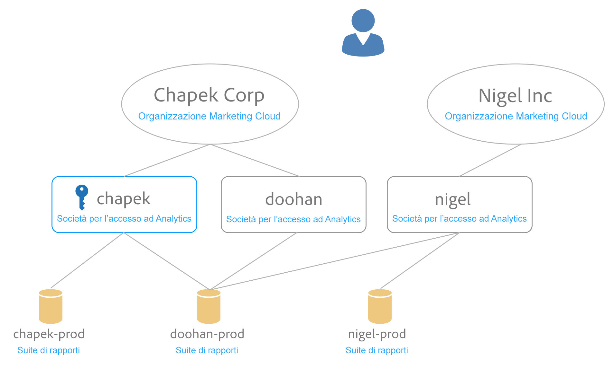

# Mappatura di suite di rapporti per un’organizzazione {#topic_7C4740559EAC4E0FA5F8DEF886B580DA}

>[!NOTE]
>
>La funzionalità di mappatura di suite di rapporti è diventata obsoleta a novembre 2020. Per eventuali domande, rivolgiti al servizio di assistenza clienti.

I servizi di Experience Cloud (come il servizio Experience Cloud ID e [!UICONTROL People]) sono associati a un’organizzazione invece che a suite di rapporti individuale. Per garantire il corretto funzionamento di questi servizi, ogni suite di rapporti di Analytics deve essere mappata su un’organizzazione. Il processo di mappatura:

* Imposta un’organizzazione di Experience Cloud come organizzazione principale per la suite di rapporti.
* Non modifica chi può accedere a una suite di rapporti (l’accesso è ancora determinato dall’account di accesso di Adobe Analytics per ogni utente)

## Requisiti

Devi essere un amministratore Analytics di una società di accesso che dispone dell’accesso alla suite di rapporti che desideri mappare. Inoltre, questo account deve essere [collegato a un&#39;organizzazione Experience Cloud](organizations.md#topic_C31CB834F109465A82ED57FF0563B3F1) per mappare le suite di rapporti su tale organizzazione.

Le organizzazioni sono disattivate se non disponi delle autorizzazioni di amministratore Analytics per una società di accesso nell&#39;organizzazione con accesso alla suite di rapporti specificata.

## Mappatura di una suite di rapporti su un’organizzazione {#task_23993FE78DF6455FA8D7BE60686EA16C}

1. Passa a Suite di rapporti per la governance dei dati da [!DNL Analytics] > **[!UICONTROL Amministratore]** > **[!UICONTROL Governance dei dati]** (consulta [Visualizzare/gestire le impostazioni di governance dei dati della suite di rapporti](https://experienceleague.adobe.com/docs/analytics/admin/data-governance/gdpr-view-settings.html?lang=en))

1. Per visualizzare le società con accesso a ogni suite di rapporti, seleziona **[!UICONTROL Visibile per le società di accesso]**.

   Questa visualizzazione ti aiuta a prendere una decisione informata sulla mappatura.

1. Seleziona l’elenco a discesa nella colonna **[!UICONTROL Organizzazione mappata]** accanto a una suite di rapporti e seleziona l’organizzazione da mappare.

   Consulta la sezione successiva per suggerimenti sulla selezione di un’organizzazione Experience Cloud.

## Mappare più suite di rapporti su un’organizzazione {#task_94955B0D8ABA4CB1A38746ECF8E32711}

1. Seleziona **[!UICONTROL Experience Cloud]** > **[!UICONTROL Amministrazione]** > **[!UICONTROL Mappatura suite di rapporti]**.

1. Seleziona le suite di rapporti da mappare.

   

1. Seleziona l’organizzazione (Outdoors Inc, in questo esempio), quindi fai clic su **[!UICONTROL Seleziona]**.

   Consulta la sezione successiva per suggerimenti sulla selezione di un’organizzazione Experience Cloud.

1. Seleziona **[!UICONTROL Salva mappatura]**.

## Suggerimenti per selezionare un&#39;organizzazione Experience Cloud {#mapping-tips}

Questa sezione contiene suggerimenti per aiutarti a selezionare l’organizzazione Experience Cloud a cui mappare una suite di rapporti.

### Quale organizzazione dovrei scegliere?

Se il servizio ID Experience Cloud è distribuito sulla suite di rapporti, assicurati che l’organizzazione selezionata nello strumento di mappatura suite per rapporti sia la stessa organizzazione specificata nel file [!DNL visitorAPI.js] sul sito. Puoi utilizzare le istruzioni in [Testa e verifica il servizio Experience Cloud ID](https://experienceleague.corp.adobe.com/docs/id-service/using/implementation/test-verify.html) per individuare l’ID organizzazione utilizzato dal servizio ID visitatore.

Assicurati che la distribuzione corrisponda all&#39;organizzazione scelta nello strumento di mappatura suite per rapporti.

### Perché alcune organizzazioni sono disattivate?

La disattivazione di un&#39;organizzazione indica che non disponi di privilegi sufficienti per la mappatura sulla suite di rapporti disattivata. Prendi in considerazione l&#39;esempio seguente:

In questo schema, il tasto blu indica i privilegi di amministratore. Le linee grigie indicano la visibilità.

Questo utente ha accesso a due organizzazioni Experience Cloud. Hanno eseguito le seguenti operazioni:

* Hanno collegato il loro account amministratore nella società di accesso [!UICONTROL chapek] Analytics al loro account organizzazione [!UICONTROL Chapek] Corp Experience Cloud.
* Hanno collegato il loro account non amministratore nella società di accesso [!UICONTROL doohan] Analytics al loro account organizzazione [!UICONTROL Chapek] Corp Experience Cloud.
* Hanno collegato il loro account non amministratore nella società di accesso nigel Analytics al loro account organizzazione di Experience Cloud Nigel Inc.

I punti seguenti elencano le azioni di mappatura che questo utente può e non può eseguire relativamente a queste suite di rapporti:

* La suite di rapporti [!UICONTROL Chapek-prod] può essere mappata sull’organizzazione [!UICONTROL Chapek Corp] poiché questo utente è un amministratore di una società di accesso di Analytics collegata ([!UICONTROL chapek]) e il suo account è collegato a questa organizzazione.
* [!UICONTROL La suite Nigel-] prodreport non può essere collegata da questo utente perché non è un amministratore in alcuna società di accesso a cui è visibile questa suite di rapporti.
* La suite di rapporti [!UICONTROL Doohan-prod] può essere mappata su [!UICONTROL Chapek Corp] poiché questo utente è un amministratore di una società di accesso ([!UICONTROL chapek]) collegata all’organizzazione di Experience Cloud (nota che non è un amministratore della società di accesso di Analytics doohan). È importante sapere che la suite di rapporti [!UICONTROL doohan-prod] è anche idonea a essere mappata sull&#39;organizzazione di Experience Cloud Nigel Inc, anche se questo utente non può eseguire tale mappatura. In questo caso, entrambe le organizzazioni di Experience Cloud sono visualizzate nell’elenco, ma [!UICONTROL Nigel Inc] è disattivata. Prima della mappatura, questo utente deve consultare un amministratore della società di accesso Nigel per determinare quale organizzazione è la migliore per la mappatura. L’interfaccia utente visualizza un avviso di possibile conflitto se selezioni un’organizzazione diversa dall’organizzazione in cui è stata originariamente creata la suite di rapporti.

## Domande frequenti {#section_099E485805994C929FF9C9F75219BEE1}

### Perché non visualizzo tutte le mie suite di rapporti?

Alcune suite di rapporti potrebbero essere visibili in una società di accesso diversa. Puoi cambiare la società di accesso corrente utilizzando il menu a discesa nella parte superiore dello schermo.

### Cosa succede se non riconosco alcune delle organizzazioni elencate nel menu a discesa per una delle mie suite di rapporti?

L’elenco ti mostra tutte le *possibili* organizzazioni su cui le tue suite di rapporti possono essere mappate, anche se non possiedi l’autorizzazione per farlo. Se non sei sicuro se la suite di rapporti deve essere mappata su una delle suite di rapporti disattivate nell’elenco, consulta un amministratore di Experience Cloud nella tua organizzazione per determinare la scelta migliore.

### Cosa vuol dire se non riconosco alcune delle società di accesso elencate per una suite di rapporti nella colonna “Visibile alle società di accesso”?

A un certo punto, questa suite di rapporti è stata condivisa con un’altra società di accesso che potrebbe far parte di un’organizzazione di Experience Cloud diversa.

### Cos’è questo errore di “Possibile conflitto” sulla suite di rapporti generato da un’altra organizzazione? Perché è importante?

Questa notifica ti aiuta a prendere una decisione informata sulla mappatura della tua suite di rapporti. Desideriamo informarti che la suite di rapporti è stata creata originariamente in un’organizzazione diversa nel caso tale organizzazione possa essere più appropriata per questa suite di rapporti.

### Come posso sapere se una suite di rapporti è mappata?

Le suite di rapporti mappate vengono visualizzate in un formato non modificabile. Se devi modificare una mappatura, contatta l’Assistenza clienti.

### Cosa succede se conosco solo l’ID organizzazione per la mia organizzazione Experience Cloud? Come posso cercare il nome per il mio ID organizzazione?

Puoi trovare il nome della tua organizzazione in [Impostazioni organizzazioni e account](organizations.md).

### Visualizzo una data nella colonna “Data di mappatura”. Chi ha eseguito la mappatura?

Puoi consultare il registro modifiche suite di rapporti nell&#39;interfaccia di Analytics per controllare l&#39;ID utente che ha apportato la modifica. Cerca l’evento “Suite associata all’organizzazione IMS”.
