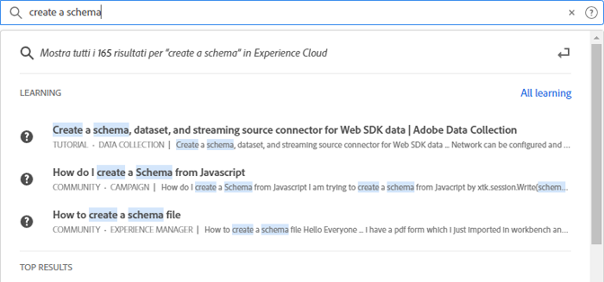

# [!UICONTROL Ricerca unificata] per oggetti ed entità {#globally-search}

La [!UICONTROL Ricerca unificata] la ricerca consente di trovare oggetti o entità aziendali ricercabili in un’esperienza semplice, coerente e semplice. Questa ricerca fa emergere gli oggetti utilizzati di recente.

## Accesso alla ricerca unificata

La funzione Ricerca unificata è disponibile in ogni pagina dell’intestazione dell’Experience Cloud nella parte superiore della pagina. È inoltre possibile utilizzare le scelte rapide da tastiera `command /` o `ctrl /` per accedere alla ricerca.

Questa funzione è disponibile solo per i prodotti supportati, che al momento sono:

* Experience Platform (AEP)
* Journey Optimizer (AJO)

Poiché è stato indicizzato più contenuto, questa funzione viene aggiunta alle applicazioni pertinenti.

## Oggetti e campi ricercati

Mentre si digita, i primi risultati corrispondenti degli Oggetti a cui si ha accesso per la visualizzazione.

I nostri algoritmi mostrano prima i record più rilevanti. L’ordine dei risultati dipende da diversi fattori, quali:

Le tue autorizzazioni di funzionalità e oggetto Corrispondenza percentuale Se esiste una corrispondenza esatta

Gli oggetti business ricercabili includono:

* Segmenti (Nome, Descrizione)
* Schema (Nome, Descrizione)
* Set di dati (Nome, Descrizione)
* Origini (Nome, Descrizione)
* Destinazioni (Nome, Descrizione)
* Query (Nome, Descrizione)
* Messaggi (Nome, Descrizione)
* Offerte (Nome, Descrizione)
* Componenti (Nome, Descrizione)
* Percorsi (Nome, Descrizione)

Se una parola chiave corrisponde a una pagina di navigazione, puoi ottenere un collegamento di accesso rapido ai set di dati di esempio della pagina di navigazione. La sezione dei primi risultati mostra i primi 30 risultati.

Sono inoltre disponibili gli articoli della guida di Experience League e Communities. Sono supportate le query per lingue naturali.

Ad esempio: _Come creare uno schema_ produce i risultati dell&#39;Experience League in _[!UICONTROL Apprendimento]_:

Gli algoritmi di ricerca visualizzano per primi i record più rilevanti. L’ordine dei risultati dipende da diversi fattori, quali:

* Autorizzazioni utente per accedere agli oggetti
* Percentuale corrispondente
* Corrispondenza esatta
* La _[!UICONTROL Risultati principali]_ La sezione mostra i primi 30 risultati.

Per perfezionare la ricerca, fai clic su una delle seguenti opzioni:

* **[!UICONTROL Tutto l&#39;apprendimento]**: Apre la ricerca in Experience League.
* **[!UICONTROL Mostra tutto...]**: Consente di perfezionare e filtrare ulteriormente i risultati.

## Funzioni di ricerca unificata

Le seguenti funzionalità sono disponibili in Ricerca unificata.

| Funzione | Descrizione |
| ------- | ------- |
| Supporto linguistico globale | La ricerca globale comprende le query e produce risultati per tedesco, spagnolo, francese, italiano, giapponese, coreano, portoghese e cinese. |
| Tolleranza Typo | La ricerca unificata fornisce una forte tolleranza di errore utilizzando gli algoritmi avanzati. Questi algoritmi calcolano le modifiche e forniscono i risultati appropriati. |
| Evidenziazione | La risposta alla ricerca evidenzia la parola chiave corrispondente dalla query di ricerca in modo da poter trovare facilmente la sezione e le parole corrispondenti alla query. L’evidenziazione funziona anche per le parole errate. |
| Frammenti | Nella risposta alla ricerca, puoi vedere uno snippet del risultato. Gli snippet restituiscono le parole corrispondenti e alcuni contenuti intorno alle parole chiave corrispondenti. |
| Interrompi parole | Alcune parole comunemente utilizzate in inglese sono definite come _interrompi parole_. Se nella query di ricerca sono incluse le parole di arresto, viene loro assegnato meno peso.  Le parole di interruzione includono: _a, an, e, sono, come, at, be, ma, per, per, se, in, in, è, è, no, non, di, on, o, tale, il, loro, allora, là, questi, loro, questo, a, era, volontà, con_.  Le parole di arresto non sono supportate in altre lingue globali. |
| Query di lingua naturale | Quando cerchi un articolo della guida o una discussione da Experience League Communities, puoi digitare la domanda utilizzando il linguaggio naturale e ottenere la risposta. Esempio di ricerca: &quot;Come si crea uno schema?&quot; |
| Ricerca esatta tra virgolette | È possibile eseguire una ricerca esatta utilizzando le virgolette nella query. Non viene eseguita alcuna correzione dell’errore ortografico sulle query di correzione. Ad esempio: &quot;Percorso Luma 2022&quot;. |
| Filtri | Puoi applicare filtri come _Tipo di oggetto_ e altri filtri specifici per gli oggetti nella finestra a comparsa dei risultati della ricerca completa. Quando premi Invio dopo aver legato la query di ricerca, viene visualizzata una finestra a comparsa a pagina intera che include i filtri. |

{style=&quot;table-layout:auto&quot;}

## Non trovi il risultato previsto o ottieni troppi risultati?

Prova questi suggerimenti:

* Immettere un termine di ricerca più specifico
* Controllare l’ortografia
* Prova a scrivere il termine di ricerca completo
* Assicurati di disporre delle autorizzazioni per l’oggetto, stai cercando

