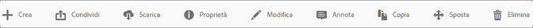
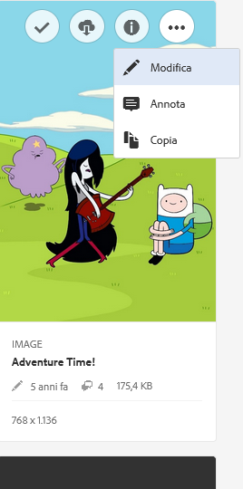
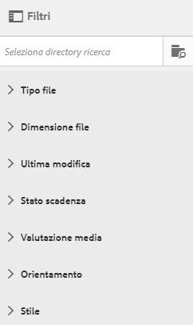
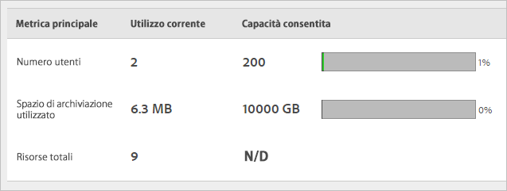

# Panoramica di CX Enterprise Assets

CX Enterprise Assets fornisce un archivio unico e centralizzato di risorse pronte per le attività di marketing da condividere tra le diverse applicazioni. Una risorsa è un documento, un’immagine, un video o dell’audio digitale (o parte di essi) che può avere più rappresentazioni e risorse secondarie (ad esempio, livelli in un file [!DNL Photoshop], slide in un file [!DNL PowerPoint], pagine in un file PDF e file in un file ZIP).

I servizi Assets includono:

* Archivio delle risorse, interfaccia di gestione, interfaccia di selezione incorporata (accessibile dall’interno di altre applicazioni).
* Integrazioni con Creative Cloud, collaborazione con CX Enterprise e applicazioni CX Enterprise.

L’utilizzo di Assets migliora la coerenza e la conformità al marchio, velocizzando il time-to-market. Puoi semplificare i flussi di lavoro nelle applicazioni:

* **[!DNL Adobe Target]**: creazione di esperienze per A/B e test multivariati.
* **[!DNL Ad Cloud]**: sviluppo di unità tra diversi canali e campagne.
* **[!DNL Adobe Campaign]**: posizionamento di risorse nelle newsletter e campagne via e-mail.

## Passare a CX Enterprise Assets

## Accedere alla barra degli strumenti

Passare a una risorsa (o una directory di risorse), quindi fare clic su **[!UICONTROL Select]**.

La barra degli strumenti consente di accedere rapidamente a funzioni quali: Cerca, Timeline, Rappresentazioni, Modifica, Annota e Scarica.

>[!NOTE]
>
>È necessario rimuovere le risorse dalle attività di Adobe Target prima di eliminarle correttamente da [!DNL Target].

## Modificare le risorse

La modifica di una risorsa abilita funzionalità quali:

* Ritaglio
* Rotazione
* Capovolgimento

## Cercare risorse

Puoi cercare per parola chiave, tipo di file, dimensione, ultima modifica, stato di pubblicazione, orientamento e stile.

## Annotare le risorse

Fare clic su **[!UICONTROL Annotate]** disegnando dei cerchi o delle frecce su un&#39;immagine e annotare la risorsa per la revisione da parte di colleghi.

## Visualizzare risorse a tutto schermo e usare lo zoom

Fai clic su **[!UICONTROL Views]** > **[!UICONTROL Image]** per visualizzare l&#39;immagine della risorsa completa e abilitare lo zoom.

## Visualizzare le proprietà della risorsa

Scegli tra la vista della scheda con proprietà, la vista dell&#39;elenco e la vista della colonna per trovare più facilmente le risorse.

Fai clic su **[!UICONTROL Views]** > **[!UICONTROL Properties]** per visualizzare le proprietà di una risorsa:

## Eseguire rapporti sull’utilizzo

Visualizza il numero di utenti, l&#39;archiviazione usata e le risorse totali.

Fai clic su **[!UICONTROL Tools]** > **[!UICONTROL Reports]** > **[!UICONTROL Usage Report]**

