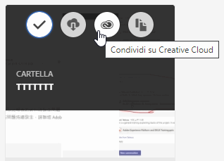
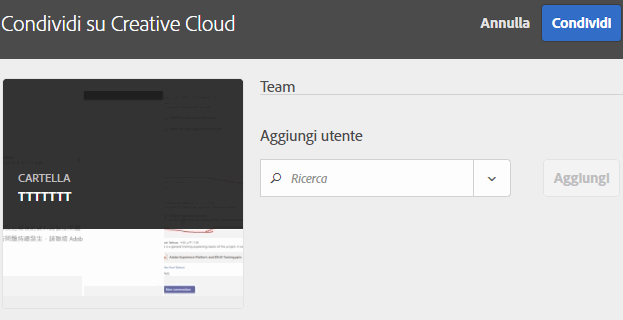
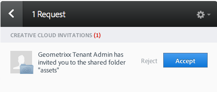
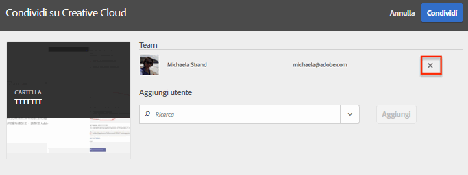
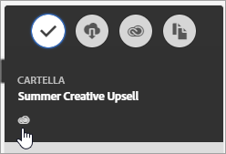

# Condivisione di una cartella di risorse Experience Cloud

Condividi una cartella di risorse Experience Cloud con utenti Creative Cloud.

1. In una cartella di risorse, fai clic su **[!UICONTROL Condividi su Creative Cloud]**.

   
1. Nella pagina Condividi su Creative Cloud cerca l’utente, quindi fai clic su **[!UICONTROL Aggiungi]**.

   

1. Fai clic su **[!UICONTROL Condividi]**.
1. Avvia l’applicazione desktop [!DNL Creative Cloud] (oppure passa alla pagina [!UICONTROL Creative Cloud Files (File di Creative Cloud)] in un browser) e cerca la richiesta.

   
1. Apri la richiesta, quindi fai clic su **[!UICONTROL Accetta]**.

   
1. Per accedere ai contenuti della cartella fai clic su **[!UICONTROL Apri cartella]** (oppure su **[!UICONTROL Vedi sul web]**).

   
1. Continua con l’aggiunta di commenti sulla risorsa condivisa:

   In Creative Cloud, puoi selezionare un&#39;immagine, quindi fare clic su **[!UICONTROL Attività]** per aggiungere un commento all&#39;immagine. I commenti vengono sincronizzati sulle risorse in [!DNL Creative Cloud] e [!DNL Experience Cloud].

   

   Ad Experience Cloud, per aggiungere un commento a un’immagine, selezionala, quindi seleziona l’icona della cronologia. I commenti vengono sincronizzati sulle risorse in Creative Cloud ed Experience Cloud.

   

1. Per annullare la condivisione di una cartella, fai clic su **[!UICONTROL Condividi con Creative Cloud]** (come [Passaggio 3](share.md)), rimuovi gli utenti selezionando X, quindi fai clic su **[!UICONTROL Condividi]**.

Quando hai rimosso tutti gli utenti di Creative Cloud, la cartella non è più condivisa e gli utenti di Creative Cloud non possono più accedervi.

Altri modi per utilizzare una risorsa condivisa includono il caricamento o lo scambio di risorse nella [Libreria offerte](https://experienceleague.adobe.com/docs/target/using/experiences/offers/manage-content.html?lang=it) in Adobe Target per le immagini nelle attività.

Dopo aver condiviso una cartella su Creative Cloud, il logo Creative Cloud viene visualizzato sulla cartella.

Argomenti correlati:

* [Aiuto di Creative Cloud - Gestione e sincronizzazione dei file](https://helpx.adobe.com/it/creative-cloud/help/sync-creative-cloud-files.html)
* [Aiuto di Creative Cloud - Collaborazione con altri](https://helpx.adobe.com/it/creative-cloud/help/collaboration.html)
* [Aiuto di Creative Cloud - Domande frequenti sulla collaborazione](https://helpx.adobe.com/it/creative-cloud/help/collaboration-faq.html)
