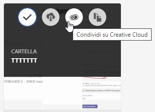
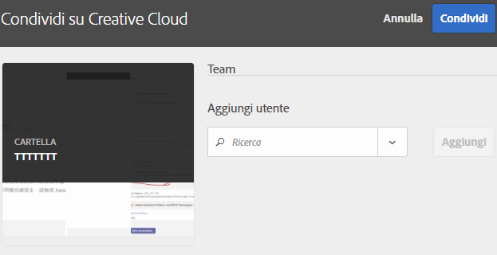
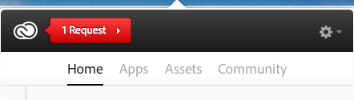
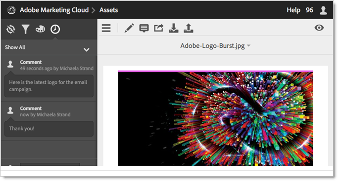
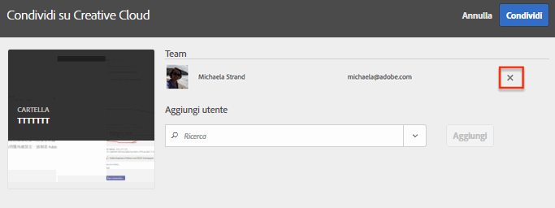
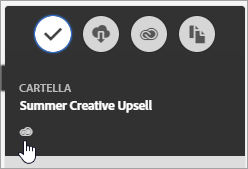

# Condivisione di una cartella di risorse CX Enterprise

Condivisione di cartelle e risorse tra CX Enterprise e Creative Cloud. Collaborazione, annotazione di risorse condivise e loro utilizzo in applicazioni CX Enterprise come Adobe Target. La cartella condivisa deve provenire da CX Enterprise.

**Vantaggi della condivisione**

* Semplificazione dei flussi di lavoro di produzione creativa nelle fasi di revisione, approvazione e pubblicazione
* Risparmio di tempo nell’elaborazione di file e versioni in più posizioni
* Maggiore efficienza nel tracciamento e nella gestione delle risorse creative
* Maggiore sicurezza aziendale
* Semplificazione di condivisione, salvataggio e invio di file tra creativi ed esperti marketing

Prima di poter accedere alle risorse, gli utenti di Creative Cloud devono essere inseriti nell&#39;elenco Consentiti di CX Enterprise. Vedi [Gestione degli utenti di Creative Cloud](manage-cc-users.md).

**Per condividere una cartella di risorse CX Enterprise**

1. In una cartella di risorse, fai clic su **[!UICONTROL Condividi su Creative Cloud]**.

   
1. Nella pagina Condividi su Creative Cloud, cerca l&#39;utente, quindi fai clic su **[!UICONTROL Aggiungi]**.

   

1. Fai clic su **[!UICONTROL Condividi]**.
1. Avvia il desktop [!DNL Creative Cloud] (oppure passa alla pagina [!UICONTROL File Creative Cloud] in un browser) e cerca la richiesta.

   
1. Apri la richiesta, quindi fai clic su **[!UICONTROL Accetta]**.

   
1. Per accedere ai contenuti della cartella, fai clic su **[!UICONTROL Apri cartella]** (o **[!UICONTROL Visualizza sul Web]**).

   
1. Continua con l’aggiunta di commenti sulla risorsa condivisa:

   In Creative Cloud puoi effettuare la selezione in un&#39;immagine, quindi fare clic su **[!UICONTROL Attività]** per aggiungere un commento all&#39;immagine. I commenti vengono sincronizzati sulle risorse in [!DNL Creative Cloud] e [!DNL CX Enterprise].

   

   In CX Enterprise, selezionare un&#39;immagine, quindi selezionare l&#39;icona relativa alla cronologia per aggiungere un commento all&#39;immagine. I commenti vengono sincronizzati sulle risorse in Creative Cloud e CX Enterprise.

   

1. Per annullare la condivisione di una cartella, fai clic su **[!UICONTROL Condividi con Creative Cloud]** (come [Passaggio 3](share.md)), rimuovi gli utenti selezionando X, quindi fai clic su **[!UICONTROL Condividi]**.

   

   Quando hai rimosso tutti gli utenti di Creative Cloud, la cartella non è più condivisa e gli utenti di Creative Cloud non possono più accedervi.

Altri modi per utilizzare una risorsa condivisa includono il caricamento o lo scambio di risorse nella [Libreria offerte](https://experienceleague.adobe.com/docs/target/using/experiences/offers/manage-content.html) in Adobe Target per le immagini nelle attività.

Dopo aver condiviso una cartella su Creative Cloud, il logo Creative Cloud viene visualizzato sulla cartella.

Argomenti correlati:

* [Guida di Creative Cloud: gestire e sincronizzare i file](https://helpx.adobe.com/it/creative-cloud/help/sync-creative-cloud-files.html)
* [Guida di Creative Cloud: collaborare con altri](https://helpx.adobe.com/it/creative-cloud/help/collaboration.html)
* [Guida di Creative Cloud - Domande frequenti su Collaboration](https://helpx.adobe.com/it/creative-cloud/help/collaboration-faq.html)

## Informazioni sulla condivisione di risorse con Adobe Target

Quando crei attività in [!DNL Adobe Target], puoi utilizzare una risorsa di immagine condivisa quando scambi immagini nella [!UICONTROL Libreria offerte].

Consulta [Libreria offerte](https://experienceleague.adobe.com/docs/target/using/experiences/offers/manage-content.html) nella Guida di [!DNL Target].

