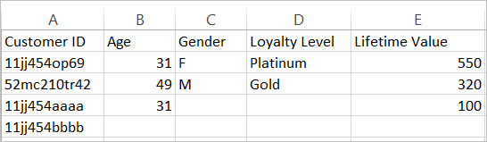

# Informazioni su file di dati e origini dati per [!DNL customer attributes]

Requisiti dei file di dati e diverse origini dati per caricare [!DNL customer attributes] in Experience Cloud.

Devi poter accedere ai dati del sistema CRM, o simili, della tua azienda. I dati caricati in Experience Cloud devono essere un file `.csv`. Se effettui il caricamento mediante FTP o sFTP, puoi caricare anche un file `.fin`.

[!DNL customer attributes] è progettato per gestire alcuni file al giorno. Per evitare che numerosi file di piccole dimensioni possano ritardare l’elaborazione, i file inviati entro 30 minuti da un batch precedente della stessa organizzazione vengono indirizzati a una coda di priorità inferiore.

## Tipi di file consentiti e requisiti per la denominazione {#section_6F64FA02ACCC4215B0862CB6A1821FBF}

| Tipo di file | Descrizione |
|--- |--- |
| `.csv` | Un file di valori separati da virgole (ad esempio un file creato in Excel). Questo file contiene i dati degli attributi del cliente.   Requisiti di denominazione: verifica che le estensioni dei nomi dei file non contengano spazi. |
| `.fin` | (Obbligatorio) Il file `.fin` informa il sistema che il caricamento dei dati è terminato. Il nome del file `.fin` deve corrispondere al nome del file `.csv`.  Adobe consiglia di creare un file di testo vuoto con estensione `.fin`. Un file vuoto consente di risparmiare spazio e tempo di caricamento. **Nota:** la ridenominazione di un file `.fin` non è consentita dopo il caricamento. Il file `.fin` deve essere caricato separatamente e non può essere un file caricato precedentemente e rinominato. Dopo aver caricato il file `.fin` nell&#39;FTP degli attributi del cliente, il sistema recupera i dati rapidamente (entro un minuto). Questo si differenzia da altri sistemi Adobe basati su FTP, che raccolgono i dati meno frequentemente (circa una volta all&#39;ora). Il file `.fin` non è necessario quando si utilizza il metodo di caricamento di trascinamento della selezione. |
| `.gz` o `.zip` | `.gz` (gzip) o `.zip` - per file compressi. Un file `.zip` non può contenere più di un file nell&#39;archivio. Requisiti di denominazione: il nome di `.zip` o `.gz` deve corrispondere al nome del file `.csv`. Ad esempio, se il file `.csv` è `crm_small.csv`, il file `.zip` deve essere `crm_small.csv.zip`. Il file `.fin` deve corrispondere a `.csv`. |


## Requisiti per i file di dati degli attributi {#section_169FBF5B7BBA47CE825B7A330CF3FE98}

**Esempio di CSV**

Il file CSV deve rispettare il seguente formato:



Lo stesso file visualizzato in un editor di testo:


**Linee guida**

<table id="table_A9849CC9AA784763921DE057F0F61515"> 
 <thead> 
  <tr> 
   <th colname="col1" class="entry"> Elemento </th> 
   <th colname="col2" class="entry"> Descrizione </th> 
  </tr> 
 </thead>
 <tbody> 
  <tr> 
   <td colname="col1"> <p>Trascinamento della selezione </p> </td> 
   <td colname="col2"> <p>Il file da trascinare deve essere inferiore a 100 MB. </p> <p>Il file <span class="filepath">.fin</span> non è necessario quando si utilizza il metodo di caricamento di trascinamento della selezione. </p> </td> 
  </tr> 
  <tr> 
   <td colname="col1"> <p>colonna ID cliente </p> </td> 
   <td colname="col2"> <p> La prima colonna deve essere un ID cliente univoco. L'ID usato deve corrispondere all'ID che viene passato al servizio Experience Cloud ID. </p> <p>Per Analytics, l'ID archiviato in una prop o eVar. </p> <p>Per Target, il valore setcustomerID. </p> <p> Questo ID cliente è l’identificatore univoco che il sistema CRM utilizza per ogni persona nel database. Le colonne rimanenti sono attributi provenienti dai dati del sistema CRM. Puoi scegliere quanti attributi caricare. </p> <p>Per le intestazioni delle colonne sono consigliati nomi descrittivi e leggibili, ma non sono obbligatori. Quando convalidi lo schema dopo il caricamento, puoi mappare i nomi descrittivi alle righe e alle colonne caricate. </p> <p> <b>Informazioni sugli ID cliente</b> </p> <p>In genere, un'azienda utilizza un ID cliente proveniente da un sistema di gestione delle relazioni con i clienti (CRM). Questo ID viene impostato utilizzando la chiamata <span class="codeph"> setcustomerIDs </span> quando una persona effettua l'accesso. Questo ID viene utilizzato anche come chiave nel file CRM che viene caricato in Experience Cloud. Un ID alias </a> di <a href="t-crs-usecase.md" format="dita" scope="local"> è un nome descrittivo per un archivio dati in Audience Manager, dove vengono memorizzati i dati alias. Il sistema invia alias a questo archivio dati (tramite setcustomerID). Il file di gestione delle relazioni con i clienti viene applicato ai dati in tale archivio di dati. </p> <p>Per <span class="codeph"> informazioni setcustomerID </span>, vedi <a href="https://experienceleague.adobe.com/docs/id-service/using/reference/authenticated-state.html" format="https" scope="external"> ID cliente e stati di autenticazione </a>. </p> </td> 
  </tr> 
  <tr> 
   <td colname="col1"> <p>Intestazioni e colonne successive </p> </td> 
   <td colname="col2"> <p>Le intestazioni successive devono rappresentare il nome di ciascun attributo. </p> <p> Queste colonne devono contenere gli attributi del cliente provenienti dal sistema di gestione delle relazioni con i clienti. </p> </td> 
  </tr> 
  <tr> 
   <td colname="col1"> <p>limiti degli attributi </p> </td> 
   <td colname="col2"> <p>In Experience Cloud è possibile caricare centinaia di <span class="filepath"> colonne .csv </span> nel servizio attributo cliente. Tuttavia, quando configuri le sottoscrizioni e selezioni gli attributi, si applicano i seguenti limiti a seconda delle applicazioni che possiedi: </p> <p> 
     <ul id="ul_2BB85067918D4BB3B59394F3E3E37A6D"> 
      <li id="li_93703988B9934384B4B94A839D028380"> <b>Analytics Standard</b>: 3 totali </li> 
      <li id="li_D1E5E7BD24C54591B14D15DE97447835"> <b>Analytics Premium</b>: 200 per suite di rapporti </li> 
      <li id="li_8C891FE3D1EF49FA9F81E2E32CD0B9CA"> <b>Adobe Target Standard:</b> 5 </li> 
      <li id="li_2B66D43023F34EA685CE2C38A9250CEA"> <b>Adobe Target Premium:</b> 200 </li> 
     </ul> </p> </td> 
  </tr> 
  <tr> 
   <td colname="col1"> <p>Limiti delle righe </p> </td> 
   <td colname="col2"> <p>Non esiste alcun limite noto al numero di righe. </p> </td> 
  </tr> 
  <tr> 
   <td colname="col1"> <p>Limiti delle colonne </p> </td> 
   <td colname="col2"> <p>Per praticità, limita il numero di colonne a circa 200. </p> </td> 
  </tr> 
  <tr> 
   <td colname="col1"> <p>Limiti dei caratteri </p> </td> 
   <td colname="col2"> <p>Quando crei una sottoscrizione Analytics, le lunghezze dei campi per i file caricati vengono troncate a 255. </p> </td> 
  </tr> 
  <tr> 
   <td colname="col1"> <p>Linee guida FTP e limiti di dimensione </p> </td> 
   <td colname="col2"> <p> 
     <ul id="ul_E157EE6F98914EADA0C103D1D1E705D3"> 
      <li id="li_84FBD455DD164A28AC16F4A5AB19E4B3">La dimensione massima del file per l'FTP è 4 GB per ciascun caricamento. </li> 
      <li>La dimensione minima del file è di 10 MB per ogni caricamento. </li>
      <li>puoi caricare un file ogni mezz'ora. </li>
      <li id="li_B69A20C51D824727AA99C1F6F78537A4"> Devi rilasciare il file <span class="filepath">.csv</span> (e <span class="filepath">.fin</span>) nella cartella root del sito FTP. </li> 
     </ul> </p> <p> <p>Importante: lo spazio totale consentito per l'account FTP è 40 GB. È tua responsabilità eliminare i file elaborati. </p> </p> </td> 
  </tr> 
  <tr> 
   <td colname="col1"> <p>Requisiti dei file </p> </td> 
   <td colname="col2"> <p> Ciascuna sorgente attributo deve contenere lo stesso numero di campi separati da virgola. </p> <p> I campi contenenti un'interruzione di riga, virgolette o virgole devono essere tra virgolette. </p> <p> Le virgolette doppie in un campo devono essere precedute da una barra inversa (\). </p> <p> Le colonne vuote sono archiviate come <span class="term"> null </span>. </p> </td> 
  </tr> 
  <tr> 
   <td colname="col1"> <p>File multipli </p> </td> 
   <td colname="col2"> <p>Durante il caricamento dei dati dell'attributo del cliente, se devi caricare diversi file in rapida successione, in particolare se sono di grandi dimensioni, accertati che il file precedente sia stato elaborato prima di caricare il file successivo. Puoi monitorare questo passaggio controllando se il file precedente è stato spostato nella cartella dei file elaborati o non riusciti all'interno dell'account FTP di [!UICONTROL attributi cliente]. </p> <p> Considera inoltre che la suddivisione di un file di grandi dimensioni in file più piccoli inviandoli in rapida successione potrebbe rallentare l’elaborazione, se non ti assicuri che ogni file sia stato elaborato prima di inviare quello successivo. </p> </td> 
  </tr> 
  <tr> 
   <td colname="col1"> <p>Codifica caratteri </p> </td> 
   <td colname="col2"> <p>Per il Giappone, è obbligatoria la codifica UTF-8. </p> </td> 
  </tr> 
   <tr> 
   <td colname="col1"> <p>Dati storici </p> </td> 
   <td colname="col2"> <p> attributi del cliente associati al profilo del visitatore sottostante in [!DNL Analytics]. Di conseguenza, gli [!UICONTROL attributi del cliente] sono associati al visitatore per l'intera durata del suo profilo in [!DNL Analytics]. Questo profilo include il comportamento precedente al primo accesso del cliente. </p> <p> Se utilizzi il metodo di recupero dati Data Warehouse, i dati vengono associati a un valore post_visid_high/low basato sull’ID di Analytics (AID). Se utilizzi il servizio Experience Cloud ID, i dati sono legati a un post_visid_high/low basato sull'Experience Cloud ID (MID). </p> <p> Il metodo di backfill Data Warehouse non sarà più disponibile a partire da ottobre 2022. </td> 
  </tr> 
  <tr> 
   <td colname="col1"> <p>Feed di dati </p> </td> 
   <td colname="col2"> <p>gli attributi del cliente non sono disponibili nei feed di dati. </p> </td> 
  </tr> 
 </tbody> 
</table>

## Utilizzo di più origini dati {#multiple}

Quando crei, modifichi o elimini sorgenti di attributi del cliente, si verifica un ritardo di circa un&#39;ora prima della effettiva sincronizzazione degli ID con la nuova sorgente dati.

L&#39;ID alias per ogni origine di attributi del cliente deve essere univoco. Se hai più sorgenti di dati che utilizzano lo stesso ID, puoi impostarle come segue:

**In VisitorAPI.js o nello strumento Experience Cloud ID in Dynamic Tag Management:**

Imposta due ID cliente corrispondenti alle origini dati appropriate:

```
Visitor.setcustomerIDs({ 
     "ds_id1":"123456", 
     "ds_id2":"123456" 
});
```

(Vedi [ID cliente e stati di autenticazione](https://experienceleague.adobe.com/docs/id-service/using/reference/authenticated-state.html) per ulteriori informazioni.)

In **[!UICONTROL Experience Cloud]** > **[!UICONTROL Attributi del cliente]**:

Crea due origini attributo del cliente con ID alias univoci corrispondenti agli ID cliente qui sopra. Questo metodo consente di inviare lo stesso ID di riferimento a più origini di attributi del cliente.
