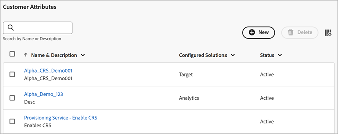

# Creare un’origine dati e caricare il file

Creare l&#39;origine attributo del cliente (`.csv` e `.fin` file) e caricare i dati. Puoi attivare l&#39;origine dati quando lo desideri. Dopo che l&#39;origine dati è attiva, condividere i dati attributo in [!DNL Analytics] e [!DNL Target].

**Flusso di lavoro attributi cliente**


## Prerequisiti

**Accesso al prodotto:** Per accedere a [!DNL Customer Attributes], gli utenti devono essere assegnati al profilo di prodotto Attributi del cliente (**[!UICONTROL Attributi del cliente - Accesso predefinito]**) in Admin Console (`adminconsole.adobe.com`).

Passa a **[!UICONTROL Admin Console]** > **[!UICONTROL Prodotti]**. Se *Attributi del cliente* viene visualizzato come uno dei prodotti (un [!UICONTROL Profilo di prodotto]), puoi iniziare. Gli utenti che vengono aggiunti al profilo di prodotto Attributi del cliente visualizzano **[!DNL Customer Attributes]** nel selettore **[!UICONTROL App]**. ()

**Gruppi di applicazioni:** Per utilizzare la funzionalità **[!DNL Customer Attributes]**, gli utenti devono appartenere anche a gruppi a livello di applicazione (Adobe [!DNL Analytics] o [!DNL Adobe Target]).

## Creazione di un file di dati {#create-data}

Questi dati sono dati aziendali dei clienti provenienti dal tuo sistema CRM. Possono includere i dati degli utenti con sottoscrizione relativi ai prodotti, inclusi ID membro, prodotti autorizzati, prodotti più lanciati e così via.

1. Crea un file `.csv`.

   >[!NOTE]
   >
   >Successivamente in questa procedura, trascinare e rilasciare il file `.csv` per caricare il file. Tuttavia, se [effettui il caricamento tramite FTP](t-upload-attributes-ftp.md#task_591C3B6733424718A62453D2F8ADF73B), serve anche un file `.fin` con la stessa denominazione del file `.csv`.

   Esempio di un file di dati di un cliente aziendale:

   

1. Prima di continuare, controlla le informazioni importanti in [Requisiti dei file di dati](crs-data-file.md) e dopo carica il file.
1. [Crea un&#39;origine attributo del cliente e carica il di dati](t-crs-usecase.md#create-source) come descritto.

## Creare un’origine di attributi e caricare il file di dati {#create-source}

Segui questi passaggi nella pagina Crea nuova origine attributo del cliente in Experience Cloud.

>[!IMPORTANT]
>
>Quando crei, modifichi o elimini origini attributo del cliente, si verifica un ritardo di circa un&#39;ora prima della effettiva sincronizzazione degli ID con la nuova origine dati. Devi disporre di diritti di amministratore in Audience Manager per creare o modificare origini degli attributi del cliente. Per ottenere i diritti di amministratore, contatta l’Assistenza clienti o la consulenza di Audience Manager.

1. In [!DNL Experience Cloud], fare clic su **[!UICONTROL App]**  > **[!DNL Customer Attributes]**.

   

1. Fai clic su **[!UICONTROL Nuovo]**.

   

1. Nella pagina [!UICONTROL Crea attributo cliente Source] configurare i campi seguenti:

   * **[!UICONTROL Nome:]** un nome descrittivo per l&#39;origine dell&#39;attributo dei dati. In [!DNL Adobe Target], i nomi degli attributi non possono includere spazi. Se viene passato un attributo con uno spazio, [!DNL Target] lo ignora. Altri caratteri non supportati sono: `< , >, ', "`.

   * **[!UICONTROL Descrizione:]** (facoltativo) una descrizione per la sorgente attributi dei dati.

   * **[!UICONTROL ID alias:]** rappresenta un&#39;origine dei dati attributo del cliente come specificato nel sistema di gestione delle relazioni con i clienti. [!UICONTROL ID alias] è un ID univoco utilizzato nel codice [!UICONTROL Source] dell&#39;attributo del cliente. L&#39;ID deve essere univoco, in lettere minuscole e non deve comprendere spazi. Il valore immesso nel campo [!UICONTROL ID alias] per l&#39;origine attributi del cliente in Experience Cloud deve corrispondere ai valori ricevuti dall&#39;implementazione (tramite Raccolta dati di Platform o JavaScript del SDK mobile).

     >[!IMPORTANT]
     >
     >L’eliminazione di un’origine dati associata a un ID alias non rende disponibile l’ID alias, in quanto viene salvato in più servizi e utilizzato per mappare i profili tra di essi.

     L’ID alias corrisponde ad alcune aree in cui puoi impostare valori ID cliente aggiuntivi. Ad esempio:

      * **Tag:** l&#39;ID alias corrisponde al valore *Integration Code* in [!UICONTROL Impostazioni cliente], nello strumento [Servizio Experience Cloud ID](https://experienceleague.adobe.com/docs/experience-platform/tags/home.html?lang=it).

      * **API visitatore:** l&#39;ID alias corrisponde agli ulteriori [ID cliente](https://experienceleague.adobe.com/docs/id-service/using/reference/authenticated-state.html) che è possibile associare a ogni visitatore.

        Ad esempio, *“crm_ id”* in:

        ```
        "crm_id":"67312378756723456"
        ```

      * **iOS:** l&#39;ID alias corrisponde a *&quot;idType&quot;* in [visitorSyncIdentifiers:identifiers](https://experienceleague.adobe.com/docs/mobile-services/ios/overview.html?lang=it).

        Esempio:

        `[ADBMobile visitorSyncIdentifiers:@{@<`**`"idType"`**`:@"idValue"}];`

      * **Android™:** l’ID alias corrisponde a *“idType”* in [syncIdentifiers](https://experienceleague.adobe.com/docs/mobile-services/android/overview.html?lang=it).

        Esempio:

        `identifiers.put(`**`"idType"`**`, "idValue");`

        Consulta [Utilizzo di più origini dati](crs-data-file.md#section_76DEB6001C614F4DB8BCC3E5D05088CB) per ulteriori informazioni sull&#39;elaborazione dei dati relativi al campo ID alias e agli ID cliente.

   * **[!UICONTROL Codice spazio dei nomi:]** Utilizzare questo valore per identificare l&#39;origine attributo del cliente quando si utilizza [IdentityMap](https://experienceleague.adobe.com/en/docs/experience-platform/web-sdk/identity/overview) come parte di un&#39;implementazione di AEP WebSDK.

1. Fai clic su **[!UICONTROL Salva]**.

## Carica file {#upload}

Viene creato il record di attributi cliente, che puoi caricare modificando l’attributo cliente.

1. Nella pagina [!DNL Customer Attributes] fare clic sull&#39;origine attributo.

1. Nella pagina [!UICONTROL Modifica Source dati cliente], fai clic su **[!UICONTROL Caricamento file]**.

   

1. Trascinare e rilasciare il file di dati `.csv` o `.zip` o `.gzip` nella finestra di trascinamento.

>[!IMPORTANT]
>
>Esistono dei requisiti del file di dati specifici. Consulta [Requisiti dei file di dati](crs-data-file.md) per ulteriori informazioni.

Dopo aver caricato il file, i dati della tabella vengono visualizzati nell&#39;intestazione [!UICONTROL Caricamento file] di questa pagina. È possibile convalidare lo schema, configurare sottoscrizioni o impostare l&#39;FTP.


* **[!UICONTROL ID cliente univoco:]** mostra quanti ID univoci hai caricato in questa origine attributo.

* **[!UICONTROL ID forniti dal cliente come alias degli ID visitatore di Experience Cloud:]** mostra quanti ID sono impostati come alias degli ID visitatore di Experience Cloud.

* **[!UICONTROL ID forniti dal cliente con soglia degli alias elevata:]** visualizza il numero di ID forniti dal cliente con 500 o più ID visitatore di Experience Cloud con alias. Questi ID forniti dal cliente non rappresentano individui ma accessi condivisi. Il sistema distribuisce gli attributi associati a questi ID ai 500 ID visitatore di Experience Cloud con alias più recenti, fino a raggiungere la soglia di 10.000. Quindi, il sistema invalida l’ID fornito dal cliente e non distribuisce più gli attributi associati. —>

## Convalida dello schema {#validate-schema}

Il procedimento di convalida consente di mappare i nomi visualizzati e le descrizioni agli attributi caricati (stringhe, interi, numeri e così via). Puoi anche eliminare gli attributi aggiornando lo schema.

Consulta [Convalida dello schema](validate-schema.md).

Per eliminare gli attributi, consulta [(Facoltativo) Aggiornare lo schema (eliminare gli attributi)](t-crs-usecase.md).

## (Facoltativo) Aggiornare lo schema (eliminare gli attributi) {#task_6568898BB7C44A42ABFB86532B89063C}

Informazioni su come eliminare e sostituire gli attributi nello schema.

1. Nella pagina [!UICONTROL Modifica origine attributo del cliente], rimuovi la sottoscrizione a **[!UICONTROL Target]** o **[!UICONTROL Analytics]** (in **[!UICONTROL Configura sottoscrizioni]**).

1. [Carica un nuovo file di dati con campi aggiornati](t-crs-usecase.md).

## Configurazione delle sottoscrizioni e attivazione dell&#39;origine attributo {#task_1ACA21198F0E46A897A320C244DFF6EA}

La configurazione di una sottoscrizione imposta il flusso di dati tra Experience Cloud e le applicazioni. L’attivazione dell’origine degli attributi consente il flusso dei dati verso le applicazioni sottoscritte. I record cliente che hai caricato vengono associati ai segnali ID in entrata provenienti dal sito web o dall&#39;applicazione.

Consulta [Configurare le sottoscrizioni e attivare l&#39;origine dati](subscription.md).

## Uso degli attributi del cliente in Adobe Analytics {#task_7EB0680540CE4B65911B2C779210915D}

Con i dati ora disponibili in applicazioni come Adobe Analytics, puoi creare rapporti sui dati, analizzarli e intraprendere azioni appropriate nelle campagne di marketing.

L’esempio seguente mostra un segmento di [!DNL Analytics] basato sugli attributi caricati. Questo segmento mostra gli utenti con sottoscrizione a [!DNL Photoshop Lightroom] il cui prodotto maggiormente lanciato è Photoshop.


Quando pubblichi un segmento in Experience Cloud, diventa disponibile in Experience Cloud Audiences e Audience Manager.

## Uso degli attributi del cliente in Adobe Target {#task_FC5F9D9059114027B62DB9B1C7D9E257}

In [!DNL Target], puoi selezionare un attributo del cliente dalla sezione [!UICONTROL Profilo visitatore] al momento della creazione di un pubblico. Tutti gli attributi del cliente hanno il prefisso `crs.` nell&#39;elenco. Per creare dei tipi di pubblico, combina questi attributi con altri attributi di dati.


Consulta [Creazione di un nuovo pubblico](https://experienceleague.adobe.com/docs/target/using/audiences/create-audiences/audiences.html) nella guida di [!DNL Target].
