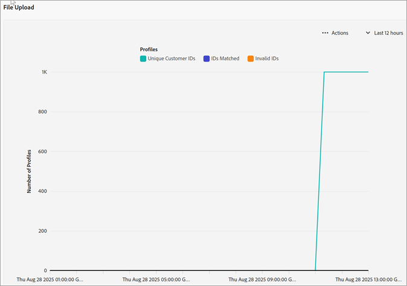

# Creare un’origine di attributi cliente e caricare il file di dati

Creazione dell’origine di attributi cliente (file CSV e FIN) e caricamento dei dati. Puoi attivare l&#39;origine dati quando lo desideri. Quando la sorgente dati è attiva, condividi i dati attributo in Analytics e Target.

## Flusso di lavoro per attributi cliente {#concept_BF0AF88E9EF841219ED4D10754CD7154}


>[!IMPORTANT]
>
>Per accedere a questa funzione, gli utenti devono essere assegnati al profilo di prodotto Attributi cliente (Attributi cliente - Accesso predefinito). Vai a **[!UICONTROL Amministrazione]** > **[!UICONTROL Admin Console]** > **[!UICONTROL Prodotti]**. Se *Attributi del cliente* viene visualizzato come uno dei [!UICONTROL profili di prodotto], puoi iniziare. Gli utenti che vengono aggiunti al gruppo Attributi del cliente visualizzeranno il menu [!UICONTROL Attributi del cliente] sul lato sinistro dell’interfaccia di Experience Cloud.
>
>Per utilizzare la funzione Attributi del cliente, gli utenti devono appartenere anche a gruppi a livello di applicazione (Analytics o [!DNL Target]).

## Creazione di un file di dati {#task_B5FB8C0649374C7A94C45DCF2878EA1A}

Questi dati sono dati aziendali dei clienti provenienti dal tuo sistema CRM. Possono includere i dati degli utenti con sottoscrizione relativi ai prodotti, inclusi ID membro, prodotti autorizzati, prodotti più lanciati e così via.

1. Crea un `.csv`.

   >[!NOTE]
   >
   >Successivamente in questa procedura, trascina il file `.csv` per caricarlo. Tuttavia, se [effettui il caricamento tramite FTP](t-upload-attributes-ftp.md#task_591C3B6733424718A62453D2F8ADF73B), serve anche un file `.fin` con la stessa denominazione del file `.csv`.

   Esempio di un file di dati di un cliente aziendale:

   

1. Prima di continuare, controlla le informazioni importanti in [Requisiti dei file di dati](crs-data-file.md) e dopo carica il file.
1. [Crea un’origine di attributi cliente e carica i dati](t-crs-usecase.md), come descritto di seguito.

## Creare un’origine di attributi e caricare il file di dati {#task_09DAC0F2B76141E491721C1E679AABC8}

Segui questi passaggi nella pagina Crea nuovo Source di attributi del cliente in Experience Cloud.

>[!IMPORTANT]
>
>Quando crei, modifichi o elimini origini di attributi del cliente, si verifica un ritardo di circa un’ora prima dell’effettiva sincronizzazione degli ID con la nuova origine dati. Devi disporre di diritti di amministratore in Audience Manager per creare o modificare origini degli attributi del cliente. Contatta l&#39;Assistenza clienti o la consulenza di Audience Manager per ottenere i diritti di amministratore.

1. In [!DNL Experience Cloud], selezionare l&#39;icona Menu .
1. In **[!DNL Experience Platform]**, seleziona **[!UICONTROL People]** > **[!UICONTROL Customer Attributes]**.

   La pagina [!UICONTROL Attributi del cliente] è il luogo in cui puoi gestire e modificare l&#39;origine dati degli attributi esistenti.

   

1. Seleziona **[!UICONTROL Nuovo]**.

   

1. Nella pagina [!UICONTROL Modifica origine attributo del cliente] configura i campi seguenti:

   * **[!UICONTROL Nome:]** un nome descrittivo per l&#39;origine dell&#39;attributo dei dati. In [!DNL Adobe Target], i nomi degli attributi non possono includere spazi. Se viene passato un attributo con uno spazio, [!DNL Target] lo ignora. Altri caratteri non supportati sono: `< , >, ', "`.

   * **[!UICONTROL Descrizione:]** (facoltativo) una descrizione per la sorgente attributi dei dati.

   * **[!UICONTROL ID alias:]** rappresenta un’origine dei dati di ttributi del cliente come specificato nel sistema CRM. [!UICONTROL Alias ID] è un ID univoco utilizzato nel codice [!UICONTROL Source] dell&#39;attributo del cliente. L&#39;ID deve essere univoco, in lettere minuscole e non deve comprendere spazi. Il valore immesso nel campo [!UICONTROL Alias ID] per un&#39;origine di attributi cliente in Experience Cloud deve corrispondere ai valori ricevuti dall&#39;implementazione (tramite Raccolta dati di Platform o JavaScript dell&#39;SDK Mobile).

     >[!IMPORTANT]
     >
     >L’eliminazione di un’origine dati associata a un ID alias non rende disponibile l’ID alias, in quanto viene salvato in più servizi e utilizzato per mappare i profili tra di essi.

     L&#39;ID alias corrisponde ad alcune aree in cui puoi impostare valori ID cliente aggiuntivi. Esempio:

      * **Tag:** L&#39;ID alias corrisponde al valore *Integration Code* in [!UICONTROL Impostazioni cliente], nello strumento [Servizio ID Experience Cloud](https://experienceleague.adobe.com/docs/experience-platform/tags/home.html?lang=it).

      * **API visitatore:** l&#39;ID alias corrisponde agli [ID cliente](https://experienceleague.adobe.com/docs/id-service/using/reference/authenticated-state.html) aggiuntivi che puoi associare a ogni visitatore.

        Ad esempio, *“crm_ id”* in:

        ```
        "crm_id":"67312378756723456"
        ```

      * **iOS:** l&#39;ID alias corrisponde a *“idType”* in [visitorSyncIdentifiers:identifiers](https://experienceleague.adobe.com/docs/mobile-services/ios/overview.html?lang=it).

        Esempio:

        `[ADBMobile visitorSyncIdentifiers:@{@<`**`"idType"`**`:@"idValue"}];`

      * **Android™:** l’ID alias corrisponde a *“idType”* in [syncIdentifiers](https://experienceleague.adobe.com/docs/mobile-services/android/overview.html?lang=it).

        Esempio:

        `identifiers.put(`**`"idType"`**`, "idValue");`

        Consulta [Utilizzo di più origini dati](crs-data-file.md#section_76DEB6001C614F4DB8BCC3E5D05088CB) per ulteriori informazioni sull&#39;elaborazione dei dati in merito al campo ID alias e agli ID cliente.

   * **[!UICONTROL Caricamento file:]** puoi trascinare il file di dati `.csv` o caricare i dati tramite FTP. L&#39;utilizzo di FTP richiede anche un file `.fin`. Consulta [Caricare i dati tramite FTP](t-upload-attributes-ftp.md#task_591C3B6733424718A62453D2F8ADF73B).

     >[!IMPORTANT]
     >
     >Esistono dei requisiti del file di dati specifici. Consulta [Requisiti dei file di dati](crs-data-file.md) per ulteriori informazioni.

     Dopo aver caricato il file, i dati della tabella vengono visualizzati nell&#39;intestazione [!UICONTROL Caricamento file] di questa pagina. È possibile convalidare lo schema, configurare sottoscrizioni o impostare l&#39;FTP.

     **Grafico caricamento del file**

     

   * **[!UICONTROL ID cliente univoco:]** mostra quanti ID univoci hai caricato in questa origine attributo.

   * **[!UICONTROL ID forniti dal cliente come alias degli ID visitatore di Experience Cloud:]** mostra quanti ID sono impostati come alias degli ID visitatore di Experience Cloud.

   * **[!UICONTROL ID forniti dal cliente con soglia degli alias elevata:]** visualizza il numero di ID forniti dal cliente con 500 o più ID visitatore di Experience Cloud con alias. Questi ID forniti dal cliente non rappresentano individui ma accessi condivisi. Il sistema distribuisce gli attributi associati a questi ID ai 500 ID visitatore di Experience Cloud con alias più recenti, fino a raggiungere la soglia di 10.000. Quindi, il sistema invalida l&#39;ID fornito dal cliente e non distribuisce più attributi associati.

## Convalida dello schema {#task_404AAC411B0D4E129AB3AC8B7BE85859}

Il procedimento di convalida consente di mappare i nomi e le descrizioni visualizzati agli attributi caricati (stringhe, interi, numeri e così via). Puoi anche eliminare gli attributi aggiornando lo schema.

Consulta [Convalida dello schema](validate-schema.md).

Per eliminare gli attributi, consulta [(Facoltativo) Aggiornare lo schema (eliminare gli attributi)](t-crs-usecase.md).

## (Facoltativo) Aggiornare lo schema (eliminare gli attributi) {#task_6568898BB7C44A42ABFB86532B89063C}

Informazioni su come eliminare e sostituire gli attributi nello schema.

1. Nella pagina [!UICONTROL Modifica origine attributo del cliente], rimuovi la sottoscrizione a **[!UICONTROL Target]** o **[!UICONTROL Analytics]** (in [!UICONTROL Configura sottoscrizioni]).
1. [Carica un nuovo file di dati con campi aggiornati](t-crs-usecase.md).

## Configurazione delle sottoscrizioni e attivazione dell&#39;origine attributo {#task_1ACA21198F0E46A897A320C244DFF6EA}

La configurazione di una sottoscrizione imposta il flusso di dati tra Experience Cloud e le applicazioni. L’attivazione dell’origine degli attributi consente il flusso dei dati verso le applicazioni sottoscritte. I record cliente che hai caricato vengono associati ai segnali ID in entrata provenienti dal sito web o dall&#39;applicazione.

Consulta [Configurazione delle sottoscrizioni](subscription.md).

**Per attivare un&#39;origine attributo**

Nella pagina [!UICONTROL Crea nuovo o modifica attributo del cliente Source], individua l&#39;intestazione [!UICONTROL Attiva], quindi seleziona **[!UICONTROL Attivo]**.


## Utilizzo degli Attributi del cliente in Adobe Analytics {#task_7EB0680540CE4B65911B2C779210915D}

Con i dati ora disponibili in applicazioni come Adobe Analytics, puoi creare rapporti sui dati, analizzarli e intraprendere azioni appropriate nelle campagne di marketing.

L’esempio seguente mostra un segmento di [!DNL Analytics] basato sugli attributi caricati. Questo segmento mostra gli utenti con sottoscrizione a [!DNL Photoshop Lightroom] il cui prodotto maggiormente lanciato è Photoshop.


Quando pubblichi un segmento in Experience Cloud, questo diventa disponibile in Experience Cloud Audiences e Audience Manager.

## Utilizzo degli Attributi del cliente in Adobe Target {#task_FC5F9D9059114027B62DB9B1C7D9E257}

In [!DNL Target] puoi selezionare un attributo del cliente dalla sezione [!UICONTROL Profilo visitatore] al momento della creazione di un pubblico. Tutti gli attributi del cliente hanno il prefisso `crs.` nell’elenco. Per creare dei tipi di pubblico, combina questi attributi con altri attributi di dati.


Consulta [Creazione di un nuovo pubblico](https://experienceleague.adobe.com/docs/target/using/audiences/create-audiences/audiences.html) nella guida di [!DNL Target].
