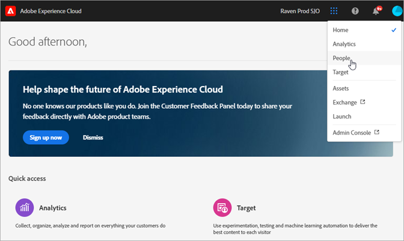

# Informazioni sui nuovi nomi cloud in Experience Cloud {#topic_BD726D3A649E4FC49063029E86B70C62}

Scopri gli ultimi aggiornamenti dei marchi per i cloud, come esplorare l&#39;interfaccia e dove trovare aiuto per le soluzioni e i servizi di base.

## Nuovi nomi cloud {#concept_3D567681C3C94989AD1A30A1C5C41609}

Ultimi nomi di cloud e soluzioni in ogni cloud:

[Experience Cloud](https://www.adobe.com/it/experience-cloud.html?promoid=FZPQZ2HS&amp;mv=other)

Sostituisce *Experience Cloud* come nome del cloud principale per le soluzioni e i servizi di esperienza digitale di Adobe.

>[!NOTE]
>
>Potresti continuare a visualizzare i riferimenti a *Experience Cloud* in un contesto precedente e più ampio fino a quando non sarà effettuato il rebranding in *Enterprise Cloud* di tutte le interfacce della soluzione.

[Experience Cloud](https://www.adobe.com/it/marketing-cloud.html)

Include le soluzioni seguenti:

* Adobe Experience Manager
* Adobe Campaign
* Adobe Target
* Adobe Primetime
* Adobe Social

[Analytics Cloud](https://www.adobe.com/it/data-analytics-cloud.html)

Include le soluzioni seguenti:

* Adobe Analytics
* Adobe Audience Manager

[Advertising Cloud](https://www.adobe.com/it/advertising-cloud.html)

Include Media Optimizer e TubeMogul.

## Quali sono le soluzioni? {#concept_4F52341A45DC49B2B216824B14D54FDA}

Le informazioni seguenti illustrano brevemente le soluzioni e includono collegamenti di aiuto. [Sono inoltre disponibili esempi di casi d’uso](https://helpx.adobe.com/it/marketing-cloud/how-to/use-cases.html) per facilitarti le operazioni con i flussi di lavoro di marketing digitale.

[Adobe Analytics](https://docs.adobe.com/content/help/it-IT/analytics/landing/home.html)

Per iniziare a usare Analytics:

1. Crea la tua prima suite di rapporti Analytics (archivio dati) utilizzando i passaggi descritti in [Guida introduttiva ad Adobe Analytics](https://docs.adobe.com/content/help/it-IT/analytics/analyze/analysis-workspace/home.html).
1. Quindi, distribuisci il codice Analytics tramite [Experience Platform Launch](https://docs.adobe.com/content/help/it-IT/launch/using/intro/get-started/quick-start.html).

Experience Platform Launch è la nuova generazione di gestione dei tag e ti consente di distribuire e gestire con facilità tutti i tag di analisi, marketing e pubblicità.

Vedi anche:

* [Quali prodotti Analytics devo utilizzare?](https://docs.adobe.com/content/help/it-IT/analytics/admin/admin-overview/which-analytics-tool.html)
* [Requisiti e confronto dei prodotti Analytics](https://docs.adobe.com/content/help/it-IT/analytics/admin/admin-overview/analytics-product-comparison.html)

[Adobe Target](https://docs.adobe.com/content/help/it-IT/target/using/target-home.html)

Adobe Target si integra con Analytics e altri servizi di base Experience Cloud. Argomenti utili della guida introduttiva:

* [Impostazione di Target](https://docs.adobe.com/content/help/it-IT/target/using/administer/administrating-target.html)
* [Come funziona Adobe Target](https://docs.adobe.com/content/help/it-IT/target/using/introduction/how-target-works.html)
* [Primi passaggi per l’amministratore](https://docs.adobe.com/content/help/it-IT/target/using/administer/start-target.html)
* [Utilizza Analytics come origine di reporting per Adobe Target](https://docs.adobe.com/content/help/it-IT/target/using/integrate/a4t/a4t.html)

[Adobe Experience Manager](https://helpx.adobe.com/it/support/experience-manager/6-5.html)

La soluzione di gestione dei contenuti Adobe Experience Manager consente di gestire con facilità le risorse e i contenuti dei siti web, delle app mobili, della community e dei moduli.

Per ricevere assistenza, consulta [Adobe Experience Manager 6.5](https://helpx.adobe.com/support/experience-manager/6-5.html).

[Adobe Audience Manager](https://docs.adobe.com/content/help/it-IT/audience-manager/user-guide/aam-home.html)

La piattaforma di gestione dei dati Adobe Audience Manager consente di creare dei profili di pubblico specifici, per individuare e rivolgersi ai segmenti di clienti più importanti su ogni canale.

[Adobe Advertising Cloud](https://docs.adobe.com/content/help/it-IT/release-notes/experience-cloud/current.html#adcloud)

Adobe Advertising Cloud è una soluzione di acquisto di annunci programmatici. consente di cercare e fare delle proiezioni sulla combinazione migliore di canali di annunci in base al budget, per poi automatizzare la distribuzione dei contenuti direttamente al tuo pubblico.

[Adobe Campaign](https://docs.adobe.com/content/help/en/campaign-standard/using/getting-started/about-adobe-campaign/campaign-orchestration.html)

Con Adobe Campaign puoi progettare, distribuire e misurare le campagne su tutti i canali online e offline. La soluzione consente inoltre di migliorare i livelli di produttività e di offrire esperienze rilevanti ai tuoi clienti.

[Adobe Primetime](https://helpx.adobe.com/it/support/primetime.html)

Adobe Primetime è una piattaforma TV multischermo che aiuta le emittenti a creare esperienze TV e cinematografiche coinvolgenti e personalizzate per qualsiasi tipo di pubblico.

## Cosa sono i servizi di base?  {#concept_38AC4888C3F84694AE4F60311C21B9C2}

[I servizi di base](https://docs.adobe.com/content/help/it-IT/core-services/interface/about-core-services/core-services-landing.html) includono funzionalità che semplificano l’implementazione dei prodotti e abilitano flussi di lavoro tra soluzioni, ad esempio la segmentazione del pubblico, il caricamento di attributi cliente e strumenti di collaborazione.

