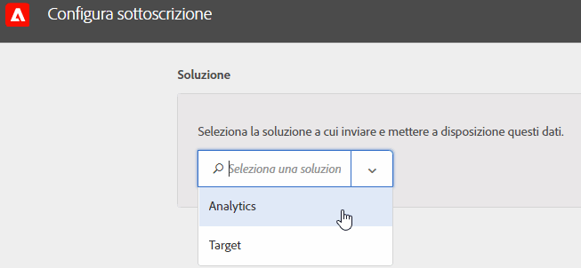

# Configurare gli abbonamenti in Experience Cloud

Scopri le origini di dati della soluzione e la configurazione delle sottoscrizioni. Le sottoscrizioni consentono il flusso di dati Attributi del cliente tra Experience Cloud e soluzioni ([!DNL Analytics] e [!DNL Target]).

Ad esempio, una sottoscrizione Adobe Analytics abilita i dati degli attributi nei rapporti. Se usi Adobe Target puoi caricare gli attributi del cliente per il targeting e la segmentazione.

**[!UICONTROL Origine degli attributi del cliente]** > **[!UICONTROL Crea nuova origine degli attributi del cliente]** > **[!UICONTROL Nuova]**

| Elemento | Descrizione |
|--- |--- |
| Soluzione | **Adobe Analytics**  Seleziona Analytics e specifica la suite di rapporti in cui vuoi ricevere i dati degli attributi e gli attributi da includere. **Adobe Target**  Puoi caricare gli attributi del cliente per il targeting e la segmentazione. Questa funzionalità è utile se vuoi destinare un test sulla base di dati di attributi o se vuoi rendere disponibili i dati per la segmentazione in Analytics. I dati dell&#39;attributo del cliente caricato per un visitatore è disponibile all&#39;accesso in  **[!DNL Target]** >  **Audiences**. Sono supportate più sorgenti di dati. Quando [imposti gli ID cliente](core-services.md) sul tuo sito web, verifica che almeno uno degli alias sia iscritto a [!DNL Target]. |
| Suite di rapporti (Analytics) | Le suite di rapporti da Analytics. Non puoi aggiungere più di 10 suite di rapporti alle sottoscrizioni di Analytics in un&#39;unica origine attributo. Quando scegli quali suite di rapporti includere, prendi in considerazione i seguenti suggerimenti:<ul><li>Scegli suite di rapporti con un set comune di clienti autenticati. Se i clienti autenticati in una suite di rapporti non si sovrappongono ai clienti autenticati in un&#39;altra suite di rapporti, separa queste suite di rapporti in sorgenti di attributi diverse.</li><li>Se possibile, le suite di rapporti incluse in un&#39;origine di attributi devono avere un volume di traffico simile.</li></ul> Se hai più di 10 suite di rapporti con un set comune di clienti autenticati, puoi configurare altre origini attributo del cliente, ciascuna con un massimo di 10 suite di rapporti. |
| Attributi da includere (Analytics e [!DNL Target]) | Gli attributi che desideri inviare alla soluzione.  Quando configuri le sottoscrizioni e selezioni gli attributi, si applicano i seguenti limiti _per suite di rapporti,_ a seconda delle soluzioni che possiedi:<ul><li>Foundation: 0</li><li>Select: 3</li><li>Prime: 15</li><li>Ultimate: 200</li><li>Standard: 3 totali</li><li>Premium: 200 per suite di report</li><li>[!DNL Target] Standard: 5</li><li>[!DNL Target] Premium: 200</li></ul> **Nota:** quando esegui l&#39;aggiornamento ad Analytics Premium, si verifica un ritardo di 24 ore prima che gli attributi aggiuntivi siano disponibili. Durante questo lasso di tempo potresti ricevere un errore di tipo “Limite di attributi massimo per abbonamento”. |

{style=&quot;table-layout:auto&quot;}
