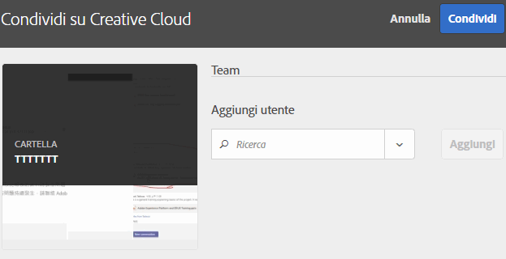

# Condivisione di una cartella di risorse Experience Cloud

Condividi una cartella di risorse Experience Cloud con utenti Creative Cloud.

1. In una cartella di risorse, seleziona **[!UICONTROL Condividi su Creative Cloud]**.

   
1. Nella pagina Condividi su Creative Cloud cerca l’utente, quindi seleziona **[!UICONTROL Aggiungi]**.

   

1. Seleziona **[!UICONTROL Condividi]**.
1. Avvia l’applicazione desktop [!DNL Creative Cloud] (oppure passa alla pagina [!UICONTROL Creative Cloud Files (File di Creative Cloud)] in un browser) e cerca la richiesta.

   
1. Apri la richiesta, quindi seleziona **[!UICONTROL Accetta]**.

   
1. Per accedere ai contenuti della cartella, seleziona **[!UICONTROL Apri cartella]** (oppure **[!UICONTROL Visualizza sul web]**).

   
1. Continua con l&#39;aggiunta di commenti sulla risorsa condivisa:

   In Creative Cloud, per aggiungere un commento all&#39;immagine puoi selezionarla, quindi selezionare **[!UICONTROL Attività]**. I commenti vengono sincronizzati sulle risorse in [!DNL Creative Cloud] e [!DNL Experience Cloud].

   

   In Experience Cloud, per aggiungere un commento a un&#39;immagine, selezionala, quindi seleziona l’icona della cronologia. I commenti vengono sincronizzati sulle risorse in Creative Cloud ed Experience Cloud.

   

1. Per annullare la condivisione di una cartella, seleziona **[!UICONTROL Condividi con Creative Cloud]** (come nel [Passaggio 3](t-share-creative-cloud.md#step_BA17CFA185284641A9B878BA29551996)), rimuovi gli utenti selezionando il simbolo X, quindi seleziona **[!UICONTROL Condividi]**.

Quando hai rimosso tutti gli utenti di Creative Cloud, la cartella non è più condivisa e gli utenti di Creative Cloud non possono più accedervi.

Altri metodi per utilizzare una risorsa condivisa:

* Utilizzare il [!UICONTROL selettore delle risorse] in [!DNL Adobe Social] per i post social.
* Carica o inverti le risorse in [Offers Library (Libreria offerte)](https://experienceleague.adobe.com/docs/target/using/experiences/offers/manage-content.html?lang=it) in [!DNL Adobe Target] per le immagini nelle attività.

Dopo aver condiviso una cartella su Creative Cloud, visualizzerai il logo Creative Cloud sulla cartella.

Argomenti correlati:

* [Aiuto di Creative Cloud - Gestione e sincronizzazione dei file](https://helpx.adobe.com/it/creative-cloud/help/sync-creative-cloud-files.html)
* [Aiuto di Creative Cloud - Collaborazione con altri](https://helpx.adobe.com/it/creative-cloud/help/collaboration.html)
* [Aiuto di Creative Cloud - Domande frequenti sulla collaborazione](https://helpx.adobe.com/it/creative-cloud/help/collaboration-faq.html)
