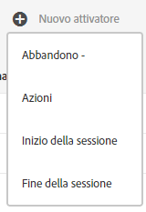

# Experience Cloud Triggers

 Trigger nell’Experience Cloud ti consente di identificare, definire e monitorare i comportamenti chiave dei consumatori, per poi generare comunicazioni tra soluzioni per coinvolgere nuovamente i visitatori.

## Panoramica di Triggers {#topic_4F21FCE9A64E46E8B6D51F494FA652A7}

Puoi utilizzare i trigger nelle decisioni in tempo reale e nella personalizzazione. Esempio:

* Configura il remarketing rapido di carrelli abbandonati o di carrelli abbandonati con i prodotti rimossi
* Applicazioni e moduli incompleti
* Qualsiasi azione o sequenza di azioni sul sito

>[!NOTE]
>
>Ulteriori informazioni sull&#39;utilizzo di [!UICONTROL Triggers] sono disponibili in [Campaign Standard](https://experienceleague.adobe.com/docs/campaign-standard/using/integrating-with-adobe-cloud/working-with-campaign-and-triggers/using-triggers-in-campaign.html?lang=en).

### Tipi di Triggers

In genere, un trigger può richiedere dai 15 ai 90 minuti per avviare una campagna di marketing. Questo ritardo varia a seconda dell’implementazione della raccolta di dati, del caricamento sulla pipeline, della configurazione personalizzata del trigger definito e del flusso di lavoro in Adobe Campaign.

* **Abbandono:** puoi creare un trigger che si attiva quando un visitatore visualizza un prodotto ma non aggiunge nulla al carrello.
* **Azione:** puoi creare trigger, ad esempio, che si attivano dopo che un utente ha effettuato un&#39;iscrizione a una newsletter, un&#39;iscrizione e-mail o ha usato applicazioni per le carte di credito (conferme). Se sei un rivenditore, puoi creare un trigger per un visitatore che si iscrive a un programma fedeltà. Nei contenuti multimediali e di intrattenimento, crea trigger per i visitatori che guardano un determinato show e che vorresti rispondessero a un sondaggio.
* **Avvio e fine sessione:** crea un trigger per gli eventi di inizio e fine sessione.

## Creare un trigger di Experience Cloud {#task_821F37183AC045E5AC8EED20317598FE}

Crea un trigger e configurane le condizioni. Ad esempio, puoi specificare i criteri per le regole di un attivatore durante una visita, come metriche quali abbandono del carrello o dimensioni quali il nome del prodotto. Quando le regole sono soddisfatte, il trigger viene eseguito.

>[!NOTE]
>
>Esiste attualmente un limite tecnico di 100 trigger.

1. Nell&#39;Experience Cloud, seleziona , quindi seleziona **[!UICONTROL Raccolta dati/Launch]**.
2. Nella scheda [!UICONTROL Triggers], seleziona **[!UICONTROL Gestisci trigger]**.
3. Seleziona **[!UICONTROL Nuovo trigger]**, quindi specifica il tipo di trigger:

   

4. Configura il trigger completando i campi seguenti e trascinando metriche ed elementi dimensione nei contenitori della regola:

   | Elemento | Descrizione |
   |--- |--- |
   | [!UICONTROL Nome] | Nome intuitivo per il trigger. |
   | [!UICONTROL Descrizione] | Descrizione del trigger, modalità di utilizzo e così via. |
   | [!UICONTROL Suite di rapporti] | La [suite di rapporti](https://experienceleague.adobe.com/docs/analytics/admin/manage-report-suites/report-suites-admin.html) di Analytics utilizzata per questo trigger. Questa impostazione identifica i dati di reporting da utilizzare. |
   | La visita deve includere La visita non deve includere Trigger dopo nessuna azione Includi metadati | Puoi definire i criteri o i comportamenti del visitatore desiderati e i comportamenti indesiderati. Ad esempio, le regole per un semplice trigger di abbandono carrello possono essere:<ul><li>La visita deve includere: [!UICONTROL Aggiunta carrello] (metrica) e [!UICONTROL Esiste]. (puoi definire ulteriormente la regola con una visualizzazione di prodotto specifica o con dimensioni come Tipi di browser).</li><li>La visita non deve includere:  [!UICONTROL Pagamento].</li><li>Trigger dopo nessuna azione per: 10 minuti.</li><li>[!UICONTROL Includi metadati]: Consente di aggiungere una  [!DNL Campaign] dimensione o variabili specifiche rilevanti per il comportamento di un visitatore. Questo campo può essere utile per Adobe Campaign per creare l&#39;e-mail di ricommercializzazione corretta.</li></ul> Puoi specificare   [!UICONTROL Qualsiasi],    O    Orlogic all’interno o tra contenitori, a seconda dei criteri che ritieni importanti per la regola. |
   | [!UICONTROL Contenitore] | [!UICONTROL Nei contenitori vengono impostati e archiviati regole, condizioni o filtri che definiscono un trigger. ] Se vuoi far verificare gli eventi contemporaneamente, inseriscili nello stesso contenitore. Ciò significa che ogni contenitore elabora indipendentemente a livello di risultato. Ad esempio, in caso di due contenitori uniti dall&#39;operatore AND, le regole saranno idonee quando due risultati soddisfano i requisiti. |
   | Start new session after (Avvia nuova sessione dopo) | Crea un trigger per gli eventi di inizio e fine sessione. |

   {style=&quot;table-layout:auto&quot;}

5. Seleziona **[!UICONTROL Salva]**.
6. Usa i trigger per la [commercializzazione in tempo reale](https://experienceleague.adobe.com/docs/campaign-standard/using/integrating-with-adobe-cloud/working-with-campaign-and-triggers/about-adobe-experience-cloud-triggers.html?lang=en) in [!DNL Adobe Campaign].

### Esempio di trigger

Esempi di Experience Cloud Triggers:

#### Trigger di abbandono del carrello

Ad esempio, nella pagina seguente sono illustrate le regole che è possibile utilizzare per un trigger [!UICONTROL Abbandono carrello] , in base ai prodotti visualizzati durante una visita.

#### Trigger referrer

Il trigger seguente si attiva quando viene visualizzato un risultato con il prodotto Stivali da uomo e il referrer Facebook. Per valutare i due criteri (*products* e *referrer*) nello stesso risultato, devono essere aggiunti allo stesso contenitore.

